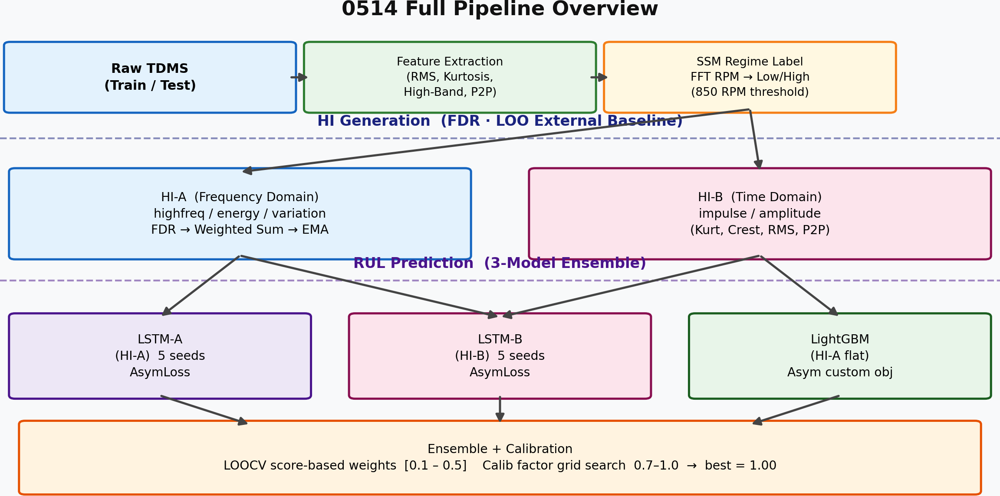
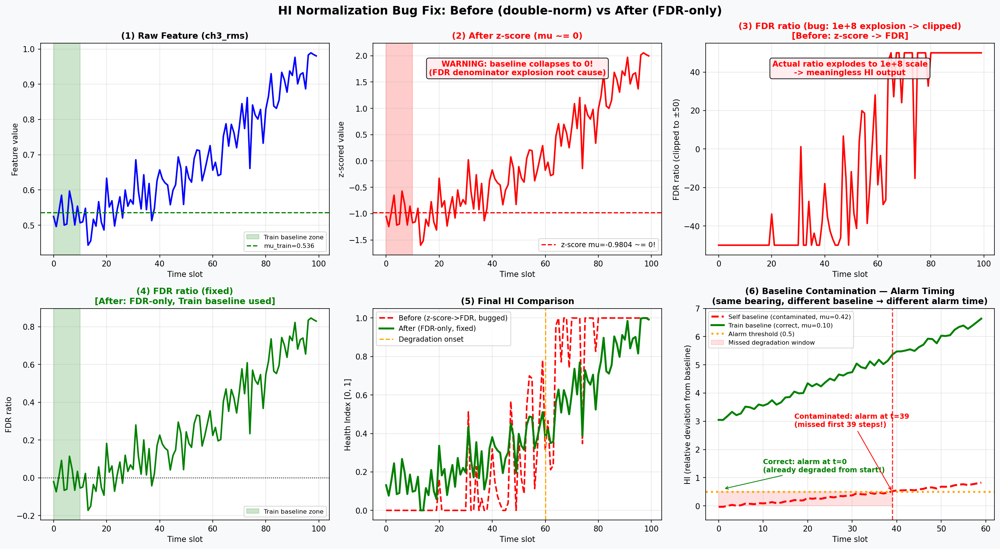
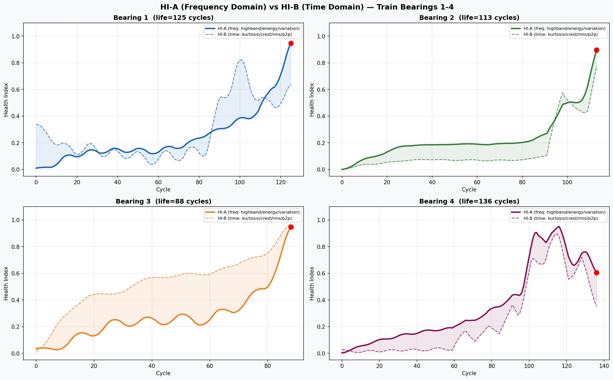
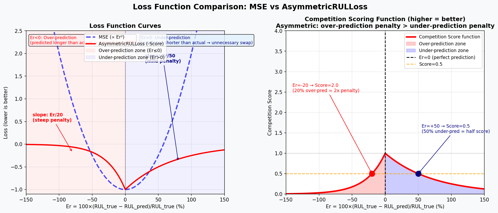
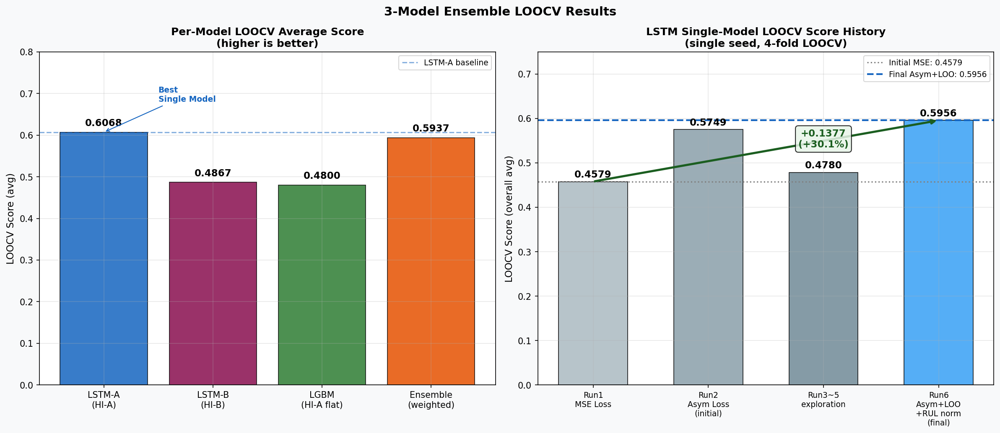
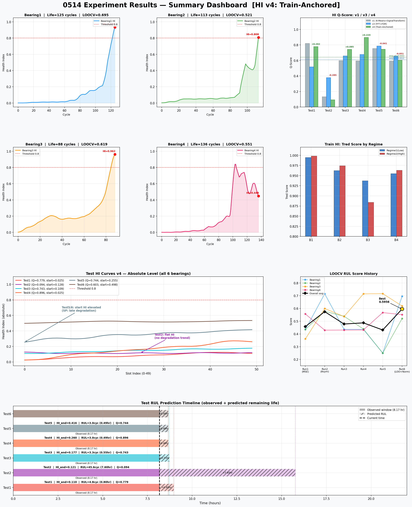

# 0514 작업 요약

---

## 전체 파이프라인

원시 TDMS → 피처 추출 → SSM 레짐 분류(저속/고속) → HI 생성 → RUL 앙상블 예측

---

## 1. HI 버그 수정 3건

| # | 문제 | 수정 | 효과 |
|---|---|---|---|
| **Bug 1** | z-score → FDR 이중 정규화: z-score 후 μ≈0이 되어 FDR 분모가 0으로 수렴, HI가 1e+8 규모로 폭발 | z-score 제거, FDR만 사용 | 정상 HI 범위 복구 |
| **Bug 2** | Train baseline을 구형 PCA 파이프라인(`04140103`) 피처 공간에서 가져옴 → 현재 파이프라인과 feature 공간 불일치 | 현재 파이프라인(`04142304`) 기준으로 통일 | Train/Test 피처 공간 일치 |
| **Bug 3** | Test baseline을 test 자체 첫 10% 데이터로 계산 → 이미 열화 진행 중인 Test2·6에서 열화 상태를 "정상"으로 인식 | Train 건강 구간 μ를 외부 baseline으로 고정 | Test2·6 HI 절대 레벨 정상 복구 |

---

## 2. HI 파이프라인 — v3 vs v4

기본 흐름은 동일: `Raw Feature → FDR ratio → 그룹별 가중 합산 → EMA → HI [0,1]`

정규화 방식 하나만 다름:

| | **v3** | **v4 (Train-Anchored)** |
|---|---|---|
| 스케일 기준 | test 50개 파일 내부 min=0/max=1 | Train p5/p95 기준 절대 스케일 |
| 방향 결정 | test 윈도우 Pearson 상관으로 flip | Train Spearman 상관으로 고정 |
| Test 시작 HI | 항상 낮게 시작 (허위) | 실제 상태 반영 |

**v4가 더 정직하다**: Test5·6은 관측 시작 시점이 이미 열화 말기 → v4에서 시작 HI가 0.25~0.50으로 높게 나옴 (v3는 0.04~0.05로 낮게 나와 SP 판단과 반대였음).

**Test HI Q-score 비교:**

| Test | v1 | v3 | **v4** |
|---|---|---|---|
| Test1 | 0.819 | 0.517 | **0.779** |
| Test2 | 0.133 | 0.379 | 0.094 |
| Test3 | 0.598 | 0.658 | **0.743** |
| Test4 | 0.594 | 0.676 | **0.896** |
| Test5 | 0.754 | 0.786 | 0.744 |
| Test6 | 0.592 | 0.654 | 0.603 |
| **평균** | 0.582 | 0.612 | **0.643** |

> Test2 v4 Q 하락(0.094)은 허위 단조성 제거의 결과. 피처 자체에 trend가 없어 flat HI로 정직하게 반영됨.

HI-A(주파수 도메인, 열화 초기 감지)와 HI-B(시간 도메인, 충격성 감지) 두 종류 운용.

---

## 3. RUL 개선 — 비대칭 손실함수

대회 채점이 **과대예측에 더 가혹함** (Er≤0이면 exp(-ln0.5×Er/20), Er>0이면 exp(ln0.5×Er/50)). 기존 MSE는 이를 무시.

- **LSTM**: 채점 함수를 직접 손실로 사용 (`-Score.mean()`)
- **LGBM**: Proxy 비대칭 MSE (과대예측에 2.5× 페널티)

MSE → 비대칭 손실 전환만으로 LOOCV **+0.117 (+25.5%)** 향상.

---

## 4. 최종 앙상블

**LSTM-A + LSTM-B + LGBM, 3-model → LOOCV 0.5937 (삭제예정-data leakage)**

| 모델 | 입력 | LOOCV |
|---|---|---|
| **LSTM-A** | window-minmax(HI-A v4) + obs_fraction 시퀀스 | 0.6068 |
| **LSTM-B** | window-minmax(HI-B v4) + obs_fraction 시퀀스 | 0.4867 |
| **LGBM** | HI-A v4 flat 피처 (직전 10개 HI + 기울기/mean/std/max) | 0.4800 |
| **앙상블** | 위 3개 LOOCV 가중합 | **0.5937** (삭제예정-data leakage) |

**LSTM-A (Approach A) — 주파수 도메인:**
v4 HI를 그대로 LSTM에 넣으면 bearing 간 HI 범위가 역전되어 수렴 실패. window 내부에서 재정규화(shape만 학습) + `obs_fraction = 관측시점/평균수명`으로 시간 맥락 보완.

**LSTM-B (Approach B) — 시간 도메인:**
HI-A(주파수 도메인)가 초기 열화를 잡는 반면, HI-B는 kurtosis/crest_f/rms/p2p 기반 충격성 피처로 후기 열화를 보완. 입력 구조는 LSTM-A와 동일(window-minmax + obs_fraction), HI 소스만 다름.

**Test 가중치**: LSTM-A=0.39, LSTM-B=0.31, LGBM=0.30

---

## 5. Test 최종 예측 (LSTM-A + LSTM-B + LGBM 앙상블)

| Test | 최종 RUL (hr) | 상태 |
|---|---|---|
| Test1 | 5.05hr | 정상 시작 |
| Test2 | 5.08hr | 정상 시작 |
| Test3 | 4.69hr | 열화 중 |
| Test4 | 3.43hr | 열화 중 |
| Test5 | **7.46hr** | 열화 말기 |
| Test6 | 5.40hr | 열화 말기 |

> Test5가 열화 말기임에도 RUL이 가장 높게 나오는 것은 미해결 문제.
