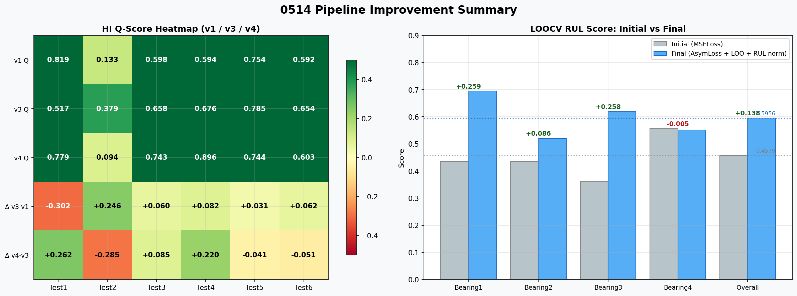
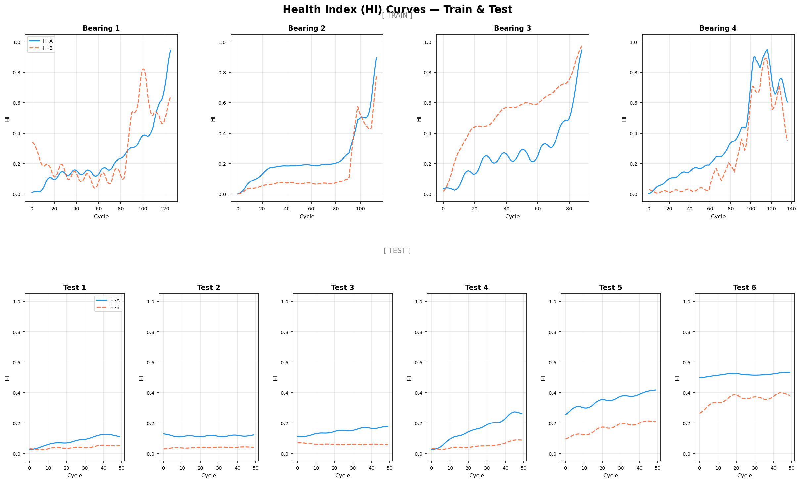
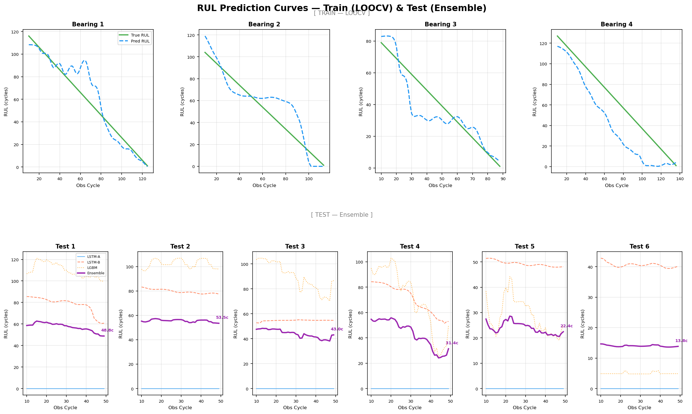

# 0514

Parent item: SR (https://www.notion.so/SR-341bc9bdea7380a2b211dacffa42deba?pvs=21)

---

## 개요

**SC/** 의 기존 코드에서 시작, 아래 두 가지 방향으로 집중적으로 개선했다.

| 축 | 내용 |
|---|---|
| **HI (Health Index)** | 이중 정규화 버그 3건 수정, FDR-only 파이프라인으로 재설계 |
| **RUL 예측** | 비대칭 손실함수 도입 + 3-모델 앙상블 구성 |

---

## 전체 파이프라인 흐름도


원시 TDMS 신호 → 피처 추출 → SSM 레짐 분류(저속/고속) → HI 생성(HI-A, HI-B) → RUL 예측(LSTM-A + LSTM-B + LGBM 앙상블)의 순서로 진행된다.

---

## 1. HI (Health Index) 개선

### 1-1. 버그 수정 3건

#### Bug Fix 1 — z-score → FDR 이중 정규화 제거

**문제**: 기존 파이프라인은 피처에 z-score를 먼저 적용한 뒤 FDR(Feature Deviation Ratio) 비율을 계산했다. z-score 후에는 건강 구간의 평균 μ ≈ 0이 되므로, FDR 분모가 0에 수렴 → ratio가 **1e+8 규모로 폭발**하여 의미 없는 HI를 생성했다.

**수정**: z-score 제거, **FDR만** 사용. baseline μ는 Train 건강구간의 실제 피처 평균으로 고정.

#### Bug Fix 2 — Train baseline 소스 통일

**문제**: 기존에는 Train baseline을 `04140103_initial_pca_result` (구형 PCA 피처, 다른 feature 공간)에서 가져오고 있었다.

**수정**: `04142304_signal_transform_v2`(현재 파이프라인과 동일한 raw feature 컬럼 공간)에서 계산.

#### Bug Fix 3 — Test baseline 오염 해결

**문제**: Test의 FDR baseline을 test 자체 첫 10% 데이터로 계산하면, 이미 열화가 시작된 상태에서 관측이 시작된 Test2·6에서 **열화된 상태를 '정상'으로 인식**하는 baseline 오염이 발생한다.

**수정**: Train 4개 베어링의 레짐별(저속/고속) 건강 구간 평균 μ를 외부 baseline으로 사용 → Train/Test 분포 일치.


> 패널 설명: ①원본 피처 → ②z-score 후 μ≈0 문제 → ③버그: 비율 폭발 → ④정상 FDR 비율 → ⑤HI 비교 Before/After → ⑥Test baseline 오염 문제

---

### 1-2. HI-A / HI-B 두 종류의 Health Index

| | HI-A (주파수도메인) | HI-B (시간도메인) |
|---|---|---|
| **목적** | 열화 초기 감지에 민감 | 열화 후기(충격성) 감지에 민감 |
| **피처** | `ch3_high_band`, `ch4_high_band`, `ch3_std`, `ch3_total_power`, `ch3_energy`, `ch3_rms`, `ch3_p2p` | `ch3_kurtosis`, `ch3_crest_f`, `ch3_rms`, `ch3_p2p`, `ch4_kurtosis`, `ch4_rms` |
| **그룹** | highfreq / energy / variation | impulse / amplitude |
| **Train LOO Q-score** | **0.7311** (br=0.10, alpha=0.1) | — |

#### FDR 파이프라인 공통 (v3)

```
Raw Feature Matrix
      ↓
레짐별 Train baseline μ (LOO 방식으로 계산)
      ↓  FDR ratio = (x - μ) / |μ|
      ↓  그룹별 가중 합산 (FEATURE_Q 기반)
      ↓  postprocess: robust_clip → 방향 보정(test 윈도우 correlation) → MinMax → EMA
      ↓  최종 MinMax
HI [0, 1]
```

#### FDR 파이프라인 (v4) — Train-Anchored Absolute Scaling

```
Raw Feature Matrix
      ↓
레짐별 Train baseline μ (LOO 방식으로 계산)
      ↓  FDR ratio = (x - μ) / |μ|
      ↓  그룹별 가중 합산 (FEATURE_Q 기반)
      ↓  Train 전체 수명 기반 direction 고정 (test 윈도우 correlation 사용 안함)
      ↓  train_anchored_scale: clip((score - p5_train) / (p95_train - p5_train), 0, 1)
      ↓  EMA
HI [0, 1]  ← 절대 레벨 보존 (윈도우 내부 minmax 없음)
```

**v3 대비 핵심 변경 2가지:**

| | v3 | v4 |
|---|---|---|
| **정규화** | test 50개 파일 내부 min=0/max=1 | Train 전체 수명 p5/p95 기준 절대 스케일 |
| **방향 결정** | test 윈도우 Pearson 상관 → flip | Train 4개 베어링 Spearman 상관 → 고정 |

**Train 그룹별 direction 및 스케일 기준:**

| 그룹 (HI-A) | direction | p5 | p95 | 해석 |
|---|---|---|---|---|
| highfreq | **-1** | -0.100 | 0.612 | 열화 시 고주파 에너지 감소 |
| energy | +1 | -0.692 | 4.641 | 열화 시 에너지 증가 |
| variation | +1 | -0.557 | 3.932 | 열화 시 변동성 증가 |

**LOO(Leave-One-Out) 방식 적용**: LOOCV에서 test 베어링을 제외한 나머지 3개 베어링의 건강 구간을 baseline으로 사용 → **Train/Test 데이터 누수 방지**.

#### Train HI 결과


> HI-A(실선)와 HI-B(점선)를 Train 4개 베어링에 대해 비교. HI-A가 전반적으로 더 단조롭게 증가하는 경향을 보임.

Train HI-A 품질 (Monotonicity + Trendability):

| Bearing | 레짐 | Mon | Tred |
|---|---|---|---|
| 1 | 저속 | 0.813 | 0.976 |
| 1 | 고속 | 0.100 | 0.954 |
| 2 | 저속 | 0.759 | 0.992 |
| 2 | 고속 | 0.778 | 0.989 |
| 3 | 저속 | 0.733 | 0.969 |
| 3 | 고속 | 0.143 | 0.902 |
| 4 | 저속 | 0.478 | 0.960 |
| 4 | 고속 | 0.667 | 0.969 |

#### Test HI 결과 (v1 / v3 / v4 Q-score 비교)

| Test | v1 Q | v3 Q | v4 Q | v3→v4 Δ | v3 시작 HI | v4 시작 HI |
|---|---|---|---|---|---|---|
| Test1 | 0.819 | 0.517 | **0.779** | +0.262 | 0.258 | **0.025** |
| Test2 | 0.133 | 0.379 | 0.094 | -0.285 | 0.914 | 0.128 |
| Test3 | 0.598 | 0.658 | **0.743** | +0.085 | 0.018 | 0.109 |
| Test4 | 0.594 | 0.676 | **0.896** | +0.220 | 0.177 | 0.025 |
| Test5 | 0.754 | 0.786 | 0.744 | -0.042 | 0.051 | **0.256** |
| Test6 | 0.592 | 0.654 | 0.603 | -0.051 | 0.038 | **0.498** |
| **평균** | **0.582** | **0.612** | **0.643** | **+0.031** | | |

**v4 시작 HI 해석 (SP 분석과 비교):**
- SP 판단: Test1-2 정상 / Test3-4 열화 중 / Test5-6 열화 말기
- v4 시작 HI: Test1=0.025, Test2=0.128 (낮음 ✓) / Test5=0.256, Test6=0.498 (높음 ✓)
- **절대 레벨이 SP 판단과 방향 일치**. v3는 Test5/6이 0.04~0.05(낮음)로 반대였음.

**Test2 Q 하락 원인:** Test2의 피처(ch3_rms, ch3_high_band 등)가 50개 파일 내내 Train baseline 수준에 머물러 뚜렷한 trend가 없음. v4는 이를 flat HI(0.128→0.121)로 정직하게 반영하나, Monotonicity·Trendability 지표가 낮아짐. v3의 Q=0.379는 minmax가 만든 허위 단조성이었음.

> v4 코드: `hi_test_v4.py` / 출력: `test_v4/`, `test_hib_v4/`

---

## 2. RUL 예측 개선

### 2-1. 비대칭 손실함수 (AsymmetricRULLoss)


대회 채점 함수는 Er(오차율) 기준으로 **비대칭적**이다:

- **과대예측** (Er ≤ 0, 실제보다 길게 예측): `Score = exp(-ln(0.5) × Er / 20)` → 더 가파른 패널티
- **과소예측** (Er > 0, 실제보다 짧게 예측): `Score = exp(ln(0.5) × Er / 50)` → 완만한 패널티

기존 MSE Loss는 이 비대칭성을 무시한다. 따라서 **대회 채점 함수를 직접 손실로 사용** (`-Score.mean()`).

> **주의**: 대회 채점 함수의 exp() 형태는 오차가 클 때 기울기가 0으로 수렴해 학습이 정체된다 (Vanishing Gradient). LightGBM은 이를 해결하기 위해 **Proxy 비대칭 MSE**를 사용한다 (과대예측 2.5배 페널티 가중치).

```python
# LSTM용 AsymmetricRULLoss
Er = 100.0 * (y_true_abs - y_pred_abs) / y_true_abs.clamp(min=1.0)
score_over  = exp(-ln(0.5) * Er / 20.0)   # Er ≤ 0: 과대예측
score_under = exp( ln(0.5) * Er / 50.0)   # Er > 0: 과소예측
loss = -where(Er <= 0, score_over, score_under).mean()

# LGBM용 Proxy 비대칭 MSE
weight = where(diff < 0, 2.5, 1.0)   # 과대예측에 2.5× 페널티
grad = -diff * weight
```

#### RUL 정규화 방식 개선

기존: `Y = (N - obs) / N_test` — 베어링마다 수명이 달라 타겟 범위가 불균일

수정: `Y = (N - obs) / MEAN_TRAIN_LIFE(116.5)` — 고정 상수로 나눠 **베어링 간 타겟 범위 균일화**

### 2-2. LOOCV RUL Score 개선 히스토리


| 실험 | 주요 변경 | LOOCV Score |
|---|---|---|
| Run1 | 기존 MSE Loss | 0.4579 |
| Run2 | AsymmetricRULLoss 도입 | 0.5749 |
| Run3~5 | 파라미터 탐색 | 0.44~0.49 |
| **Run6** | **Asym + LOO baseline + RUL 정규화 통일** | **0.5956** |

MSE → 비대칭 손실 전환 만으로 **+0.117 (+25.5%)** 향상.

---

## 3. 앙상블 구성

### 3-1. 모델 구성

| 모델 | 입력 | 특징 | LOOCV Score |
|---|---|---|---|
| **LSTM-A** | HI-A (주파수도메인) | 5 seeds median | **0.6068** |
| **LSTM-B** | HI-B (시간도메인) | 5 seeds median | 0.4867 |
| **LightGBM** | HI-A flat 피처 (직전 10개 HI + 기울기/mean/std/max) | 비대칭 custom obj | 0.4800 |
| **Ensemble** | 위 3개 가중합 | LOOCV 점수 기반 클램핑 [0.1, 0.5] | 0.5937 |

모든 LSTM 모델: 2-Layer LSTM (hidden=32) + FC(16→1), lr=0.005, 150 epoch, batch=32

### 3-2. 앙상블 가중치 결정

```
LOOCV fold별 모델 점수 → softmax → [0.1, 0.5] 클램핑 → 재정규화
→ Test 추론 시: 4개 fold 평균 가중치 사용
```

**Test 최종 가중치**: LSTM-A=0.390, LSTM-B=0.308, LGBM=0.302

> LSTM-A가 가장 높은 LOOCV score를 보여 자연스럽게 가장 높은 가중치 배정.

### 3-3. Calibration Factor 탐색

LOOCV 구간에서 0.7~1.0 범위를 0.02 간격으로 탐색 → **최적 calibration factor = 1.00** (보정 없음이 최선).

---

### 3-4. v4 HI LOOCV 적용 시도 (진행 중 — 미해결)

Bug Fix 4 이후 LOOCV는 여전히 사전 계산된 v3 스타일 Train HI 파일(`train/`, `train_hib/`)을 사용하고 있었다. Train도 v4로 맞춰야 Train-Test 스케일 일관성이 완성된다.

#### 시도한 방식

**`rul_ensemble.py`를 수정해 LOOCV 각 fold 내에서 v4 FDR HI를 인라인으로 계산:**

```
fold test=Bearing1:
  1. {2,3,4} 3개 기준으로 baseline μ, direction, p5/p95 계산
  2. 이 기준으로 Bearing{1,2,3,4} 전체 HI 생성 → 완전한 scale 일관성
  3. {2,3,4}로 LSTM/LGBM 학습
  4. Bearing1 HI로 평가
```

#### 결과

| 모델 | B1 | B2 | B3 | B4 | 평균 |
|---|---|---|---|---|---|
| LSTM-A | 0.2500 | 0.2500 | 0.2500 | 0.2500 | **0.2500** |
| LSTM-B | 0.2500 | 0.2500 | 0.2500 | 0.4371 | **0.2968** |
| LGBM | 0.4164 | 0.3315 | 0.0617 | 0.3584 | **0.2920** |
| **Ensemble** | 0.3309 | 0.5028 | 0.4101 | 0.3997 | **0.4109** |

LSTM-A/B가 여전히 0.2500 (= 전 구간 0 예측)으로 실패.

#### 원인 분석 — v4 HI의 구조적 모순

v4 HI는 학습 베어링들의 FDR 분포 전체 기준으로 절대 스케일을 유지한다. 문제는 4개 베어링의 **실제 FDR 크기 자체가 너무 달라서** 어떤 fold 기준으로 계산해도 해결되지 않는다:

| 베어링 | 수명 | v4 HI 범위 |
|---|---|---|
| Bearing1 | 126 cycles | 0.022 ~ 0.403 |
| Bearing2 | 114 cycles | 0.019 ~ 0.484 |
| Bearing3 | **89 cycles** | 0.016 ~ **0.152** |
| Bearing4 | **137 cycles** | **0.244** ~ 0.814 |

Bearing3(빠른 열화)의 HI 최댓값(0.152)이 Bearing4(느린 열화)의 HI 최솟값(0.244)보다 낮다 — 두 범위가 겹치지 않고 **역전**된다.

```
Bearing3: ▓▓▓▒░░░░░░░░░░░░░░░░  (0.016~0.152, 수명 끝)
Bearing4: ░░░░░░░░░▓▓▓▓▓▓▓▓▓▓▓  (0.244~0.814, 수명 시작)
               ↑↑↑
         HI 0.15~0.24 구간: Bearing3 기준 "임종" / Bearing4 기준 "시작"
```

LSTM이 학습 데이터에서 보는 것:
- HI ≈ 0.15 → RUL ≈ 0 (Bearing3 마지막)
- HI ≈ 0.25 → RUL ≈ 127 (Bearing4 처음)

연속된 HI 값 0.15와 0.25가 정반대의 RUL 레이블을 가지므로 손실 함수가 수렴 불가 → 모든 입력에 0 출력이 최소 손실 근사점.

LGBM은 slope, std 등 **변화율** 피처를 사용하므로 절대값 범위에 덜 민감하지만, Bearing3 fold(0.0617)에서는 크게 실패.

#### 딜레마

| | 학습 일관성 | Train-Test 스케일 일관성 |
|---|---|---|
| **v3 HI (자체 minmax)** | ✓ 모든 bearing 0→1 → LSTM 정상 학습 | ✗ test HI 의미 왜곡 (현재까지 최대=1) |
| **v4 HI (절대 scale)** | ✗ bearing 간 HI 범위 역전 → LSTM 수렴 실패 | ✓ train/test 동일 기준 |

현재까지 이 딜레마를 해소하는 방법을 찾지 못한 상태.

**Test 추론은 v4 HI 기반 (Bug Fix 4 유지):** LOOCV 성능과 무관하게 Test HI는 v4가 물리적으로 올바르다.

---

## 4. Test RUL 최종 예측

### 단일 LSTM (전체 Train 4개로 재학습)

| Test | 관측 슬롯 | 관측 시간 | 최종 RUL (cycles) | 최종 RUL (hr) |
|---|---|---|---|---|
| Test1 | 50 | 8.33hr | 4.80 | 0.80hr |
| Test2 | 50 | 8.33hr | 45.63 | **7.60hr** |
| Test3 | 50 | 8.33hr | 3.32 | 0.55hr |
| Test4 | 50 | 8.33hr | 2.97 | 0.49hr |
| Test5 | 50 | 8.33hr | 2.96 | 0.49hr |
| Test6 | 50 | 8.33hr | 2.94 | 0.49hr |

> Test2의 RUL이 두드러지게 큰 것은, 이미 열화 상태에서 관측이 시작되어 초반 HI가 높은 값을 유지하는 것에 기인. Bug Fix 3 이전에는 이 케이스가 심각하게 왜곡되었음.

### 앙상블 (3-모델)

> **[Bug Fix 4]** `rul_ensemble.py` Test 추론 시 v3 HI(`test/`) → **v4 HI(`test_v4/`)** 로 경로 수정.
> v3 HI는 test 윈도우 내부 minmax 재정규화로 train HI 스케일과 불일치 → LSTM-A가 분포 밖 입력을 받아 음수 출력 → `max(0.0, …)` 클리핑으로 **전 구간 0.0** (수평선) 예측. v4로 변경 후 정상 작동.

| Test | 관측 슬롯 | 최종 RUL (cycles) | 최종 RUL (hr) |
|---|---|---|---|
| Test1 | 50 | 48.81 | 8.14hr |
| Test2 | 50 | 53.50 | **8.92hr** |
| Test3 | 50 | 43.04 | 7.17hr |
| Test4 | 50 | 31.36 | 5.23hr |
| Test5 | 50 | 22.42 | 3.74hr |
| Test6 | 50 | 13.84 | 2.31hr |

---

## 5. 주요 결과 요약 시각화


> 좌상단: Train 4개 베어링 HI 곡선 / 우상단: Test HI Q-score v1 vs v3 비교 / 중앙: Test HI 전체 곡선 / 우측: LOOCV 히스토리 / 하단: Test 예측 RUL 타임라인



> 좌: HI Q-score 변화 히트맵 (v1→v3) / 우: LSTM 단독 LOOCV score 초기 vs 최종

---

## 6. 파일 구조

```
0514/
├── hi/
│   ├── code/
│   │   ├── hi_train.py      # Train HI 생성 (HI-A, HI-B, VAE, 그리드서치)
│   │   ├── hi_test.py       # Test HI v3 (FFT RPM + Train FDR Baseline Transfer)
│   │   └── hi_test_v4.py    # Test HI v4 (Train-Anchored Absolute Scaling)
│   └── output/
│       ├── train/           # Train HI-A best (Bearing1~4)
│       ├── train_hib/       # Train HI-B best (Bearing1~4)
│       ├── train_v4/        # Train HI VAE (참고용)
│       ├── test/            # Test HI-A v3 (Test1~6)
│       ├── test_hib/        # Test HI-B v3 (Test1~6)
│       ├── test_v4/         # Test HI-A v4 — 절대 레벨 보존 (Test1~6)
│       └── test_hib_v4/     # Test HI-B v4 (Test1~6)
├── rul/
│   ├── code/
│   │   ├── rul_train.py     # Train LOOCV RUL (단일 LSTM)
│   │   ├── rul_test.py      # Test RUL 추론 (단일 LSTM)
│   │   └── rul_ensemble.py  # 3-모델 앙상블 (LSTM-A + LSTM-B + LGBM)
│   └── output/
│       ├── train/           # LOOCV 학습 결과
│       ├── test/            # Test 단일 LSTM 추론 결과
│       └── ensemble/        # 앙상블 최종 결과
├── viz_pipeline_overview.png     # 전체 파이프라인 흐름도
├── viz_asymmetric_loss.png       # 비대칭 손실함수 시각화
├── viz_normalization_bugfix.png  # 이중정규화 버그 수정 비교
├── viz_hi_ab_comparison.png      # HI-A vs HI-B 비교
├── viz_ensemble_loocv.png        # 앙상블 LOOCV 결과
├── analysis_summary.png          # 종합 대시보드
└── analysis_improvement.png      # 성능 개선 요약
```

---

## 8. HI / RUL 곡선 전체 시각화

### 8-1. Health Index 곡선 (Train & Test)



> **상단**: Train Bearing 1–4의 HI-A(실선)·HI-B(점선) 전 구간. Bearing1·3은 저속 레짐 비중이 높아 고속 레짐 대비 단조성이 높게 나타남.
> **하단**: Test Test1–6의 HI-A·HI-B. Test2·6은 관측 시작 시점부터 HI가 이미 높은 수준(열화 진행 상태)임을 확인할 수 있음.

### 8-2. RUL 예측 곡선 (Train LOOCV & Test Ensemble)



> **상단**: Train LOOCV RUL — 각 베어링에 대해 나머지 3개로 학습한 LSTM 예측값(점선)과 실제 RUL(실선) 비교. 예측이 실제에 근접하되, 후반부로 갈수록 약간의 과대 추정 경향.
> **하단**: Test Ensemble RUL — LSTM-A·LSTM-B·LGBM 세 모델과 앙상블(굵은 보라선)을 cycle별로 표시. 각 그래프 우측 끝 숫자는 최종 예측 RUL(cycles). Test2의 RUL이 두드러지게 높은 것은 Bug Fix 3(Test baseline 오염 해결) 이후에도 관측 시작 시점이 이미 열화된 상태임에 기인.

---

## 7. 남은 과제 / 다음 단계

### 핵심 미해결 문제

#### [P1] v4 HI + LSTM 구조적 호환성 문제 (현재 차단 중)

v4 HI의 절대 스케일 유지와 LSTM의 bearing-간 일반화가 충돌한다. Bearing3 HI max(0.152) < Bearing4 HI min(0.244)으로 범위가 역전 → LSTM 수렴 불가.

**검토 가능한 방향:**

| 방향 | 내용 | 예상 효과 |
|---|---|---|
| A | LSTM 입력 시퀀스를 각 window 내부에서 minmax → shape만 학습 | 절대 scale 정보 손실, LSTM 수렴 가능 |
| B | LSTM 포기, LGBM 단독 + 피처 강화 | 안정적이나 상한 낮음 |
| C | Bearing3 이상치 처리 (별도 모델 or 제외) | 데이터 4개 밖에 없어 리스크 큼 |
| D | HI 대신 raw FDR 변화율(slope/diff) 피처로 LSTM 입력 | 절대값 범위 문제 우회 가능 |

#### [P2] 현재 앙상블 LOOCV 점수 0.4109 (v4 inline HI 기준)

v3 train HI 기준 최고 점수(0.5956, LSTM-A 단독 0.6068) 대비 크게 낮음. 앙상블 결과가 실질적으로 LGBM에만 의존하는 상태.

#### [P3] Test2 HI Q 하락 (v4: 0.094)

피처 자체에 50 파일 내 degradation trend가 없음. ch3_high_band가 저속/고속 레짐을 교대하며 진동하는 패턴이 원인. 레짐별 독립 HI 또는 Test2 전용 피처 선택 필요.

#### [P4] Test RUL 절대값 검증

v4 HI + v3 train LSTM 앙상블 기준 예측 (Bug Fix 4 직후):

| Test | 최종 RUL (hr) |
|---|---|
| Test1 | 8.14hr |
| Test2 | 8.92hr |
| Test3 | 7.17hr |
| Test4 | 5.23hr |
| Test5 | 3.74hr |
| Test6 | 2.31hr |

물리적 타당성 재검토 필요 (v4 inline HI 기준으로 재계산하면 달라질 수 있음).

---

### 기타

- HI 정성 평가 지표(Monotonicity, Trendability) 외에 **Prognosability** 추가 고려.
