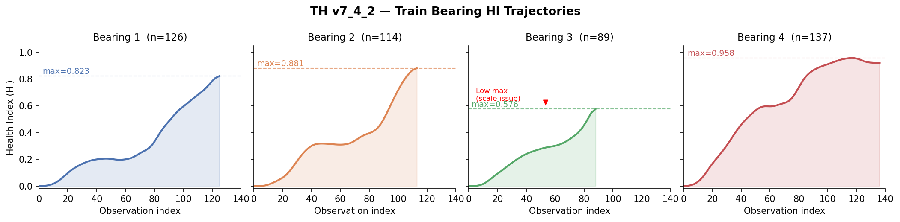
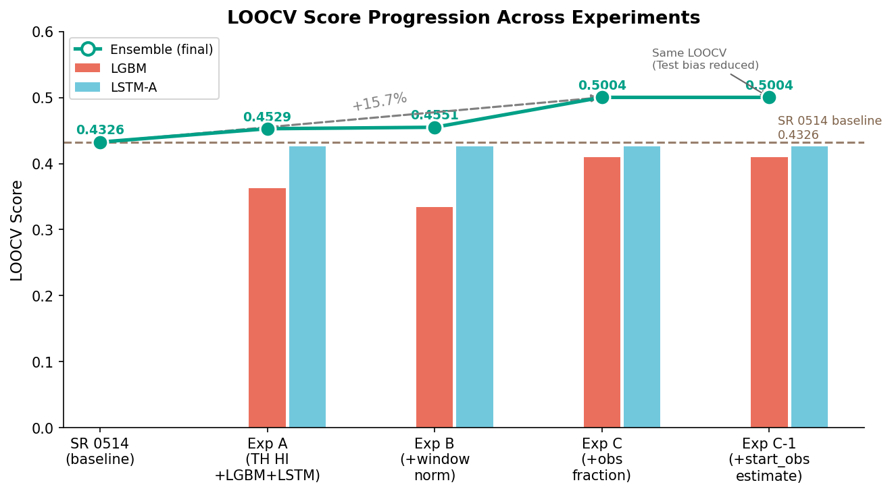
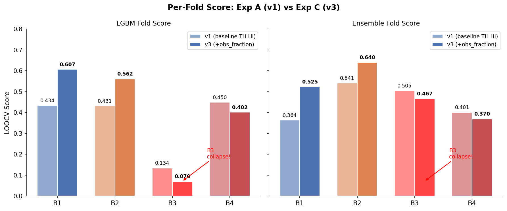
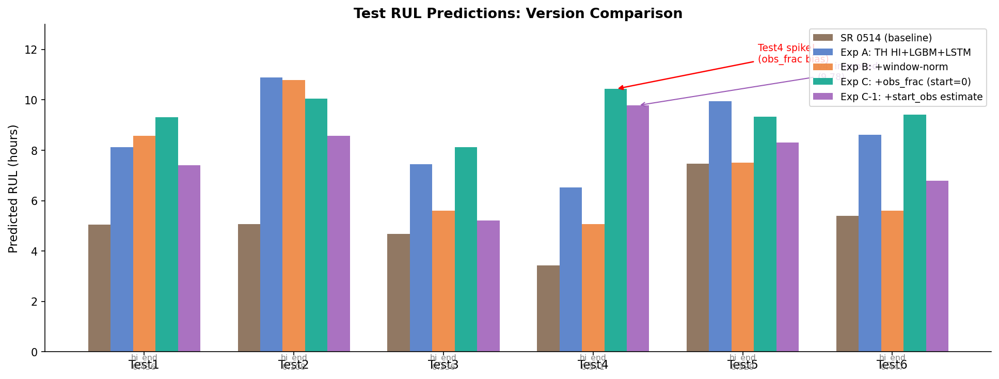
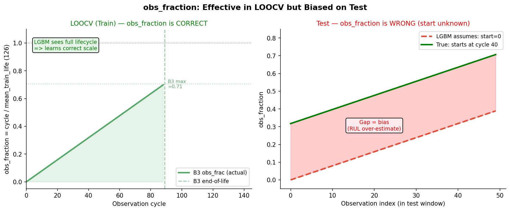
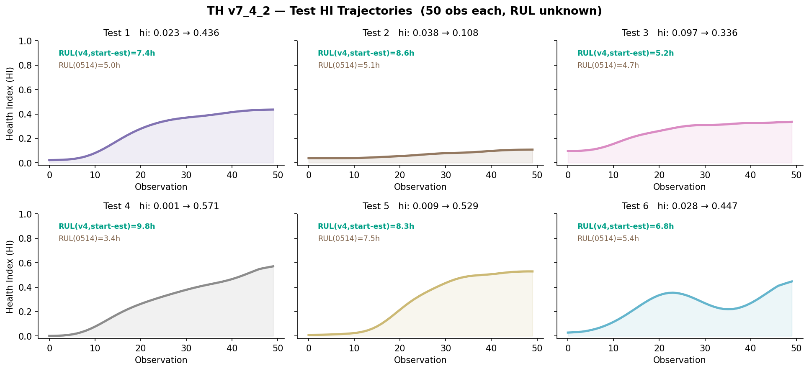

# SR/0518 Progress Log
**Date:** 2026-05-18 | **Branch:** tmp/seorang | **대회:** KSPHM 2026 Bearing RUL Prediction

---

## 1. SR/0514 기준 파이프라인

### 파이프라인 구성

```
[진동 신호] → [7개 피처 추출] → [그룹 가중합 HI] → [LGBM + LSTM-A 앙상블] → RUL (hr)
```

**7개 피처:**

| 그룹 | 피처 | 가중치 |
|---|---|---|
| highfreq | ch3_high_band, ch4_high_band | 0.43 |
| energy | ch3_total_power, ch3_energy | 0.41 |
| variation | ch3_rms, ch3_std, ch3_p2p | 0.41 / 0.37 |

- **HI baseline:** Train LOO (나머지 3개 베어링 평균)
- **Train Q-score:** 0.7311
- **RUL 앙상블:** LGBM(0.382) + LSTM-A(0.618), cf=0.76
- **LOOCV:** 0.4326

### 식별된 문제점

| # | 문제 | 영향 |
|---|---|---|
| P1 | 그룹 가중치 수동 튜닝 | HI 품질 제한 |
| P2 | Train Q 0.7311 → Test avg 0.612 갭 | 일반화 불안 |
| P3 | Test5: HI=0.995인데 RUL=7.46hr | 예측 역설 |
| P4 | LSTM-B 단독 0.4867 > 앙상블 0.4326 | LSTM-B 미포함 |
| P5 | LGBM B3 취약: HI 스케일 차이에 민감 | B3 예측 폭발 |

---

## 2. TH v7_4_2 분석

팀원 TH가 독립적으로 개발한 HI 생성기. Train Q-score **0.896** 달성.

SR과 TH가 독립적으로 동일한 7개 피처를 최종 선택 → 교차 검증됨.

### TH Train HI 궤적



**핵심 관찰:** B3 max HI = 0.576 (다른 베어링 0.82~0.96 대비 낮음). 빠른 열화 베어링이라 calibration이 충분히 끌어올리지 못한 것. → 이것이 LGBM B3 붕괴의 근본 원인.

### TH v7_4_2 구조: 이중분기 + 조건부 Boost

SR(단순 가중합)과 달리 TH는 피처를 두 가지 역할로 분리:

| Branch | 피처 | 역할 |
|---|---|---|
| **Main** | ch3_energy, ch3_rms, ch3_total_power, ch3_std, ch3_p2p | 에너지·변동 — 열화 시 증가 |
| **Aux** | ch3_high_band, ch4_high_band, ch3_mean_freq | 고주파 — 열화 시 감소 |

Main이 실패(열화 신호 미감지)할 때만 Aux가 조건부로 개입:

```
main_failure = 0.65 × fail_recent + 0.35 × fail_max   (threshold 0.18/0.22)
aux_reliable = 0.85 × aux_recent  + 0.15 × aux_max    (threshold 0.10/0.20)
gate         = 0.90 × main_failure × aux_reliable^0.5
hi_final     = (1-gate) × hi_main + gate × max(hi_main, aux_reflected)
```

**실제 동작 예 (Test2):** Main=0.043(실패) → gate=0.243 → hi_final=0.108 (Aux가 회복)

| 항목 | SR 0514 | TH v7_4_2 |
|---|---|---|
| HI 조합 | 수동 그룹 가중합 | 이중분기 + 조건부 boost |
| Baseline | Train LOO (타 3개 평균) | 자신의 초기 데이터 (regime별) |
| Highfreq | Main에 포함 | Aux로 분리 (조건부) |
| Train Q-score | 0.7311 | **0.896** |

---

## 3. 실험 A: TH HI → SR RUL 파이프라인 (`rul_th742.py`)

**질문:** TH의 더 좋은 HI를 SR RUL 모델에 넣으면 성능이 올라가는가?

### LOOCV 결과



TH HI + LGBM+LSTM-A 앙상블: **0.4326 → 0.4529 (+4.7%)**

### 폴드별 상세 및 B3 붕괴 발견



**LGBM B3 = 0.1344 (붕괴)** 원인:

- TH B3 max HI = 0.576 (낮음), B1/B2/B4 max = 0.82~0.96 (높음)
- LGBM이 B1/B2/B4로 학습: "HI = 0.5 → 아직 초반 → RUL 많이 남음"
- B3 예측 시: hi_last=0.5 → LGBM이 "초반"으로 판단 → RUL 과대예측

반면 LSTM-A는 window-minmax 정규화 덕분에 스케일 무관 → B3에서 0.4636 달성. 적응적 가중치가 자동으로 LSTM-A 비중을 높여 Ensemble B3 = 0.5054.

---

## 4. 실험 B: LGBM window-minmax 정규화 (`rul_th742_v2.py`)

**가설:** raw HI 값 → trend shape(상대값)으로 바꾸면 B3 스케일 문제 해결?

**결과:** Ensemble 0.4529 → 0.4551 (+0.002), B3 LGBM 0.1344 → 0.0916 (여전히 붕괴)

**원인 분석:** window-norm은 스케일은 제거하지만 **시간 위치 정보가 없음**.
- LSTM-A: `window_norm + obs_fraction` → "지금 cycle 80/89 = 말기"를 알 수 있음
- LGBM: `window_norm + hi_last` → B3에서 hi_last=0.5여도 여전히 "초반"으로 판단

→ 근본 해결책: LGBM에도 시간 위치 정보(obs_fraction) 추가 필요.

---

## 5. 실험 C: LGBM obs_fraction 추가 (`rul_th742_v3.py`)

**변경:** `obs_fraction = obs_idx / MEAN_TRAIN_LIFE` 추가 (피처 총 17개)

### LOOCV 결과: 대폭 개선


Ensemble LOOCV: 0.4551 → **0.5004 (+10%)**  
SR 0514 대비: 0.4326 → **0.5004 (+15.7%)**

**B1/B2 LGBM 대폭 개선 (+0.17, +0.13):** obs_fraction이 "지금 수명의 몇 %인가"를 알려줌.

**B3 LGBM 여전히 붕괴 (0.0705):**
- B3 수명 = 89 cycle, 평균 train 수명 = 126 cycle
- cycle 40에서 obs_frac = 40/126 = 0.32 → LGBM: "B1 기준 32% = 초반"
- B3 실제: 40/89 = 45% = 중반 → 하지만 LGBM은 이 차이를 알 수 없음

### Test 예측 비교



### 핵심 문제: Test에서 obs_fraction 편향



| | LOOCV (Train) | Test |
|---|---|---|
| 수명 시작 위치 | 알고 있음 (cycle 0부터) | **모름** (어느 시점에 잘렸는지 불명) |
| obs_fraction | 정확히 계산 가능 | start=0 가정 → **편향 발생** |
| 결과 | B1/B2 대폭 개선 | Test4 = 10.43hr 폭등 |

**LOOCV에서는 효과적이지만 Test에서는 편향** — LGBM이 "아직 수명 초반"으로 오판.

---

## 6. 실험 C-1: Test start_obs 역산 (`rul_th742_v4.py`)

**질문:** Test 베어링의 hi_start 값으로 Train 궤적에서 수명 위치를 역산하면 obs_frac 편향이 줄어드는가?

### 방법

```
1. Test 베어링의 첫 HI 값(hi_start)을 가져옴
2. Train 4개 베어링 각각에서 HI ≥ hi_start인 첫 번째 cycle을 찾음
3. 4개 평균 → start_obs 결정
4. obs_frac = (start_obs + i) / MEAN_TRAIN_LIFE
```

**예시 (Test3, hi_start=0.097):**
- B1에서 HI≥0.097 첫 cycle = 20
- B2=24, B3=21, B4=16 → 평균 **start_obs=20** (obs_frac₀=0.172)
- v3(start=0)에서는 obs_frac₀=0.0이었음

### Test 예측 결과

| Test | 0514 | v2 | **v4(start 추정)** | start_obs | obs_frac₀ | hi_start |
|---|---|---|---|---|---|---|
| 1 | 5.05 | 8.58 | **7.40** | 12 | 0.103 | 0.023 |
| 2 | 5.08 | 10.79 | **8.58** | 14 | 0.120 | 0.038 |
| 3 | 4.69 | 5.60 | **5.21** | 20 | 0.172 | 0.097 |
| 4 | 3.43 | 5.06 | **9.78** | 3 | 0.026 | 0.001 |
| 5 | 7.46 | 7.51 | **8.31** | 8 | 0.069 | 0.009 |
| 6 | 5.40 | 5.61 | **6.79** | 12 | 0.103 | 0.028 |

**LOOCV: 0.5004 (v3와 동일)** — LOOCV는 Train이므로 start_obs=0이 올바름. ✅


### 한계: Test4

`hi_start=0.001` → Train에서도 수명 3번째 cycle에 해당 → `start_obs=3` (obs_frac₀=0.026)
→ LGBM이 여전히 "거의 초반"으로 판단 → **9.78hr 과대예측 지속**

**근본 원인:** hi_start가 낮은 베어링은 HI 역산 방법 자체가 통하지 않음.
Test4는 수명 초반부터 관측 시작했거나, HI 자체가 특이한 패턴일 가능성.

---

## 7. 전체 실험 요약

### LOOCV 점수 진화

| Config | LGBM avg | LSTM-A avg | Ensemble | vs SR 0514 |
|---|---|---|---|---|
| SR 0514 baseline | — | — | 0.4326 | — |
| Exp A: TH HI + LGBM+LSTM | 0.3625 | 0.4261 | 0.4529 | +4.7% |
| Exp B: +window-norm | 0.3345 | 0.4261 | 0.4551 | +5.2% |
| **Exp C: +obs_fraction** | **0.4102** | **0.4261** | **0.5004** | **+15.7%** |
| Exp C-1: +start_obs 역산 | 0.4102 | 0.4261 | 0.5004 | +15.7% (LOOCV 동일) |

### Test HI 궤적 (TH v7_4_2)



### 핵심 딜레마 (업데이트)

obs_fraction은 LOOCV에서 +15.7%를 만들었지만 Test에서 편향.
start_obs 역산(C-1)으로 Test1/2/3/5/6은 안정화됐으나 **Test4(hi_start≈0)는 미해결**.

---

## 8. 다음 실험 후보

### ~~C-1. Test obs_fraction 추정 보정~~ ✅ 완료
구현 완료 (v4). Test4(hi_start≈0) 문제는 미해결 — hi_start가 낮으면 역산 불가.

### C-2. Test4 전용 처리
- hi_start < threshold인 경우 obs_frac을 고정값(예: 0.0) 또는 hi_end 기반 추정으로 대체
- 또는 LGBM 가중치를 낮추고 LSTM-A 비중을 높임 (LSTM-A는 스케일 무관)

### D. SR HI에 TH 이중분기 구조 도입
- SR FDR 기반으로 main(energy+variation) / aux(highfreq) 분리
- TH v7_4_2 수준 Train Q 목표 (현재 0.7311 → 0.896)

### E. 3-model Ensemble
- TH HI → LGBM + LSTM-A + LSTM-B
- 0514 이력: LSTM-B 단독 0.4867, 3-model에서 0.5937 달성

---

## 파일 구조

```
SR/0518/
├── progress.md
├── make_figures.py
├── figures/
│   ├── fig1_train_hi.png           ← TH Train HI 궤적
│   ├── fig2_test_hi.png            ← TH Test HI 궤적 + RUL 예측
│   ├── fig3_loocv_progression.png  ← 실험별 LOOCV 진화
│   ├── fig4_fold_scores.png        ← 폴드별 v1 vs v3 비교
│   ├── fig5_test_rul.png           ← 버전별 Test RUL 비교
│   └── fig6_obs_frac_dilemma.png  ← obs_fraction LOOCV vs Test 문제
└── rul/
    ├── code/
    │   ├── rul_th742.py         ← Exp A
    │   ├── rul_th742_v2.py      ← Exp B
    │   ├── rul_th742_v3.py      ← Exp C (+obs_fraction)
    │   └── rul_th742_v4.py      ← Exp C-1 (+start_obs 역산)
    └── output/
        ├── th742/               ← Exp A 결과
        ├── th742_v2/            ← Exp B 결과
        ├── th742_v3/            ← Exp C 결과
        └── th742_v4/            ← Exp C-1 결과
```
