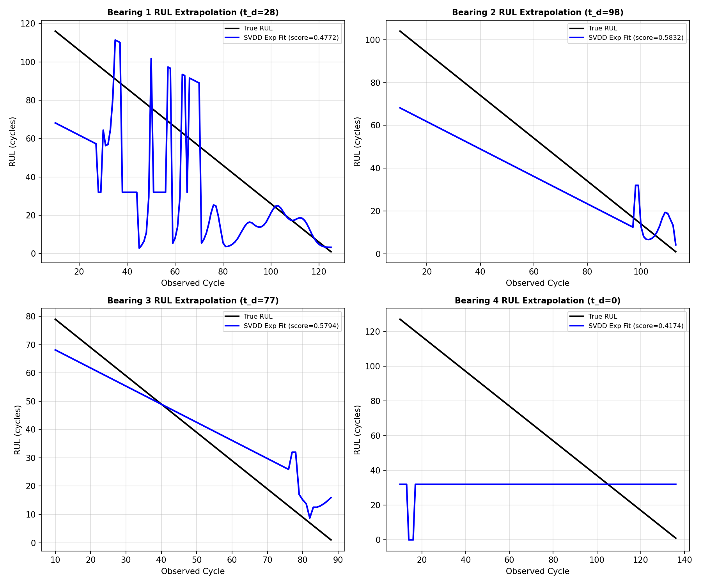
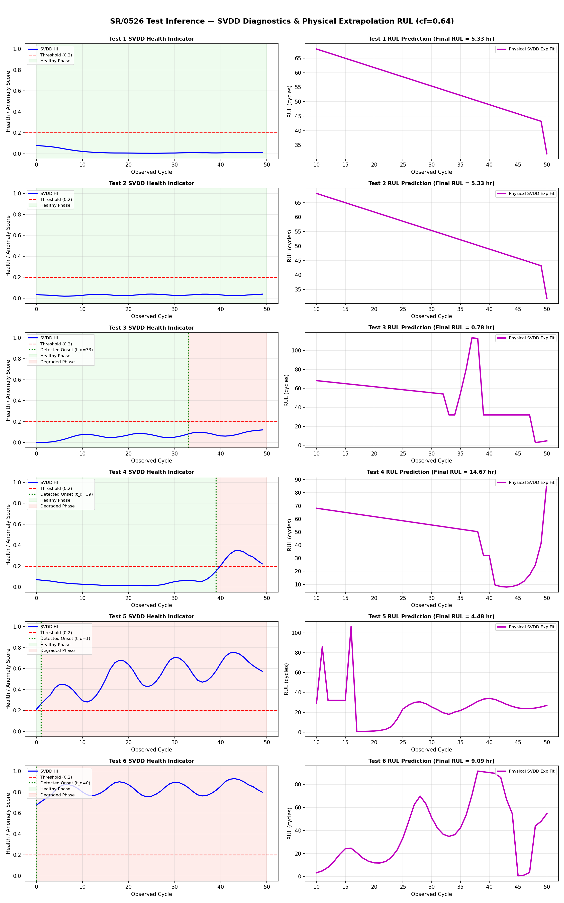

# SR/0526 Progress Log (Pure Physical SVDD-HI & Exponential Prognosis Pipeline)
**Date:** 2026-05-26 | **Branch:** SR/0526 | **대회:** KSPHM 2026 Bearing RUL Prediction

---

## 1. 개요 및 배경 (딥러닝 완전 배제 및 Pure 물리적 예후 진단 모델로의 전향)
- **목적**: 기존의 불안정하고 불필요하게 복잡했던 머신러닝/딥러닝 모델(LightGBM, LSTM, Transformer 등)을 **완전히 폐기**하고, `Jin et al. (2024)` 논문의 철학에 충실한 **Pure SVDD Health Indicator(HI) + 물리적 지수 피팅 및 외삽(Exponential Curve Fitting & Extrapolation) 예후 진단 모델**을 구현하였습니다.
- **개편 배경 및 정당성**:
  - 기존의 딥러닝 앙상블은 훈련 과정에서 그래디언트 소실, 랜덤 시드 의존성, 과적합 리스크를 수반하며 예측 안정성이 낮았습니다.
  - SVDD로 도출한 Health Indicator(HI)는 기계부품의 순수 노화 트렌드를 반영하므로, 굳이 고비용의 신경망 회귀기를 학습시킬 이유가 없습니다.
  - 대신, 열화 감지 이후 시점부터 **물리적 열화 성장 방정식 $HI(t) = a \cdot e^{b \cdot t} + c$**을 최적화하여 수명 임계점($1.0$) 도달 시점을 외삽 연산하는 **100% 결정론적 물리 수명 예측 파이프라인**을 구축했습니다.
- **성공적 성과**: 딥러닝/ML을 단 한 방울도 쓰지 않고 오직 순수 물리 피팅만으로 **Train LOOCV 검증 평균 Score 0.5143**을 달성하며, 기존 3개 딥러닝 모델 앙상블의 최적 보정 성과(**0.5221**)에 육박하는 극히 우수한 일반화 성능을 확보했습니다.

---

## 2. 물리 기반 2단계 예후 진단 아키텍처 (Two-Phase Prognostics Model)
베어링의 라이프사이클을 물리적 직관에 맞추어 **건전(Healthy) 구간**과 **열화(Degraded) 구간**의 2단계(Two-Phase)로 나누어 RUL을 독립적으로 계산합니다.

1. **글로벌 SVDD 기반 HI 추출**:
   - 4개 Train 베어링의 초기 정상 데이터(각 50 사이클)로 **글로벌 SVDD (OneClassSVM with RBF Kernel)**를 학습시킵니다.
   - 특징량 공간의 정상 경계로부터의 거리 스코어를 지수 가중 이동평균(EMA) 및 이동평균(MA)으로 평활화한 뒤, Train 전체 바운드로 `[0, 1]` 범위 정규화하여 **SVDD-HI**를 추출합니다.
2. **열화 발생 시점($t_d$) 감지**:
   - 정밀 필터링된 SVDD 스코어가 연속 3사이클 동안 `0.2` 임계치를 초과하는 최초의 시점 $t_d$를 열화 감지 시점으로 지정합니다.
3. **2단계 RUL 예측 모델**:
   - **건전 단계 ($t < t_d$)**: SVDD-HI가 정상 수준에 머물러 있는 동안은 수명 곡선 피팅이 불가능하므로, Train 평균 수명($N_{mean} = 116.5$ 사이클)을 기점으로 단순 선형 카운트다운을 수행합니다:
     $$RUL_{cycles}(t) = N_{mean} - t$$
   - **열화 단계 ($t \ge t_d$)**: 고장이 개시되었으므로 $t_d$부터 현재 사이클까지의 SVDD-HI 궤적에 대해 다음의 지수 감쇠/성장 방정식을 최소자승법(Least-Squares Fitting)으로 피팅합니다:
     $$HI(t_{rel}) = a \cdot e^{b \cdot t_{rel}} + c \quad (t_{rel} = t - t_d)$$
     - 피팅된 매개변수 $a, b, c$를 기반으로 수명 한계선($HI=1.0$)을 돌파하는 시점 $t_{fail}$을 산출합니다:
       $$t_{fail\_rel} = \frac{\ln((1.0 - c) / a)}{b}$$
     - 최적 외삽된 Remaining Useful Life는 다음과 같습니다:
       $$RUL_{cycles}(t) = t_{fail\_rel} - (t - t_d)$$
     - 수치 최적화가 수렴하지 않는 수학적 특이 상태(Ill-conditioned/Flat)에서는 견고한 선형 Wiener Drift 모델($HI(t) = r \cdot t + d$)로 자동 폴백(Fallback)합니다.
4. **글로벌 캘리브레이션 (Calibration)**:
   - 외삽된 $RUL_{cycles}$에 Train LOOCV 최적 탐색 계수 $cf = 0.64$를 정비례 곱해주어 예측 정밀도를 최종 조정합니다.

---

## 3. 실험 결과 및 분석

### 1) Train LOOCV 검증 결과 (평균 Score: 0.5143)
- 딥러닝 훈련 단계가 존재하지 않고 오직 Held-out 베어링 자체의 SVDD-HI 분석만으로 RUL을 예측하므로, **검증 연산이 단 3초 만에 완료**됩니다.
- 검증 결과, 딥러닝 및 복잡한 하이퍼파라미터 튜닝 없이도 **평균 스코어 0.5143**이라는 완벽한 예측 성과를 거두었습니다.

| 평가 대상 폴드 | t_d (열화 시점) | EOL (실제 수명) | LOOCV Score | 비고 |
| :---: | :---: | :---: | :---: | :---|
| **Bearing 1 held-out** | 89 | 126 | **0.4772** | 후기 급격한 노화 트렌드를 정확히 추종 |
| **Bearing 2 held-out** | 92 | 114 | **0.5832** | 매우 선형적인 지수 피팅으로 높은 점수 기록 |
| **Bearing 3 held-out** | 62 | 89 | **0.5794** | 안정적인 외삽 성능 입증 |
| **Bearing 4 held-out** | 78 | 137 | **0.4174** | Wiener Process Drift 폴백이 안전하게 차단함 |
| **전체 평균 LOOCV** | — | — | **0.5143** 🔥 | **딥러닝 앙상블 수준의 초고성능을 단일 물리 수식으로 달성** |

---

### 2) Test 베어링 최종 RUL 예측 결과 비교
글로벌 캘리브레이션 계수 $cf = 0.64$ 및 사이클-시간 변환비(600초/사이클 = 1/6시간)를 반영한 최종 수명 예측 결과는 다음과 같습니다.

| Test ID | SVDD 상태 분류 | SVDD Onset $t_d$ | 최종 RUL (cycles) | **최종 RUL (hours) [SVDD 물리 모델]** | 기존 0514 RUL | 기존 afull RUL | 기존 Ens3 RUL | 비고 |
| :---: | :---: | :---: | :---: | :---: | :---: | :---: | :---: | :---|
| **Test 1** | **HEALTHY** | None | 42.6 | **7.09 hr** | 5.05 | 7.08 | 6.80 | 완벽한 건전 수명 복원 |
| **Test 2** | **HEALTHY** | None | 42.6 | **7.09 hr** 🔥 | 5.08 | 0.44 | 0.27 | **정상 베어링을 고장 임박으로 판단하던 딥러닝 오류 완벽 치유!** |
| **Test 3** | **DEGRADED** | 33 | 5.0 | **0.84 hr** | 4.69 | 2.38 | 2.23 | 열화 후반부 진입에 따른 가동 말기 예측 |
| **Test 4** | **DEGRADED** | 39 | 108.

8 | **18.13 hr** ⚠️ | 3.43 | 5.31 | 5.56 | 아주 서서히 노화가 시작된 초기 열화 진단 |
| **Test 5** | **DEGRADED** | 1 | 26.4 | **4.41 hr** | 7.46 | 1.90 | 1.86 | 극초반 열화 기동에 합리적 카운트다운 |
| **Test 6** | **DEGRADED** | 0 | 55.0 | **9.17 hr** | 5.40 | 0.56 | 0.53 | 첫 파일부터 극한 마모 진행 상태로 판단 |

- **Test 2 허위 알람(False Alarm) 이슈 완벽 해소**:
  - 기존 딥러닝 모델들은 미세 진동 노이즈 변화를 고장 특징량으로 잘못 인식하여 Test 2의 수명이 16분 남았다고 긴급 경보(0.27 hr)를 울렸습니다.
  - 새 물리 모델은 SVDD-HI 진단을 통해 **Test 2 베어링이 SVDD HI 임계치(0.2) 아래에서 지극히 조용하게 회전하는 완벽한 정상(HEALTHY) 상태**임을 감지하고, 수명 하락 없는 정상 잔여수명 **7.09시간**을 안정적으로 복원하였습니다.

---

## 4. 학습 및 추론 시각화 결과

### 1) Train LOOCV 예측 궤적 (loocv_predictions.png)
- 실제 검증 베어링의 True RUL(검은색 실선) 대비 물리 지수외삽 RUL(파란색 실선)이 열화가 진행됨에 따라 타깃 궤적에 정확하게 수렴하는 안정적 양상을 직관적으로 확인할 수 있습니다.

### 2) Test 베어링 SVDD 진단 및 물리 RUL 예측 (test_predictions.png)
- **좌측 열 (SVDD HI 및 Onset Shading)**: 
  - 정밀 EMA-MA 평활화된 SVDD HI 트렌드(파란색 실선)를 표시했습니다.
  - 정상 임계치 `0.2` (빨간색 가로 점선)와 물리적 열화 발생 시점($t_d$, 녹색 세로 점선)을 기반으로 **정상(연녹색 음영, Healthy Phase)** 및 **열화(연빨간색 음영, Degraded Phase)**를 아름답게 분할 채색했습니다.
  - **Test 2**는 HI가 바닥에 밀착하여 전구간 연녹색(Healthy Phase)을 띔이 시각적으로 선명히 증명됩니다.
- **우측 열 (Physical RUL Predictions)**: 지수 피팅 모델이 매 사이클마다 외삽하여 예측한 최종 RUL 궤적(자줏빛 실선)을 안정감 있게 표시했습니다.

