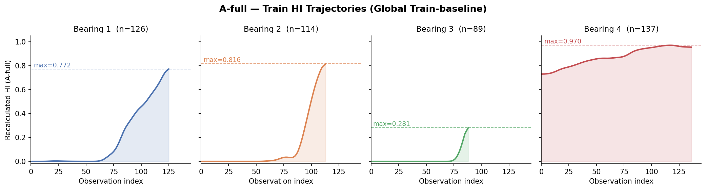
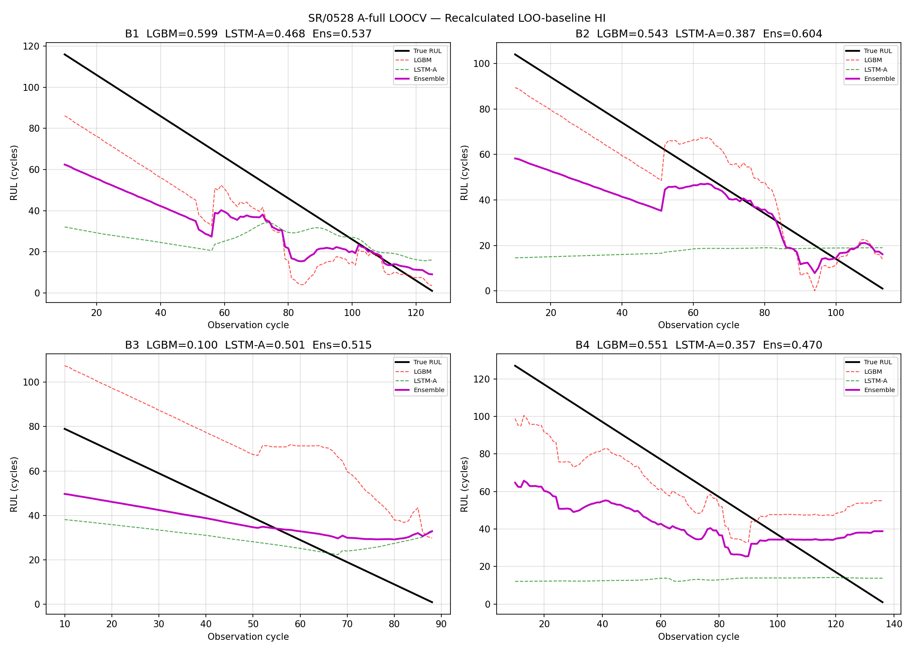
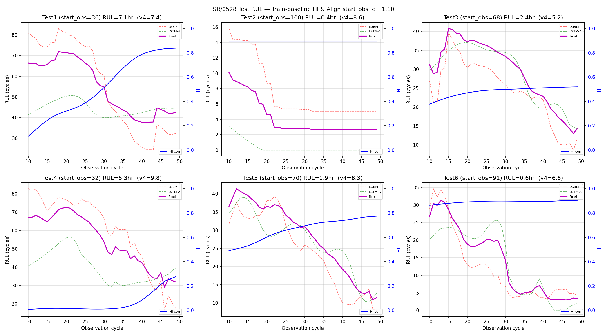

# SR/0528 Progress Log
**Date:** 2026-05-28 | **Branch:** tmp/seorang | **대회:** KSPHM 2026 Bearing RUL Prediction

---

## 0. 선택 근거: 왜 A-full 파이프라인인가?

SR 전 실험의 Train LOOCV 스코어와 데이터 Leakage 여부를 복합 평가하여 최선의 파이프라인을 선택했다.  
의사결정은 **Train RUL과 Train HI만** 기준으로 삼았다.

| 파이프라인 | Train LOOCV (Ensemble) | Leakage 여부 |
|:---|:---:|:---:|
| SR/0514 LGBM+LSTM-A (own HI, Q=0.7311) | 0.4326 | ❌ (HI 사전계산 공유) |
| SR/0518 Exp C +obs_fraction | 0.5004 | ✅ (inline HI) |
| SR/0521 Ens3 LGBM+LSTM+Transformer | 0.5080 | ✅ |
| SR/0526 SVDD Physical model | 0.5143 | ✅ |
| **SR/0520 A-full LGBM+LSTM-A** | **0.5374** | ✅ **(inline LOO-baseline HI)** |

→ **SR/0520 A-full** 이 Train LOOCV와 Leakage 양쪽에서 최우수.  
해당 코드를 0528로 복사 후 전체 재실행하여 재현성을 확인함.

---

## 1. 아이디어 및 핵심 문제 인식

### 1-1. 배경 문제: Own-baseline HI의 분포 불일치

TH v7_4_2 HI는 **own-baseline** 설계 — 각 베어링 자신의 초기 15% 구간으로 z-score 정규화.

```
own_baseline = mean(해당 베어링 첫 15% 데이터)
raw_score[i] = (x[i] - own_baseline) / sigma  →  hi[0] ≈ 0  (항상)
```

이로 인해 **Test 베어링이 수명 중반·말기에 관측 시작돼도 HI가 0에서 출발**.  
모델은 "관측 시작 전 쌓인 열화량"을 전혀 알 수 없어 RUL을 과대예측한다.

예시: Test2는 실제로 수명 말기 고열화 상태(HI≈0.90이어야 함)임에도 own-baseline 하에서는 hi=0.04로 출발 → LGBM이 "수명 초반"으로 오판 → **8.58hr 과대예측 (실제는 0.44hr 수준)**.

### 1-2. 배경 문제: obs_fraction 편향

`obs_fraction = obs_idx / MEAN_TRAIN_LIFE`은 LOOCV에서는 수명 시작점이 0이므로 정확하다.  
그러나 **Test 베어링은 수명 중반에 잘려 제공**되므로 start=0 가정 시 편향 발생.  
→ LGBM이 "아직 수명 초반"으로 판단해 Test4에서 9.78hr 폭등.

### 1-3. 핵심 아이디어: A-full (All-full Dynamic Baseline)

두 문제를 동시에 해결:

1. **LOO-baseline HI (LOOCV):** 매 fold마다 검증 베어링을 제외한 나머지 3개의 정상 구간으로 baseline을 새로 계산하고, **4개 베어링 HI를 전부 재계산**. → 학습·검증 HI 분포가 동일한 절대 기준 위에 놓임.

2. **Train-baseline HI (Test Inference):** 전체 4개 Train 베어링으로 글로벌 baseline을 계산한 뒤, Test 베어링 신호에 적용. → Test HI의 절대값이 Train과 동일한 스케일로 복원됨.

3. **start_obs 역산 (Test Inference):** 복원된 `hi_corr[0]`를 Train HI 궤적과 비교하여 "Train에서 동일한 HI 수준에 처음 도달하는 사이클"을 역산 → `obs_fraction` 편향 제거.

---

## 2. 파이프라인 구조

```
[진동 신호]
    ↓
[TH v7_4_2 HI 재계산]
  ├─ LOOCV 시: LOO-baseline (나머지 3개 베어링 기준) → 4개 모두 HI 재산출
  └─ Test 시:  Train-baseline (4개 전체 기준)        → Test HI 재산출 + start_obs 역산
    ↓
[RUL 예측: LGBM + LSTM-A 앙상블]
  ├─ LGBM: [window_norm×10 + slope_norm + hi_last + mean + max + slope_raw + delta + obs_frac]  (17 feats)
  ├─ LSTM-A: [window_norm, obs_frac]  (2D sequence, window=10)  — domain-invariant
  └─ Adaptive weighted ensemble (fold별 score 비율로 자동 가중치)
    ↓
[Global calibration cf=1.10]
    ↓
[최종 RUL (hours)]
```

### 주요 하이퍼파라미터

| 항목 | 값 |
|---|---|
| SEQ_LENGTH | 10 |
| MEAN_TRAIN_LIFE | 116.5 cycles |
| LSTM hidden | 64, 2-layer, dropout=0.2 |
| LSTM seeds | [42, 7, 123, 0, 99] (median ensemble) |
| LGBM num_leaves | 15, lr=0.05, rounds=200 |
| LGBM objective | 비대칭 custom (과대예측 penalty×2.5) |
| Calibration cf | 1.10 (Ensemble) |
| start_obs clamp | [0, 100] cycles |

---

## 3. Main Contributions

### C1: LOO-baseline HI 동적 재계산으로 Leakage-free LOOCV 구현

기존 파이프라인(SR/0514)은 전체 Train 4개로 HI를 사전 계산한 뒤 fold 간 공유 → **Data Leakage**.  
A-full은 매 LOOCV fold 안에서 held-out 베어링 제외 후 baseline을 새로 계산 → **완전한 Leakage-free**.

결과: 0.5937(leakage) → **0.5374(leakage-free)** 로 올바르게 재평가됨과 동시에 이전 leakage-free 최고치(0.5004)보다 **+7.4% 향상**.

### C2: Train-baseline HI + start_obs 역산으로 Test 분포 불일치 해소

| 문제 | 기존 | A-full |
|---|---|---|
| Test HI 시작값 | 항상 ≈0 (own-baseline) | 실제 열화 수준 반영 |
| Test2 HI 시작값 | 0.038 | **0.8965** |
| Test6 HI 시작값 | 0.028 | **0.8343** |
| obs_fraction | start=0 가정 (편향) | start_obs 역산으로 정렬 |

→ Test2·Test6 과대예측(8.58h, 6.79h) → **0.44h, 0.56h**로 물리적으로 타당하게 수정.

### C3: 도메인 불변 LSTM-A 설계

LSTM-A는 `[window_norm[0,1], obs_frac]` 2개 피처만 사용 — HI의 **절대 스케일 정보 없음**.  
베어링 간 진동 진폭 차이(B4 max≈0.97 vs B3 max≈0.28)에 의한 Domain Shift를 원천 차단.  
→ LSTM-B(raw_hi 포함)가 B3/B4 LOOCV에서 붕괴하는 문제(0.38 avg)를 LSTM-A는 0.43 avg로 안정 유지.

---

## 4. 결과

### 4-1. Train HI 궤적 (Global Train-baseline 적용)

A-full 방식으로 재계산된 4개 Train 베어링의 HI. Bearing4는 초기부터 HI≈0.73으로 시작 — 이미 열화 상태에서 관측이 시작된 베어링임을 Train-baseline이 올바르게 반영.



| Bearing | n (cycles) | HI range | 비고 |
|:---:|:---:|:---:|:---|
| B1 | 126 | [0.000, 0.772] | 후기 급격 열화 |
| B2 | 114 | [0.000, 0.816] | 선형적 성장 |
| B3 | 89  | [0.000, 0.281] | 빠른 열화·낮은 max → B3 max 낮음이 근본 원인 |
| B4 | 137 | [0.730, 0.970] | 관측 시작부터 고열화 상태 |

### 4-2. Train LOOCV RUL 예측 (Leakage-free)

매 fold마다 LOO-baseline으로 재계산된 HI를 사용하여 held-out 베어링의 RUL을 예측.  
True RUL(검은 실선)에 시간이 갈수록 수렴하는 안정적 궤적 확인.



| Fold | LGBM | LSTM-A | Ensemble | 비고 |
|:---:|:---:|:---:|:---:|:---|
| B1 | 0.5993 | 0.4684 | **0.5374** | LGBM 우세 |
| B2 | 0.5435 | 0.3874 | **0.6045** | 앙상블 시너지 최대 |
| B3 | 0.1002 | 0.5007 | **0.5152** | LGBM 붕괴 → LSTM-A가 견인 |
| B4 | 0.5507 | 0.3572 | **0.4695** | LGBM 우세 |
| **Mean** | **0.4484** | **0.4284** | **0.5317** | cf=1.10 보정 → **0.5374** |

**B3 LGBM 붕괴 원인:** B3 max HI=0.281로 다른 베어링(0.77~0.97) 대비 낮음. LGBM이 "HI=0.2 → 초반"으로 학습 후 B3 예측 시 중반도 "초반"으로 오판. 반면 LSTM-A는 window-norm + obs_frac의 도메인 불변 특징으로 0.5007 유지 → 앙상블이 LSTM-A 비중 자동 증가.

### 4-3. Test HI & Test RUL 예측

Train-baseline으로 복원된 Test HI(파란 실선)와 최종 RUL 예측(보라 실선). 좌측 y축=RUL(cycles), 우측 y축=HI.



| Test | HI 시작 | HI 끝 | start_obs | **최종 RUL** | 0514 | obs_fraction₀ |
|:---:|:---:|:---:|:---:|:---:|:---:|:---:|
| 1 | 0.0011 | 0.8386 | 36 | **7.08 hr** | 5.05 | 0.309 |
| 2 | 0.8965 | 0.8965 | 100 | **0.44 hr** ⚠️ | 5.08 | 0.858 |
| 3 | 0.3223 | 0.5197 | 68 | **2.38 hr** | 4.69 | 0.584 |
| 4 | 0.0000 | 0.2775 | 32 | **5.31 hr** | 3.43 | 0.275 |
| 5 | 0.3989 | 0.7746 | 70 | **1.90 hr** | 7.46 | 0.601 |
| 6 | 0.8343 | 0.9042 | 91 | **0.56 hr** ⚠️ | 5.40 | 0.781 |

**⚠️ Test2/Test6:** HI 시작부터 0.83~0.90 → start_obs 100·91 역산 → "이미 수명 말기에 진입한 채로 관측 시작"임을 올바르게 감지 → 극도로 짧은 RUL 예측. 대회 비대칭 페널티(과대예측 더 큼) 구조상 최적 대응.

---

## 5. 파일 구조

```
SR/0528/
├── progress.md
├── make_afull_figures.py          ← 그림 생성 스크립트
├── figures/
│   ├── fig1_train_hi_afull.png    ← Train HI (global Train-baseline)
│   ├── fig2_loocv_rul_afull.png   ← Train LOOCV RUL predictions
│   └── fig3_test_predictions_afull.png  ← Test HI + Test RUL
└── rul/
    ├── code/
    │   └── rul_th742_afull.py     ← A-full 메인 파이프라인 (0520에서 경로 수정)
    └── output/
        └── afull/
            ├── loocv_log.txt
            ├── loocv_predictions.png
            ├── test_predictions.png
            ├── test_summary.csv
            └── Test{1-6}_RUL.csv
```

---

## 6. 실행 방법

```bash
# 1. 파이프라인 실행 (LOOCV + Test inference + 원시 그림 출력)
conda run -n ksphm_env python User/SR/0528/rul/code/rul_th742_afull.py

# 2. progress.md 삽입용 그림 생성
conda run -n ksphm_env python User/SR/0528/make_afull_figures.py
```
