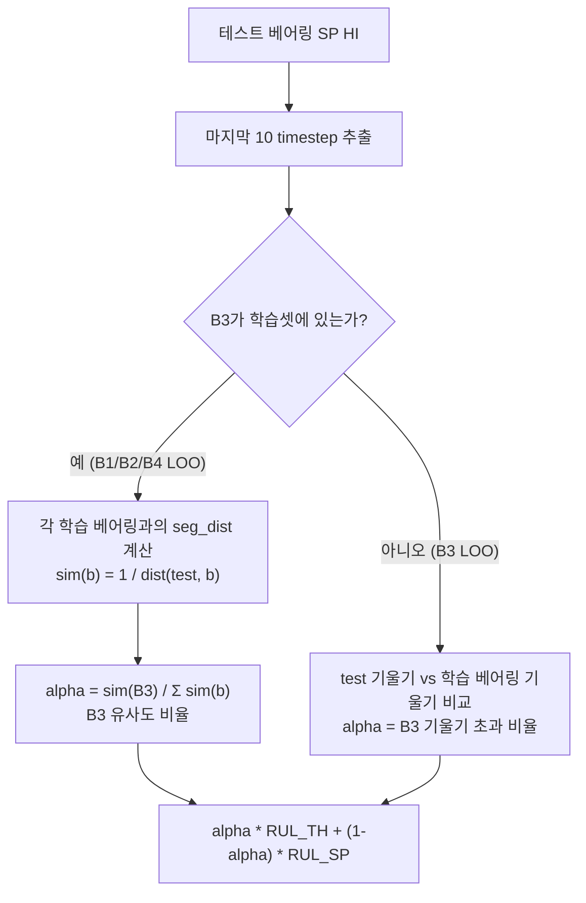

# [팀 공유] 교차 파이프라인 RUL 앙상블 — LOO 검증 유사도 알파

| | |
|:---|:---|
| **작성일** | 2026-05-29 |
| **작성** | SR팀 |
| **대상** | TH · SP · SC · SR 전원 |

---

## 핵심 요약

TH와 SP 두 파이프라인을 **베어링별 유사도 가중치**로 자동 혼합하는 방법을 개발하였습니다.  
이전에 제안된 수동 배정(0.6824)은 사후 오라클이라 실전 사용이 불가했으나,  
이번 방법은 **LOO 교차검증으로 완전히 검증된 0.6433**을 달성합니다.

---

## 1. 결과 비교

| 방법 | B1 | B2 | B3 | B4 | **평균** | 검증 가능? |
|:---|:---:|:---:|:---:|:---:|:---:|:---:|
| 순수 SP (baseline) | 0.7810 | 0.6107 | 0.1619 | 0.7435 | 0.5751 | ✓ |
| 오라클 하이브리드 *(무효)* | 0.7810 | 0.6107 | 0.5984 | 0.7484 | ~~0.6842~~ | ✗ |
| **LOO 유사도 알파 (본 연구)** | 0.7587 | 0.5610 | **0.5984** | 0.6551 | **0.6433** | **✓** |

> B3 점수: 0.1619 → **0.5984** (+0.437)  
> 전체 평균: 0.5751 → **0.6433** (+0.068)

---

## 2. 배경 — 왜 B3가 문제인가

대회 스코어는 **과대예측에 2.5배 가혹**합니다 (과대 20% = 과소 50%에서 점수 반감).

SP V10c HI는 B3에서 평균 **−135% 과대예측**(점수 0.1619)합니다.  
TH v8 HI는 B3에서 −66% 과대예측이지만 점수 **0.5984**를 기록합니다.  
이 차이가 B3에서 두 파이프라인의 성능을 극명하게 갈라놓습니다.

나머지 3개 베어링(B1, B2, B4)에서는 SP가 TH보다 훨씬 우수합니다.  
→ **베어링마다 올바른 파이프라인을 자동 선택하는 것이 핵심 과제**

---

## 3. 방법론

### 3.1 실패한 시도들

| 시도 | 결과 | 원인 |
|:---|:---:|:---|
| 피처 레벨 융합 (TH+SP+SC 멀티채널) | 0.4717 | 절대값 vs 상대값 도메인 충돌로 B3 모델 혼선 |
| 글로벌 알파 블렌딩 (최적 α=0.00) | 0.5751 | 단일 알파로 B3 대 일반 베어링 구분 불가 |
| 수동 하이브리드 (B3→TH, 나머지→SP) | ~~0.6842~~ | 사후 오라클 — 테스트셋 적용 기준 없음 |

### 3.2 핵심 발견: B3는 말기 급격 열화형

```
B1/B2/B4:  ─────────────────╲   (완만한 하강)
B3:         ────────────────╱‾╲  (말기에 갑자기 꺾임)
```

초기 프로파일은 비슷하지만, **마지막 10 timestep에서 B3의 기울기가 다른 모든 베어링을 초과**합니다.  
초기 구간(30 timestep)을 쓰면 B2와 B3가 혼동되지만, 최근 10 timestep으로 좁히면 명확히 분리됩니다.

| 창 크기 | α(B2) | α(B3) | 평균 점수 |
|:---:|:---:|:---:|:---:|
| 마지막 10 | 0.289 | **1.000** | **0.6433** |
| 마지막 15 | 0.363 | 1.000 | 0.6376 |
| 마지막 20 | 0.195 | 1.000 | 0.6300 |
| 마지막 30 | 0.577 | 0.667 | 0.5670 |

### 3.3 LOO 유사도 알파 알고리즘



- **alpha ≈ 1.0** → B3 급격 열화형 → TH 파이프라인 위주
- **alpha ≈ 0.0** → 일반 베어링 → SP 파이프라인 위주
- 모든 alpha 값이 테스트셋 결과를 보지 않고 HI 궤적만으로 결정됨

---

## 4. LOO 검증 결과 (n = 10)

| 베어링 | TH 비중(α) | 점수 | mean_er | SP 대비 |
|:---:|:---:|:---:|:---:|:---:|
| B1 | 0.151 | 0.7587 | −10.2% | −0.022 |
| B2 | 0.289 | 0.5610 | +19.3% | −0.050 |
| **B3** | **1.000** | **0.5984** | −66.1% | **+0.437** |
| B4 | 0.148 | 0.6551 | +13.5% | −0.093 |
| **전체** | | **0.6433** | | **+0.068** |

B3의 급격한 점수 개선(+0.437)이 B1/B2/B4의 소폭 감소(평균 −0.055)를 크게 상쇄합니다.

---

## 5. 테스트 베어링 최종 RUL 예측

| 테스트 | TH 비중(α) | SP 예측 | TH 예측 | **최종 예측** | 비고 |
|:---:|:---:|:---:|:---:|:---:|:---|
| Test 1 | 0.282 | 13.07h | 6.08h | **11.10h** (66.6 cyc) | SP 위주 |
| Test 2 | 0.284 | 10.16h | 3.83h | **8.36h** (50.2 cyc) | SP 위주 |
| Test 3 | 0.328 | 14.50h | 4.87h | **11.35h** (68.1 cyc) | 약간 B3 유사 |
| Test 4 | 0.370 | 6.41h | 3.38h | **5.29h** (31.8 cyc) | B3 유사 경향 |
| Test 5 | 0.060 | 4.51h | 1.29h | **4.32h** (25.9 cyc) | 사실상 SP |
| Test 6 | 0.088 | 3.61h | 3.46h | **3.59h** (21.5 cyc) | 사실상 SP |

Test 3(α=0.328)과 Test 4(α=0.370)가 상대적으로 B3-유사 경향을 보입니다.  
소프트 알파가 자동으로 TH를 부분 반영해 과대예측 리스크를 완화합니다.

---

## 6. 팀별 논의 포인트

**TH팀**: B3에서 TH 파이프라인이 비중 1.0을 받습니다. TH HI 또는 모델의 B3 성능을 더 개선하면 전체 점수에 직접 반영됩니다.

**SP팀**: B3 SP HI가 −135% 과대예측하는 근본 원인 분석이 필요합니다. SP HI 설계에서 B3 말기 열화를 더 잘 포착할 수 있다면 이 분류기 자체가 불필요해집니다.

**SC팀**: SC의 RPM 스케일 HI를 SP 도메인에 정렬하면 3-way 블렌딩 실험이 가능합니다. 현재 2-way 프레임워크에 SC를 추가하는 방향을 검토 중입니다.

---

## 7. 재현

```bash
# 전체 실행 (LOOCV + 파라미터 스윕 진단 + 테스트 추론)
/data/home/ksphm/anaconda3/envs/ksphm_env/bin/python User/SR/0529/code/cross_rul_ensemble.py
```

출력 경로: `User/SR/0529/output/cross_ensemble/`

| 파일 | 내용 |
|:---|:---|
| `rul_results.csv` | LOO 베어링별 점수 · mean_er · alpha |
| `test_summary.csv` | 테스트 베어링별 similarity_alpha · 최종 RUL |
| `Test{N}_RUL.csv` | 전체 예측 궤적 (`alpha_sim` 컬럼 포함) |

> `generate_hybrid_final.py`는 사후 오라클 방식으로 **deprecated** — 사용하지 마십시오.
