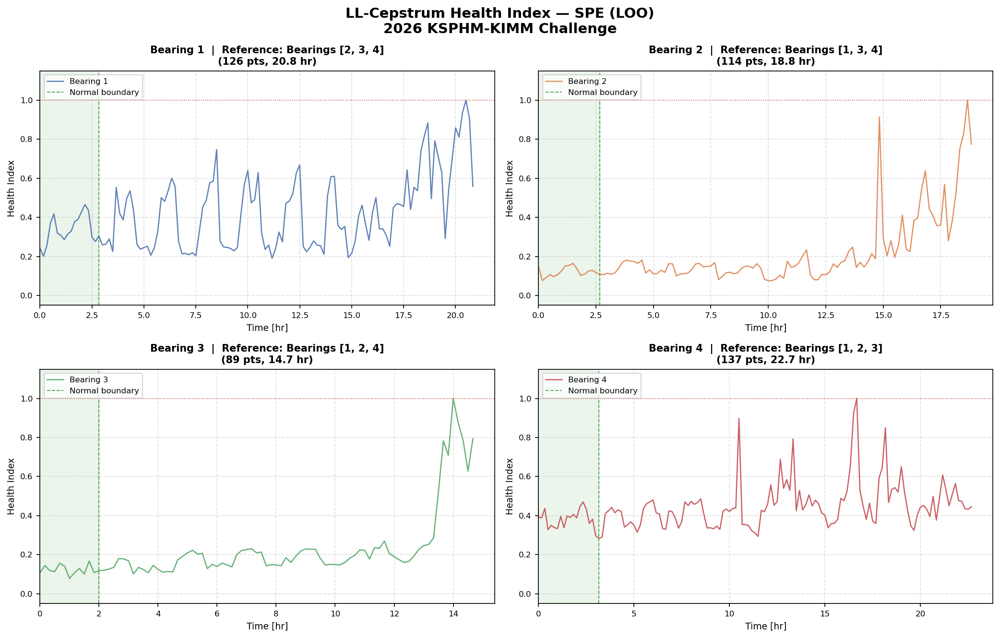

# 0602 Cepstrum-based HI 시도 기록

## 목표

LL-Cepstrum (Cepstrum_ref.md 참조)을 사용해 Train 베어링 4개에 대한 Health Index를 LOO 방식으로 구성.

**LOO 규칙**: Bearing i의 HI 구성 시, Bearing i의 데이터는 레퍼런스로 사용하지 않음. 반드시 나머지 3개 베어링의 초기 정상 구간만 사용.

---

## 데이터 특성 (중요 제약 조건)

| 항목 | 내용 |
|---|---|
| Train 베어링 | 4개 (126, 114, 89, 137 파일) |
| Validation 베어링 | 6개 × 50 파일 (각 8.3시간 윈도우) |
| 샘플링 레이트 | 25,600 Hz |
| 수집 주기 | 10분마다 1분 취득 |
| RPM 범위 | 700~950 RPM, **1시간 간격으로 변경** |
| **Validation RPM 정보** | **제공 없음** (진동 데이터만 제공) |

Train 베어링별 열화 정도 (RMS 기준):
- Train 1: 0.22g → 0.61g (2.77x) — 명확한 열화
- Train 2: 0.20g → 0.48g (2.47x) — 명확한 열화
- Train 3: 0.19g → 0.35g (1.91x) — 중간 열화
- Train 4: 0.27g → 0.28g (1.04x) — **열화 신호 거의 없음**

---

## 핵심 물리 배경

**LL-Cepstrum 분해:**
```
c_x[n] = c_h[n] + c_f[n]

c_h[n] : 구조적 전달함수 기여 → low quefrency (n 작음)
c_f[n] : 가진력 기여 (fault harmonics) → 특정 n에 impulse peaks
```

**Quefrency bin 계산 (N_FFT, FS=25600 기준):**

`n = f_fault(Hz) * N_FFT / FS`

| | N_FFT=2048 | N_FFT=25600 |
|---|---|---|
| BPFI @ 700~950 RPM | n = **7.8~10.6** | n = **98~133** |
| BPFO @ 700~950 RPM | n = **5.2~7.1** | n = **65~88** |
| BSF  @ 700~950 RPM | n = **4.4~5.9** | n = **55~74** |

→ RPM이 바뀌면 fault bin 위치가 이동함.

---

## 시도 1: N_FFT=2048, κ=256, LOO PCA-SPE

**방법:**
- 1초 미만 윈도우(2048 샘플) 기준 LL-Cepstrum 추출
- κ=N_FFT/8=256으로 low-pass liftering
- 4채널 평균 → 256차원 feature vector
- LOO: 다른 3개 베어링 초기 15% 정상 데이터로 PCA 학습 (95% 분산)
- HI = SPE (재구성 오차), [0,1] 정규화

**결과:**



- Bearing 2, 3: 말기 상승 확인됨 (부분적으로 양호)
- Bearing 4: 초반 HI=0.8 이상 튐 → 정상 구간에서 비정상적으로 높음
- Bearing 1: 전반적으로 noisy

**실패 원인:**

N_FFT=2048에서 fault frequency bin은 n=4~11에 위치. κ=256은 이를 포함함.
RPM이 700→950으로 바뀌면 BPFI bin이 n=8→11로 이동 → bin 이동 자체가 SPE를 증가시킴.
즉 **건강한 베어링도 RPM 변화 시 SPE가 올라가는 RPM artifact** 발생.

---

## 시도 2: N_FFT=25600, κ=50, LOO PCA-SPE + T²

**방법:**
- N_FFT=25600 (1초 윈도우)으로 변경 → fault frequency bin이 n=55~133으로 이동
- κ=50으로 low-pass liftering → **모든 fault frequency를 제거**
- 50차원 feature vector (순수 structural transfer function 구간)
- LOO: 동일 방식으로 SPE + T² 모두 계산

**이론적 근거:** structural transfer function은 RPM에 무관 → κ=50 구간은 진정한 RPM-invariant feature.

**결과:**

- Bearing 2, 3: 시도 1과 유사하게 말기 상승
- Bearing 4: 초반 spike 감소, 하지만 여전히 noisy
- SPE와 T² 간 큰 차이 없음

**실패 원인:**

κ=50으로 fault frequency 전체를 제거했더니 **열화 신호도 함께 제거됨**.
structural transfer function 구간(n<50)의 에너지 변화만으로는 열화를 충분히 구별하지 못함.
민감도 부족.

---

## 시도 3: N_FFT=25600, Fault-Band Energy, LOO 정규화

**방법:**
- N_FFT=25600 유지
- liftering 없이 전체 cepstrum 계산
- Structural band (n=1~54), Fault band (n=55~149) 에너지를 각각 scalar로 추출
- LOO: 다른 3개 베어링 초기 15%의 E_fault 평균을 기준으로 정규화
- HI = (E_fault - mu_ref) / (max_E_fault - mu_ref)

**결과:**

- Bearing 4: e_fault_max (0.000053) < mu_ref (0.000070) → HI 전부 0
- 전 베어링: E_fault 값이 5e-5 ~ 9e-5 수준으로 노이즈와 구분이 거의 안 됨
- 열화에 따른 E_fault 변화가 너무 작아 HI로 쓸 수 없음

**실패 원인:**

N_FFT=25600 (1초 윈도우)에서 n=55~149 구간의 cepstrum 에너지는 극히 작고 노이즈에 묻힘.
30개 윈도우를 평균내도 신호가 너무 약함.
또한 베어링 간 개체차이(Train4가 레퍼런스 평균보다 작음)로 인해 정규화 자체가 깨짐.

---

## 공통 실패 원인 정리

### 1. RPM 변동 vs. 열화 신호 분리 불가

RPM이 700~950 RPM으로 변동하면 fault frequency cepstrum bin이 이동함.
Validation에는 RPM 정보가 없으므로 외부 RPM 데이터로 보정 불가.
→ RPM-invariant를 만들수록 열화 신호도 약해지는 tradeoff 존재.

### 2. LL-Cepstrum의 설계 목적 불일치

참조 논문의 LL-Cepstrum은 fault **분류**(어떤 고장인지 판별)를 위해 설계됨.
건강 **진행도**(어느 정도 열화했는지) 추적에는 적합하지 않음.

- 분류: 특정 시점의 cepstrum 패턴 → 어떤 고장 타입인지 분류
- 진행도: 시간에 따른 cepstrum 변화 추적 → HI 구성

### 3. Train 4 특수성

Train 4는 RMS 비율 1.04x로 열화 신호 자체가 거의 없음.
어떤 cepstrum 기반 방법으로도 열화 추적이 어려울 것으로 판단.

---

## 결론

Cepstrum 기반 HI는 이 데이터의 제약 조건(RPM 정보 없음, validation 위상 미지, 변동 RPM)에서 잘 작동하지 않음.
RPM-invariant한 feature를 만들수록 열화 신호도 함께 줄어드는 근본적 tradeoff가 존재함.

대안으로 고려할 수 있는 방향:
- 통계적 feature (RMS, Kurtosis 등) + LOO 정규화 (단순하지만 검증된 방법)
- Envelope spectrum 기반 feature (고주파 에너지 추적)
- Autoencoder 기반 재구성 오차 (비선형 패턴 학습, 단 데이터 부족 위험)
