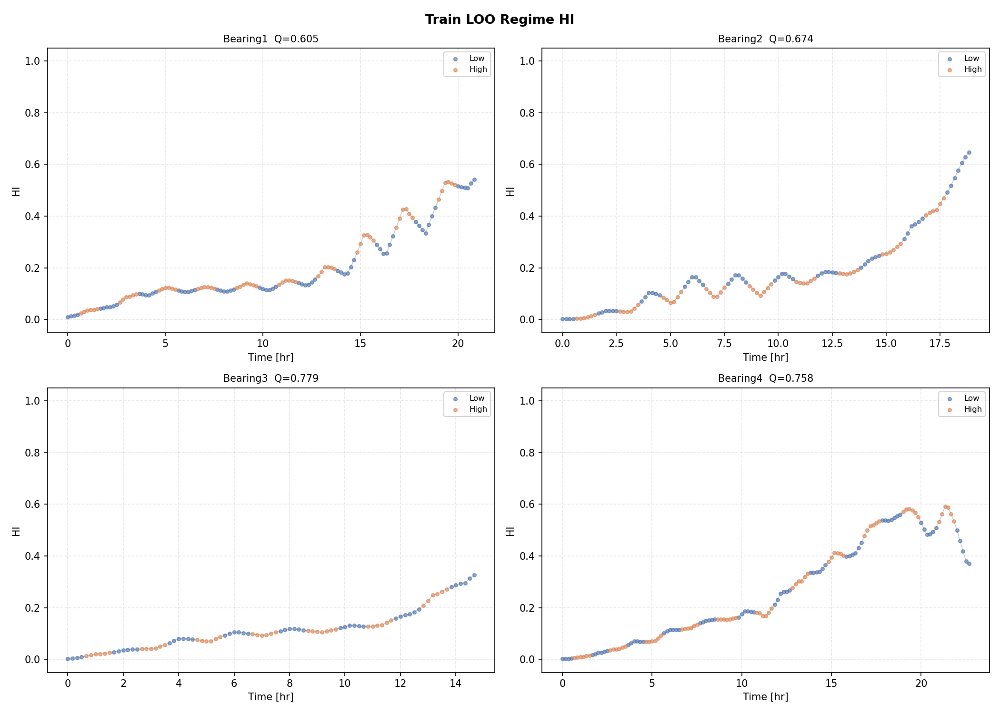
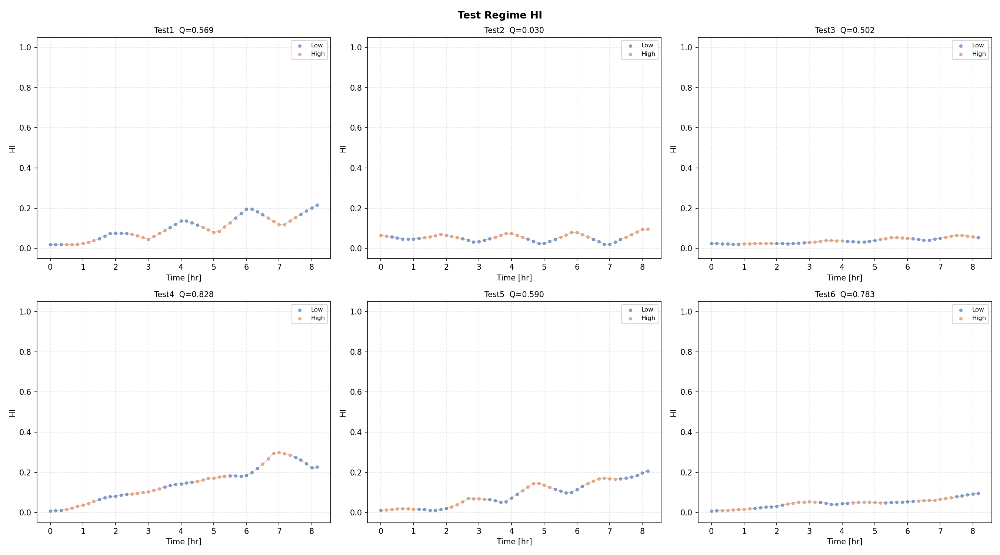
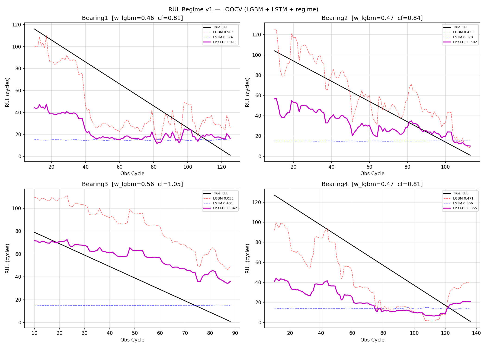
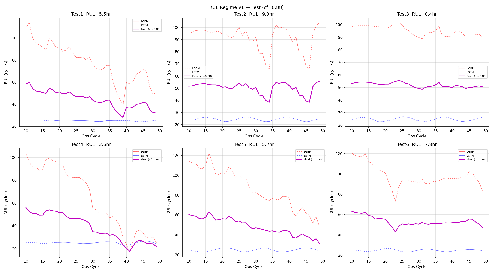

# 0603_regime_f2s2 Progress

## 목표
F2S2 기반 per-regime LOO HI + LGBM/LSTM 앙상블 RUL 예측 파이프라인 구축

---

## 작업 흐름

### Phase 1: 원래 코드 분석 (0603_v2, 구 디렉토리명)

원래 `hi_loo_regime_v1.py`는 외부 디렉토리에서 사전 계산된 CSV를 읽어오는 구조였음:
- Train 특징: `SC/HI/04142304_signal_transform_v2/output/BearingN_features_transformed.csv` (F2S2 변환 완료)
- Test 특징: `SC/HI/05072245_signal_transform_v5_test/output/TestN_features.csv` (raw)
- 레짐(cond): `BearingN_SSM_result.csv`

**발견된 문제점:**

| 문제 | 심각도 | 설명 |
|------|--------|------|
| Train/Test 파이프라인 불일치 | 🔴 심각 | Train은 F2S2 변환된 특징, Test는 raw 특징 |
| F2S2 변환 temporal leakage | 🔴 심각 | 변환 파라미터 추정 시 전체 시계열(미래 포함) 사용 |
| `FEATURE_Q_GLOBAL` hardcode | 🟡 중간 | 전체 4개 베어링 기반으로 계산된 값 — LOO fold에서 test_bid 정보 누출 |
| Test 파이프라인 temporal leakage | 🟡 중간 | minmax_scale/robust_clip이 전체 시계열 min/max 사용 |

---

### Phase 2: Self-contained 재작성

**변경 내용:**
- TDMS에서 직접 특징 추출 (`extract_features_from_file`) — 외부 SC/ 디렉토리 의존 완전 제거
- Train 레짐 분류: `TrainN_Operation.csv` → RPM 850 기준 이진 분류
- Test 레짐 분류: CH2 FFT 피크 → RPM 추정
- F2S2 변환 제거 (per-regime FDR ratio로 대체)
- `FEATURE_Q_GLOBAL` hardcode 제거 → exclude_bid 기반 LOO fallback
- 특징 캐시: `output/cache/` (재실행 속도 개선)
- `rul_regime_v1.py` SR_BASE 경로 수정 (`0603_v2` → `0603_regime_f2s2`)

**1차 실행 결과:**

| 지표 | 값 |
|------|----|
| Train avg Q | 0.629 |
| Test avg Q | 0.339 |
| LOOCV RUL | 0.4281 |

**발견된 문제:** Bearing4 HI가 0.55에서 시작 (LOO 베어링 B1~3 기반 baseline이 B4의 절대값과 크게 다름)

> 결과 그림은 Phase 3에서 덮어씌워짐 (별도 보관 안 함)

```
ch3_p2p:    B4 baseline = B1~3 평균의 8.1배
ch3_energy: B4 baseline = B1~3 평균의 2.5배
ch3_rms:    B4 baseline = B1~3 평균의 1.6배
```

---

### Phase 3: Own-baseline 적용

**변경 내용:**
- `compute_own_baseline()` 추가: 각 레짐별 자기 자신의 첫 10% 평균
- `compute_regime_stats()`: feat_q/direction/p5/p95 계산 시에도 각 베어링의 own baseline 기준 FDR 사용
- `apply_regime_hi()`: regime_stats의 baseline 대신 own baseline으로 FDR ratio 계산

**설계 근거:**
- Validation data는 정상~열화 어느 시점에서나 시작할 수 있음
- Own baseline = "관측 시작 시점 대비 얼마나 더 열화됐나"
- RUL 모델은 HI 절대값이 아닌 **열화 속도(slope/rate)**로 예측

**2차 실행 결과 (Phase 3 그림 — Phase 4에서 덮어씌워짐):**

| 지표 | Phase 2 | Phase 3 | 변화 |
|------|---------|---------|------|
| Train avg Q | 0.629 | **0.712** | ↑ +0.083 |
| Test avg Q | 0.339 | **0.582** | ↑ +0.243 |
| B4 hi_start | 0.553 (버그) | **0.002** | ✅ 수정 |
| LOOCV RUL | **0.4281** | 0.3521 | ↓ -0.076 |

**LOOCV 상세:**

| Bearing | LGBM | LSTM | Ens+CF |
|---------|------|------|--------|
| B1 | 0.4846 | 0.3747 | 0.3863 |
| B2 | 0.4363 | 0.3840 | 0.4692 |
| B3 | **0.0528** | 0.4785 | **0.1869** |
| B4 | 0.4853 | 0.3644 | 0.3661 |
| 평균 | 0.3647 | 0.4004 | **0.3521** |

**LOOCV 하락 원인:**
- B3 hi_end=0.185로 낮고, B1~4 중 열화 패턴이 가장 완만 (89 cycles, 최단 수명)
- Own baseline으로 전환 후 전체 HI scale이 낮아지면서 LGBM이 B3 패턴을 제대로 학습 못함
- LSTM은 B3에서도 0.48로 준수 → LGBM이 낮은 HI end 케이스에 취약

---

---

### Phase 4: obs_frac 제거 + 멀티스케일 slope 피처

**발견된 설계 충돌:**
- Own baseline HI로 인해 Train/Test 모두 관측 시작 = HI≈0, obs_frac=0
- LSTM 입장에서 모든 Test 베어링이 "새 베어링"처럼 보임 → RUL 과다 예측
- LGBM의 HI 절대값 의존 → hi_end가 낮은 B3(0.185) 오판

**변경 내용 (`rul_regime_v1.py`):**

| 항목 | 이전 | 이후 |
|------|------|------|
| LSTM 채널 2 | `obs_frac = t / MEAN_TRAIN_LIFE` | `hi_slope_norm = slope / slope_scale` |
| slope_scale | — | `compute_slope_scale(train_bids)` — LOO leakage-free |
| LGBM 피처 수 | 18 | 20 (+slope20, +slope30) |
| `MEAN_TRAIN_LIFE` 상수 | 사용 | 제거 |

**설계 근거:**
- slope는 HI 절대 스케일에 무관 → B3(hi_end=0.185)와 B2(hi_end=0.641)를 동일 기준으로 평가
- slope_scale은 train_bids 기반으로만 계산 (LOO leakage 없음)
- 멀티스케일 slope(10/20/30-window): 단기·중기·장기 열화 속도를 LGBM에 제공

**결과:**

| Bearing | LGBM | LSTM | Ens(raw) | CF | Ens+CF |
|---------|------|------|----------|----|--------|
| B1 | 0.4896 | 0.3744 | 0.4231 | 0.83 | 0.3942 |
| B2 | 0.4781 | 0.3792 | 0.4905 | 0.83 | 0.4738 |
| B3 | 0.0493 | 0.4012 | 0.4169 | 1.05 | 0.3628 |
| B4 | 0.4594 | 0.3654 | 0.3879 | 0.83 | 0.3714 |
| 평균 | 0.3691 | 0.3800 | **0.4296** | — | **0.4005** |

**Phase 3 대비 변화:**

| 지표 | Phase 3 | Phase 4 | 변화 |
|------|---------|---------|------|
| LGBM avg | 0.3647 | 0.3691 | ↑ +0.004 |
| LSTM avg | 0.4004 | 0.3800 | ↓ -0.020 |
| Ens raw | 0.3805 | **0.4296** | ↑ **+0.049** |
| Ens + CF | 0.3521 | **0.4005** | ↑ **+0.048** |

**분석:**
- Ens raw가 0.3805 → 0.4296으로 크게 개선: obs_frac 제거로 LSTM 앙상블 조화가 개선됨
- B3 LGBM은 여전히 낮음(0.0493 ← 0.0528): slope 피처만으로는 hi_end 스케일 문제 미해결
- B3 Ens raw가 0.2314 → 0.4169로 급등: LSTM slope 채널이 B3 패턴을 더 잘 포착
- B3 CF = 1.05 (다른 bearing과 반대 방향): B3에 맞는 CF 탐색이 안 되는 구조적 문제 잔존
- CF가 0.89로 올라감(이전 0.69~0.70): obs_frac 제거로 LSTM이 전반적으로 보수적 예측

**Train LOO HI:**



**Test HI:**



**LOOCV RUL 예측:**



**Test RUL 예측:**



---

### Phase 5: CH1 추가 + log1p 정규화

**동기:**
- B3 hi_end=0.185가 낮은 근본 원인을 분석한 결과, B3 신호 자체가 약한 게 아님을 확인
- 실제 원인: LOO pool(B1+B2+B4)에서 B2(에너지 182배↑)·B4(에너지 253배↑)가 p95를 지배 → B3의 실제 열화(1.6~2.7배)가 압도당함
- FDR pooled p95 = 14.76 → B3 end FDR 1.63 → scaled 0.11 (사실상 0)
- 해결책 탐색: 채널 조합(ch3only/ch3+ch1/ch3+ch4full/all_ch) × pooling 방식(raw/log1p/per_bearing_avg) 격자 탐색

**탐색 결과 요약:**

| 실험 | avg_Q | B3 Q | B3 hi_end |
|---|---|---|---|
| ch3only+raw (현재) | 0.430 | 0.362 | 0.17 |
| ch3only+log1p | **0.450** | 0.423 | 0.32 |
| ch3+ch1+log1p | 0.443 | **0.434** | **0.37** |
| all_ch+per_bearing_avg | 0.450 | 0.417 | 0.17 |

> per_bearing_avg는 avg_Q는 같지만 B3 hi_end가 여전히 낮음 → 기각

**채택: ch3+ch1+log1p**
- `FEATURE_GROUPS`에 `"ch1": ["ch1_rms", "ch1_energy", "ch1_p2p"]` 추가
- `compute_regime_stats()`: direction 적용 후 `arr = np.sign(arr) * np.log1p(np.abs(arr))` → p5/p95 저장
- `apply_regime_hi()`: `score * direction` 직후 `np.sign(score) * np.log1p(np.abs(score))` → train_anchored_scale 적용

**결과:**

| 지표 | Phase 4 | Phase 5 | 변화 |
|---|---|---|---|
| Train avg Q | **0.712** | 0.704 | ↓ -0.008 |
| B3 HI Q | 0.674 | **0.779** | ↑ +0.105 |
| B3 hi_end | 0.185 | **0.326** | ↑ +0.141 |
| B1 RUL Ens+CF | 0.394 | 0.411 | ↑ |
| B2 RUL Ens+CF | 0.474 | **0.502** | ↑ |
| B3 RUL Ens+CF | 0.363 | 0.342 | ↓ |
| B4 RUL Ens+CF | 0.371 | 0.355 | ↓ |
| **LOOCV Ens+CF** | 0.4005 | **0.4024** | ↑ +0.002 |

**분석 및 결론:**
- B3 HI 품질은 크게 개선됐으나 B3 LGBM이 여전히 0.055로 고정 → HI 절대값을 올려도 LGBM이 B3 패턴을 generalize 못함
- log1p·ch1 변경으로 B2 RUL은 크게 개선(0.474→0.502), B1도 소폭 개선
- **전체 LOOCV 개선은 +0.002로 미미** — B3 LGBM 문제는 HI 수준의 개선으로는 해결 불가

---

## 전체 결론 및 방향 전환

### B3 LGBM 문제의 본질

B3 LGBM은 Phase 2부터 Phase 5까지 모든 실험에서 0.04~0.06으로 고정됨.

**원인**: LOO fold에서 LGBM이 B1+B2+B4로 학습 시, B3의 완만한 HI 상승 패턴(hi_end≤0.33)이 학습 데이터에 없는 패턴. LGBM이 "HI가 낮으면 아직 건강"으로 오인하여 RUL 과대 예측.

**HI 개선으로는 해결 불가**: B3 hi_end를 0.185 → 0.326으로 올려도 LGBM 스코어 불변. elapsed_frac(수명 내 현재 위치) 피처가 없어 LGBM이 "지금이 수명의 몇 % 시점인지" 모름이 핵심.

### 0603_v3 비교

동 시기 별도로 진행된 `0603_v3` 파이프라인이 이 문제를 해결:

| | 0603_regime_f2s2 | 0603_v3 |
|--|--|--|
| Baseline 방식 | own-baseline (자기 첫 10%) | LOO train 3개 평균 |
| LGBM 피처 | slope 중심 | + **elapsed_frac** 추가 |
| LSTM 정규화 | window-local minmax | global standardization |
| B3 LGBM | 0.049~0.055 | **0.132** |
| **LOOCV Ens_raw** | 0.430 | **0.465** |

`elapsed_frac` 하나로 B3 LGBM이 0.05 → 0.13으로 개선됨. 이 방향이 맞음.

### 결론

**0603_regime_f2s2는 여기서 종료.** 다음 작업은 `0603_v3` 기반으로 진행:
1. CF 전략 수정 (B3 CF=1.40이 0.526→0.173으로 망가뜨림 — Ens_raw 사용이 실질 최고)
2. LGBM B3 피처 추가: HI 누적 변화량, 변화 속도
3. LSTM → Ridge 또는 2nd LGBM 교체 검토

---

## 파일 구조

```
code/
  hi_loo_regime_v1.py    # TDMS → 특징 추출 → LOO HI (own baseline + ch1 + log1p)
  rul_regime_v1.py       # LOO LGBM+LSTM 앙상블 RUL (slope 피처)
output/
  cache/                 # 특징 추출 캐시 (TDMS 재파싱 방지)
  train/                 # BearingN_HI.csv, summary.csv, 시각화
  test/                  # TestN_HI.csv, summary.csv, 시각화
  rul/                   # TestN_RUL.csv, loocv_log.txt, 시각화
```
