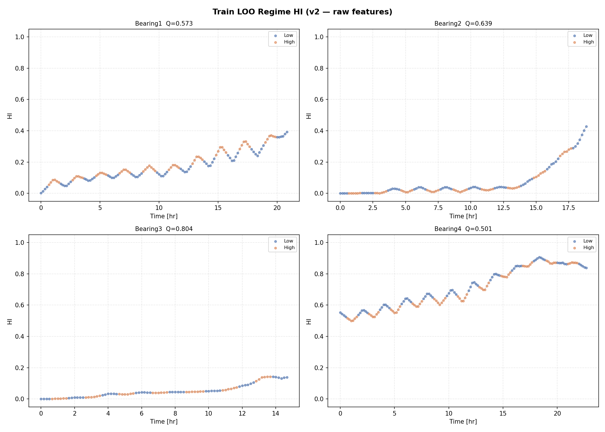
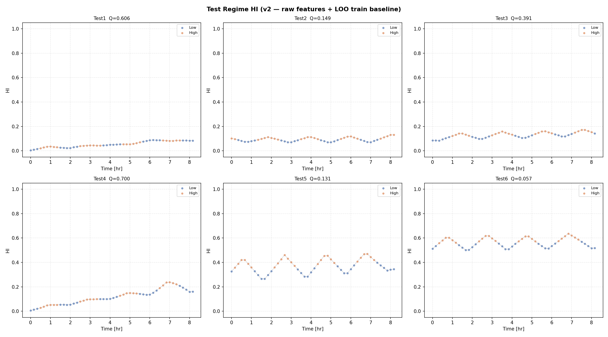
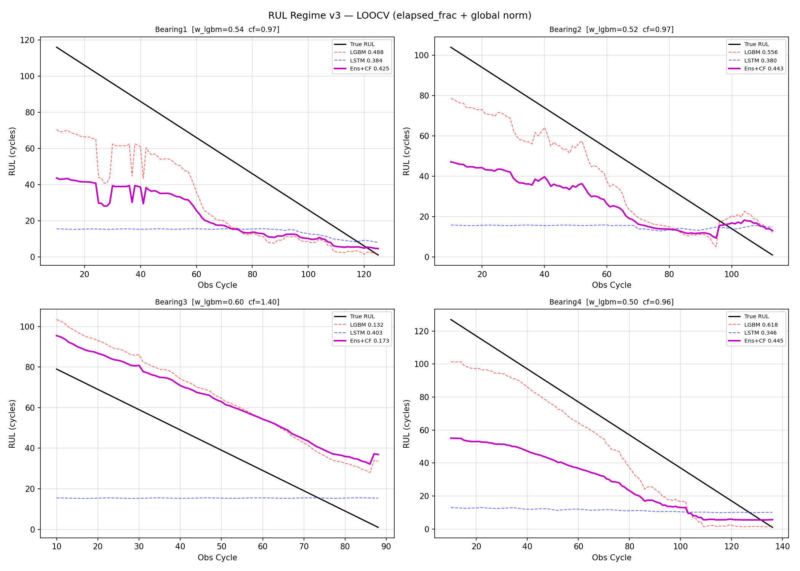
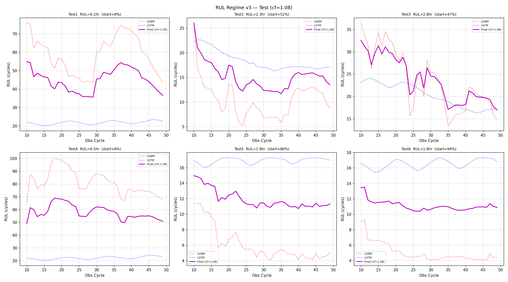
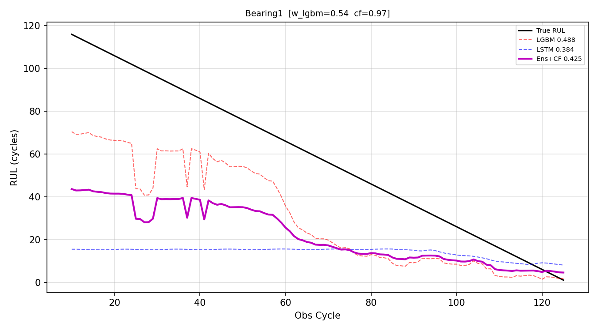
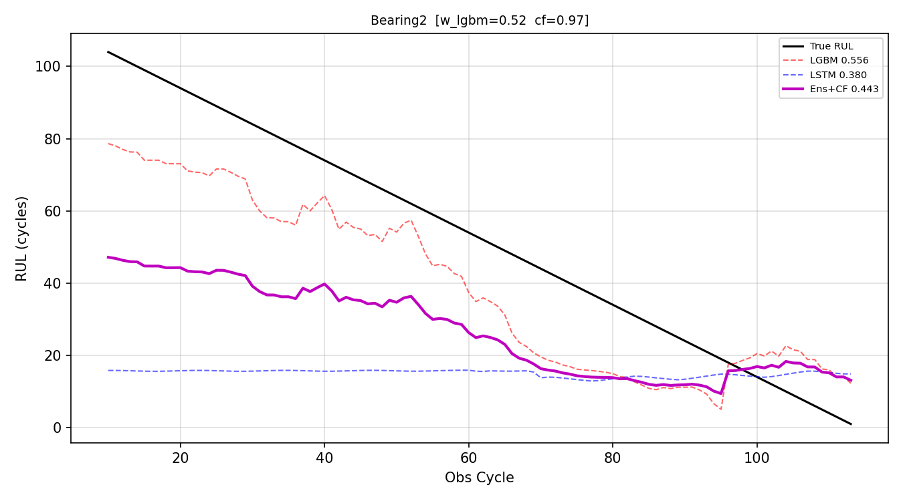
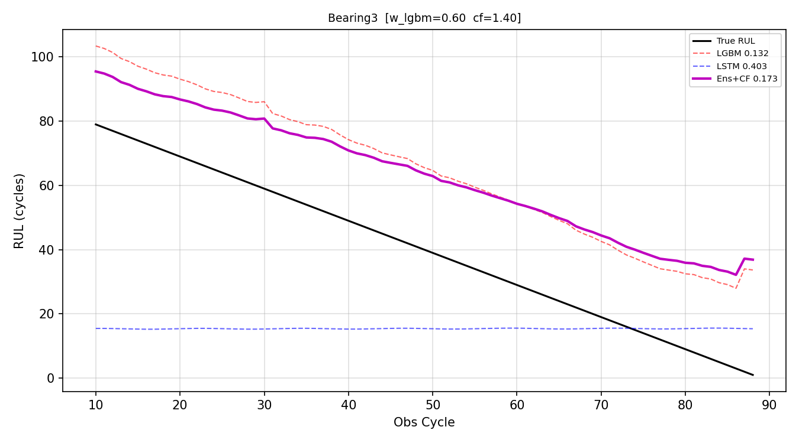
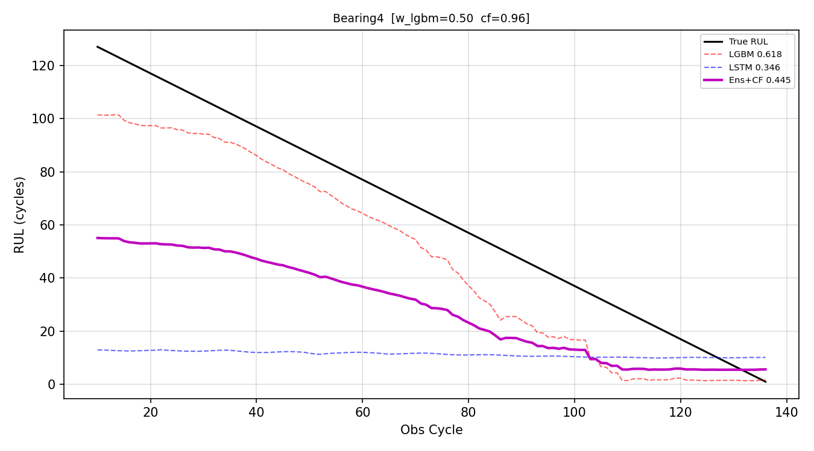

# KSPHM 2026 Challenge — 작업 진행 기록

> 마지막 업데이트: 2026-06-03 (섹션 9 추가, Test 피처 TDMS 직접 추출로 전환)

---

## 1. 프로젝트 개요

- **목표**: 베어링 진동 데이터로 Health Index(HI) 구성 및 잔여 수명(RUL) 예측
- **데이터**: Train 베어링 4개 (전체 수명), Test 베어링 6개 (관측 창 ~50 사이클)
- **채점 함수**: Er = 100×(RUL_true − RUL_pred)/RUL_true → 낙관적 예측(Er<0) 페널티 큼
- **레짐**: 저속(0, <850 RPM) / 고속(1, ≥850 RPM) 교번, 1시간 단위

### Train 베어링 정보

| Bearing | Total cycles | Normal until | Max RUL |
|---------|-------------|-------------|---------|
| B1      | 126         | 89          | 37      |
| B2      | 114         | 92          | 22      |
| B3      | 89          | 62          | 27      |
| B4      | 137         | 78          | 59      |

---

## 2. 출발점 — `User/SR/0603_v2`

### 구성 파일

| 파일 | 역할 |
|------|------|
| `hi_loo_regime_v1.py` | HI 계산 (LOO + Per-regime) |
| `rul_regime_v1.py` | RUL 예측 (LGBM + LSTM 앙상블) |

### 피처 입력

- **Train HI**: `SC/HI/04142304_signal_transform_v2/output/Bearing{b}_features_transformed.csv`
  (F2S2 변환 적용된 피처)
- **Test HI**: `SC/HI/05072245_signal_transform_v5_test/output/Test{tid}_features.csv`
  (원시 피처)

### v2 LOOCV 결과

| | B1 | B2 | B3 | B4 | 평균 |
|--|-----|-----|-----|-----|------|
| LGBM | 0.469 | 0.444 | 0.038 | 0.312 | 0.316 |
| LSTM | 0.373 | 0.380 | 0.462 | 0.363 | 0.395 |
| Ens+CF | 0.360 | 0.452 | 0.175 | 0.333 | **0.330** |

### v2 Test RUL 예측

| Test | RUL (hr) |
|------|----------|
| T1   | 6.3      |
| T2~T6| 3.4~3.9  |

---

## 3. 발견된 문제점

### A. [치명] Train/Test 피처 스케일 불일치

- Train: F2S2 선형 변환 적용 (`a·y + b`, 고속→저속 스케일 매핑)
- Test: 원시 피처 (변환 없음)
- LOO baseline이 F2S2 변환된 Train 통계로 계산되었는데 Test에 원시 피처를 그대로 대입
- → 고속 레짐에서 FDR ratio 스케일 완전 불일치 → Test HI 신뢰 불가

### B. [중간] Signal Transform 시간적 자기 누출

- `estimate_transform_params`가 베어링 전체 수명(열화 포함)으로 F2S2 파라미터 학습
- 자기 미래 데이터로 정규화 → temporal leakage
- Cross-bearing leakage는 없음

### C. [RUL] LGBM 위치 피처 없음

- LGBM이 HI 통계만 사용, 시간 정보 없음 → 전 구간 flat 예측

### D. [RUL] LSTM window-local 정규화

- `win_norm = (win - win.min()) / (win.max() - win.min())` → HI 절댓값 소실
- 열화 초기(HI=0.05)와 말기(HI=0.5) 구간이 LSTM에 동일하게 보임

### E. [RUL] LSTM rul_scale fold-의존 버그

- `rul_scale = max(y_train)` → fold마다 다름
- B4 fold: rul_scale=37인데 B4 최대 RUL=59 → LSTM이 37 사이클 이상 예측 불가 (캡)

### F. [설계] Self-anchored baseline의 한계

- Test 데이터는 이미 열화 상태에서 시작할 수 있음
- 자기 자신의 첫 10%를 기준점으로 쓰면 열화 기준이 잘못됨
- → Train LOO 기반 절대 기준점 사용해야 함

---

## 4. 신규 구현 — `User/SR/0603_v3`

### 4-1. HI 파이프라인 (`hi_loo_regime_v2.py`)

#### 핵심 변경

| 항목 | v1 (0603_v2) | v2 (0603_v3) |
|------|-------------|-------------|
| Train 피처 | F2S2 변환 CSV | **TDMS 직접 추출 (raw)** |
| Test 피처 | 외부 CSV (raw) | **TDMS 직접 추출 (raw)** |
| Baseline | LOO train 3개 pooled 평균 | 동일 유지 |
| 개별 PNG | 없음 (통합만) | **Bearing{b}_HI.png, Test{tid}_HI.png 추가** |

#### raw 피처 추출 (첫 실행 시 TDMS에서 추출, 이후 캐시)

- 추출 피처: `ch3_high_band, ch4_high_band, ch3_total_power, ch3_energy, ch3_rms, ch3_std, ch3_p2p`
- 레짐 분류: Train → Operation CSV (RPM ≥ 850 = 고속), Test → FFT peak
- Train/Test 모두 TDMS 직접 추출 → `output/train/Bearing{b}_features_raw.csv`, `output/test/Test{tid}_features_raw.csv` 캐시

#### Train LOO HI Q-score 비교

| Bearing | v2 (F2S2) | v3 (raw) |
|---------|-----------|----------|
| B1      | 0.610     | 0.573    |
| B2      | 0.605     | 0.639    |
| B3      | 0.566     | **0.804** |
| B4      | 0.469     | 0.501    |
| **평균** | **0.563** | **0.629** |

B3 대폭 향상 — F2S2 변환이 B3 피처를 왜곡하고 있었음.



#### Test HI 결과

| Test | HI start | HI end | Q-score | 비고 |
|------|----------|--------|---------|------|
| T1   | 0.005    | 0.084  | 0.606   | 정상 초기 관측 |
| T2   | 0.103    | 0.131  | 0.149   | 열화 중기, 평탄 |
| T3   | 0.085    | 0.143  | 0.391   | 열화 중기 |
| T4   | 0.006    | 0.161  | 0.700   | 정상 초기, 증가 |
| T5   | 0.326    | 0.346  | 0.131   | **이미 열화 상태에서 시작** |
| T6   | 0.513    | 0.518  | 0.057   | **심각 열화 상태에서 시작**, 평탄 |



### 4-2. RUL 파이프라인 (`rul_regime_v3.py`)

#### 핵심 변경

| 항목 | v2 (rul_regime_v1) | v3 (rul_regime_v3) |
|------|-------------------|--------------------|
| LGBM 피처 | HI window + 통계 + regime | + **elapsed_frac** (현재가 수명의 몇% 지점) |
| LSTM 정규화 | window-local minmax | **LOO train 기반 global standardization** |
| LSTM rul_scale | `max(y_train)` (fold-의존, 캡 버그) | `max(EOL[b] for b in train_bids)` |
| Test 시작 위치 | start_obs=0 (건강 상태 가정, 잘못됨) | **estimate_start_frac**: HI 초기값→train 궤적 매칭 |
| 개별 PNG | 없음 | **Bearing{b}_RUL.png, Test{tid}_RUL.png 추가** |

#### estimate_start_frac 로직

Test 베어링의 HI 초기값이 Train 베어링의 HI에서 처음 도달하는 사이클 비율의 평균.
- Train HI가 HI_start에 못 미치면 → EOL 이후로 간주 (EOL/MEAN_TRAIN_LIFE)
- Train HI가 처음부터 HI_start 이상이면 → 참조 불가 (skip)

| Test | HI start | 추정 위치 | start_obs |
|------|----------|-----------|-----------|
| T1   | 0.005    | 8.6%      | ~10 cyc   |
| T2   | 0.103    | 52.6%     | ~61 cyc   |
| T3   | 0.085    | 47.2%     | ~55 cyc   |
| T4   | 0.006    | 8.9%      | ~10 cyc   |
| T5   | 0.326    | 86.4%     | ~100 cyc  |
| T6   | 0.513    | 94.1%     | ~109 cyc  |

---

## 5. 최종 LOOCV 결과 (rul_regime_v3, rul_scale fix 포함)

| | B1 | B2 | B3 | B4 | 평균 |
|--|-----|-----|-----|-----|------|
| LGBM | 0.488 | 0.556 | **0.132** | 0.618 | 0.449 |
| LSTM | 0.384 | 0.380 | 0.403 | 0.347 | 0.378 |
| **Ens_raw** | **0.431** | **0.448** | **0.526** | **0.455** | **0.465** |
| Ens+CF | 0.425 | 0.443 | 0.173 | 0.445 | 0.372 |

> **v2 대비: Ens+CF 0.330 → Ens_raw 0.465 (+41%)**
> CF가 B3를 망가뜨리므로 Ens_raw가 실질적 최고 성능



### Test RUL 예측 (v3)

| Test | start 위치 | RUL (cycles) | RUL (hr) |
|------|-----------|-------------|----------|
| T1   | 8.6%      | 36.6        | 6.10     |
| T2   | 52.6%     | 13.5        | 2.26     |
| T3   | 47.2%     | 17.0        | 2.84     |
| T4   | 8.9%      | 50.9        | 8.48     |
| T5   | 86.4%     | 11.3        | 1.89     |
| T6   | 94.1%     | 10.9        | 1.82     |



---

## 6. 현재 남은 문제

### 6-0. 개별 Bearing LOOCV 예측

| Bearing1 | Bearing2 |
|----------|----------|
|  |  |

| Bearing3 (LGBM 문제) | Bearing4 |
|----------------------|----------|
|  |  |

### 6-1. LSTM 여전히 flat (~15~20 사이클 상수 예측)

- 훈련 데이터 3개 베어링 × ~100시퀀스 = ~300개 → MSE local min 수렴
- global norm, rul_scale fix에도 불구하고 개선 제한적
- B3에서는 LSTM(0.403) > LGBM(0.132)이므로 완전 제거 불가
- **방향**: 소형 데이터에 맞는 Ridge Regression 또는 제2 LGBM으로 교체

### 6-2. LGBM B3 과대 예측 (score 0.132)

- B3 fold train = [B1, B2, B4]. B4의 HI(0.55~0.84)가 학습에 포함
- B3 말기(cycle 80, HI=0.12)가 B1 중기(cycle 80, HI=0.15)와 elapsed_frac, HI 모두 유사
  → LGBM이 B3를 "B1 중기 상태"로 오인 → 과대 예측
- **방향**: HI 누적 상승량, HI 상승 속도 피처 추가

### 6-3. CF가 B3를 망가뜨림

- B3 Ens_raw=0.526 → CF=1.40 적용 후 0.173
- 다른 베어링(B1, B2, B4) 기준 최적 CF가 B3에는 역효과
- **방향**: Ens_raw 그대로 사용, 또는 per-bearing confidence 기반 CF

---

## 7. 파일 구조

```
User/SR/0603_v3/
├── code/
│   ├── hi_loo_regime_v2.py    # HI: raw TDMS + LOO baseline
│   ├── rul_regime_v2.py       # RUL: 개별 PNG 추가 (미사용)
│   └── rul_regime_v3.py       # RUL: elapsed_frac + global norm + start_frac 추정
├── output/
│   ├── train/
│   │   ├── Bearing{1-4}_features_raw.csv   # TDMS 추출 캐시
│   │   ├── Bearing{1-4}_HI.csv / .png
│   │   ├── Bearing_LOO_Regime_HI.png
│   │   └── summary.csv
│   ├── test/
│   │   ├── Test{1-6}_features_raw.csv   # TDMS 추출 캐시 (신규)
│   │   ├── Test{1-6}_HI.csv / .png
│   │   ├── Test_Regime_HI.png
│   │   └── summary.csv
│   └── rul/
│       ├── loocv_log.txt
│       ├── loocv_predictions.png
│       ├── Bearing{1-4}_RUL.png
│       ├── test_predictions.png
│       ├── Test{1-6}_RUL.csv / .png
│       └── test_summary.csv
└── progress.md                # 이 파일
```

---

## 8. 다음 작업 후보

- [ ] LSTM → Ridge Regression 또는 2nd LGBM으로 교체
- [ ] LGBM B3 개선: HI 누적 변화량, 변화 속도 피처 추가
- [ ] CF 전략 수정: Ens_raw 사용 또는 per-confidence CF
- [ ] HI 품질 재검토 (B3 max HI=0.14, B4 시작 HI=0.55 이상치)

---

## 9. 실험 기록 — `0603_v4` (레짐별 피처 Q-score 필터링, 폐기)

### 9-1. 아이디어 및 동기

- **가설**: 고속/저속 레짐에서 열화를 잘 나타내는 피처가 다를 것
- **분석**: 레짐별 피처 Q-score를 사전 계산 (LOO, 4개 베어링 평균)

| Feature | LOW Q | HIGH Q | 차이 |
|---------|-------|--------|------|
| ch4_high_band | 0.799 | 0.903 | +0.104 |
| ch3_total_power | 0.790 | 0.899 | +0.108 |
| ch3_std | 0.790 | 0.899 | +0.109 |
| ch3_energy | 0.788 | 0.898 | +0.111 |
| ch3_rms | 0.788 | 0.898 | +0.111 |
| ch3_high_band | 0.694 | 0.865 | +0.171 |
| **ch3_p2p** | **0.544** | 0.789 | +0.245 |

- 피처 순위 순서는 레짐에 무관하게 동일 → "완전히 다른 피처셋" 근거 약함
- ch3_p2p만 LOW에서 평균 0.544 (B4에서 0.077)로 두드러지게 낮음

### 9-2. 구현 (`User/SR/0603_v4/code/hi_loo_regime_v3.py`)

`compute_regime_stats` 내 `feat_q` 계산 직후, `Q_THRESHOLD` 이하 피처 가중치를 0으로 설정:

```python
Q_THRESHOLD = 0.35
feat_q = {f: (q if q >= Q_THRESHOLD else 0.0) for f, q in feat_q.items()}
```

### 9-3. 실제로 필터링된 피처

- B1/B3 LOO — LOW 레짐: `ch3_total_power`, `ch3_energy`, `ch3_rms`, `ch3_std` 제거 (4개!)
- B2 LOO — LOW 레짐: `ch3_total_power`, `ch3_energy` 제거
- B4 LOO — 필터링 없음

### 9-4. 문제 원인

**B4가 LOW 레짐에서 이미 열화 상태로 시작** (hi_start ≈ 0.55).  
B1/B2/B3 fold에 B4가 훈련 베어링으로 포함되면, B4의 첫 10% LOW 레짐 사이클이 이미 열화됨
→ pooled baseline이 높게 왜곡 → 에너지 피처의 LOO Q-score가 비정상적으로 낮게 계산
→ ch3_p2p가 아닌 멀쩡한 피처까지 필터링됨

### 9-5. HI Q-score 결과 비교

| Bearing | v3 (raw) | v4 (Q-filter) | 변화 |
|---------|----------|---------------|------|
| B1 | 0.573 | 0.782 | +0.209 |
| B2 | 0.639 | 0.633 | -0.006 |
| B3 | **0.804** | 0.698 | **-0.106** |
| B4 | 0.501 | 0.501 | ±0 |
| **평균** | **0.629** | 0.654 | +0.025 |

### 9-6. LOOCV RUL 결과 비교

| | B1 | B2 | B3 | B4 | 평균 |
|--|-----|-----|-----|-----|------|
| v3 Ens_raw | 0.431 | 0.448 | **0.526** | 0.455 | **0.465** |
| v4 Ens_raw | 0.390 | 0.428 | 0.525 | 0.443 | **0.447** |

**모든 베어링에서 소폭 악화 → v4 폐기.**

### 9-7. 결론

- 레짐별 피처 순위가 사실상 동일하므로 "레짐별 다른 피처셋" 아이디어의 근거가 약함
- Q-threshold 필터는 B4 baseline 오염 문제로 인해 의도치 않은 피처까지 제거
- 근본 문제는 B4의 비정상적 초기 상태이며, 피처 선택으로는 해결 불가
- `User/SR/0603_v4/` 디렉토리는 삭제, v3 유지

---

## 8. 다음 작업 후보 (업데이트)

- [ ] LGBM B3 개선: HI 누적 변화량, 변화 속도 피처 추가 ← **우선순위 높음**
- [ ] LSTM → Ridge Regression 또는 2nd LGBM으로 교체
- [ ] CF 전략 수정: Ens_raw 사용 또는 per-confidence CF
- [x] 레짐별 피처 Q-score 필터링 → 효과 없음 (섹션 9 참조)
