# 0605 실험 기록

> 마지막 업데이트: 2026-06-05 (실험 G — Adaptive Ensemble)

---

## 출발점: 0604 파이프라인의 두 가지 문제

0604 파이프라인(LOOCV 0.468, 제출 점수 0.3)을 분석한 결과 독립적인 두 문제가 확인됐다.

**문제 1 — HI scale 불일치**: FDR 정규화가 fleet-wide p5/p95 기준이라 베어링마다 HI 범위가 달라짐

| Bearing | hi_start | hi_end | 문제 |
|---------|----------|--------|------|
| B1 | 0.002 | 0.392 | 정상 (기준) |
| B2 | 0.000 | 0.428 | 정상 (기준) |
| B3 | 0.001 | **0.139** | EOL HI가 너무 낮음 → LSTM이 B3 사망 시점을 "초기"로 오인 |
| B4 | **0.553** | 0.839 | 정상기부터 HI 높음 → fleet baseline 대비 offset |

**문제 2 — start_frac 추정 편향**: 테스트 베어링의 수명 위치를 HI값으로 추정할 때, B3(max HI=0.14)와 B4(hi_start=0.55)가 참조에서 제외되어 B1·B2만 사용됨

오늘 실험들은 이 두 문제를 각각, 그리고 조합해서 해결하려는 시도다.

---

## 실험 A — HI scale 직접 수정 (`hi_self_norm.py`)

### 가설

HI scale 불일치(문제 1)가 근본 원인이므로, 각 베어링이 자기 자신의 초기 데이터를 baseline으로 쓰고(self-baseline), EOL raw score로 정규화하면(failure anchor) hi_start≈0, hi_end≈1.0을 달성할 수 있다.

- **Self-baseline**: 각 베어링이 자신의 초기 10% 구간으로 FDR 계산 → B4 hi_start 수정
- **Failure anchor**: 각 베어링의 EOL raw HI 평균으로 나눔 → hi_end≈1.0 강제
- **FLOOR_RATIO=0.25**: 열화량이 작은 B3의 과도 증폭 방지

### 결과

Train HI Q-score는 전반적으로 개선됐다.

| Bearing | hi_start (구→신) | hi_end (구→신) | Q-score (구→신) |
|---------|-----------------|----------------|-----------------|
| B1 | 0.002 → **0.000** | 0.392 → **1.000** | 0.573 → 0.770 (+0.197) |
| B2 | 0.000 → **0.000** | 0.428 → **0.970** | 0.639 → 0.615 (-0.024) |
| B3 | 0.001 → **0.000** | 0.139 → **0.105** | 0.804 → 0.713 (-0.091) |
| B4 | **0.553 → 0.000** | 0.839 → **0.831** | 0.501 → 0.660 (+0.159) |
| **평균** | — | — | **0.629 → 0.690 (+0.060)** |

그러나 LOOCV는 악화됐다.

| Bearing | 구 LSTM | 신 LSTM | 변화 |
|---------|---------|---------|------|
| B1 | 0.387 | 0.609 | +0.222 |
| B2 | **0.577** | **0.053** | **-0.524** |
| B3 | 0.468 | 0.184 | -0.284 |
| B4 | 0.373 | 0.427 | +0.054 |
| **평균** | **0.451** | **0.318** | **-0.133** |

**Train HI (self-norm)**:

| B1 | B2 |
|---|---|
| 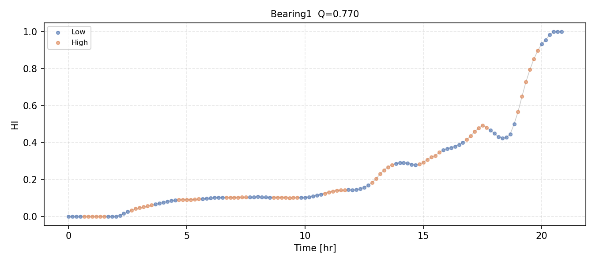 | 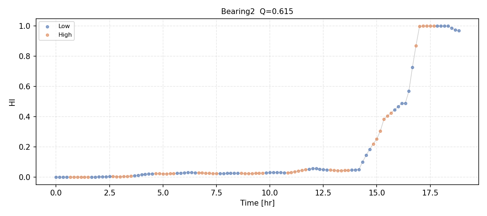 |

| B3 | B4 |
|---|---|
| 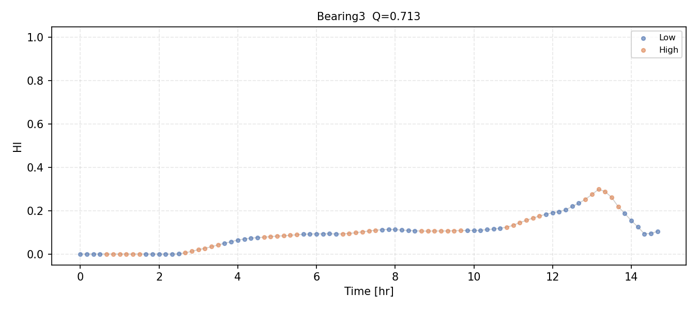 | 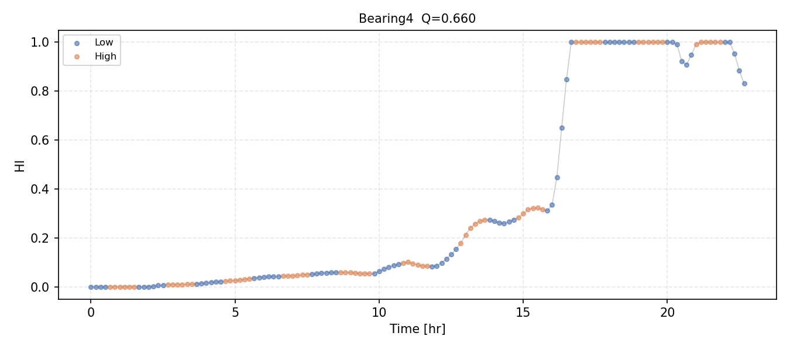 |

**Test HI (self-norm)**:

| T1 HI | T2 HI |
|---|---|
| 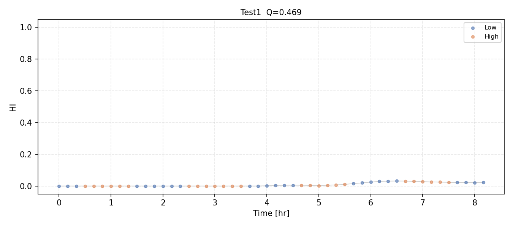 | 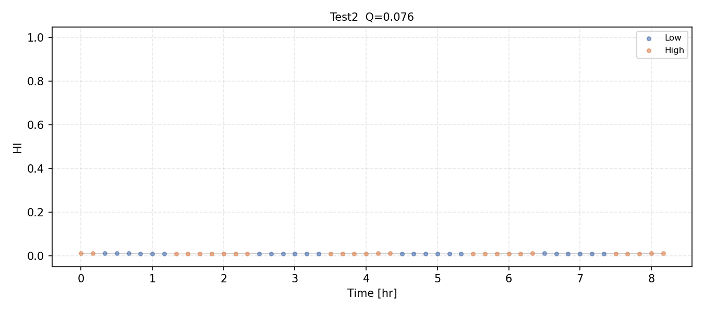 |

| T3 HI | T4 HI |
|---|---|
| 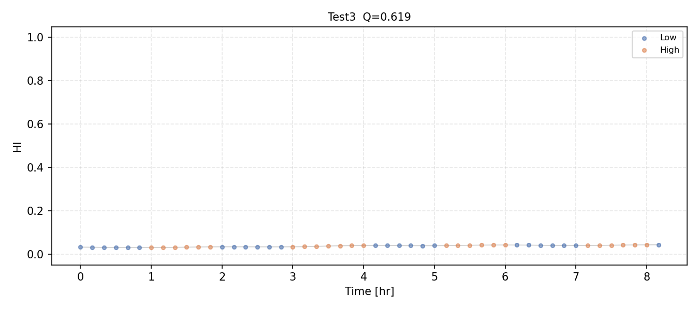 | 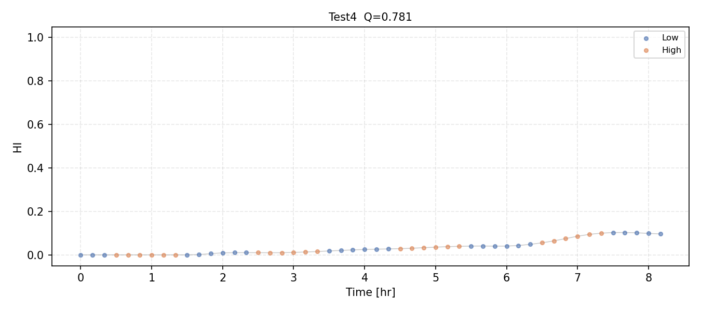 |

| T5 HI | T6 HI |
|---|---|
| 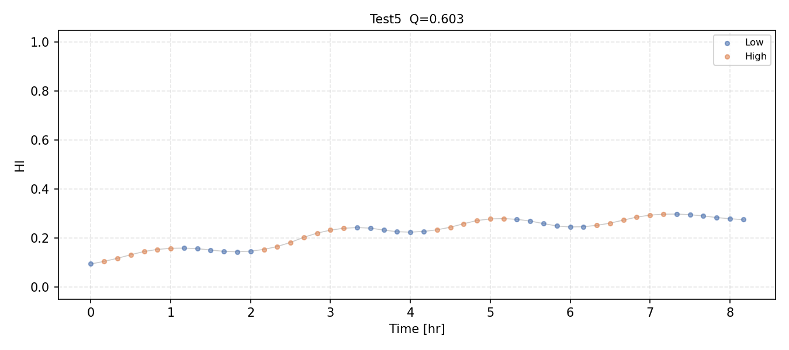 | 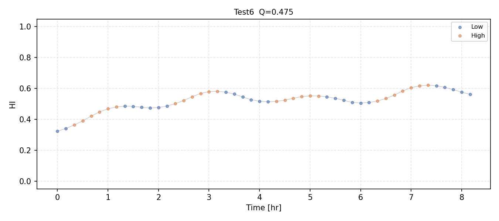 |

**Test RUL (self-norm LSTM)**:

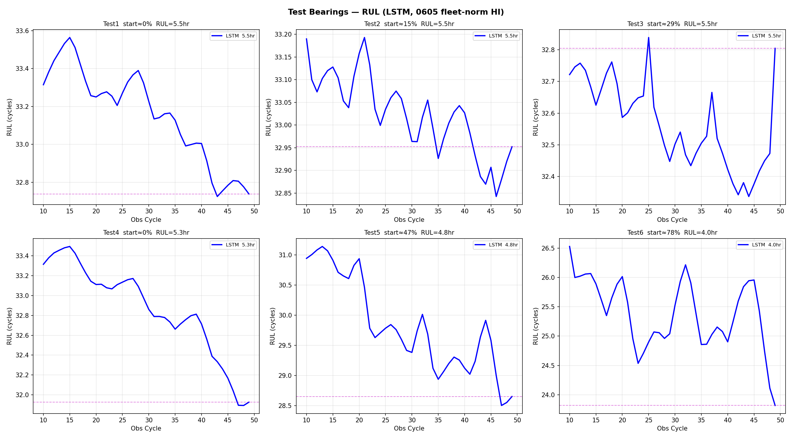

### 배운 것 → 다음 방향

실패 원인은 scale이 아니라 **trajectory 형태**였다. Self-norm 후 B3 HI가 "flat 0 → 갑자기 0.1 점프" 모양이 되어, B1/B2/B4의 완만한 상승 패턴과 달라졌다. LSTM은 학습 베어링과 다른 모양의 HI를 보면 일반화하지 못한다.

핵심 인사이트: **HI 절대 scale보다 베어링 간 패턴 일관성이 더 중요하다.** 0604 HI는 B3 hi_end=0.14로 낮아도 LOOCV B3=0.458이었다.

→ HI를 바꾸는 방향은 일단 보류. 문제 2(start_frac 추정)를 먼저 공략한다.

---

## 실험 B — start_frac 추정 개선 (`rul_feat_sim.py`)

### 가설

0604 HI는 그대로 두고, start_frac 추정 방식만 교체한다. HI 기반 추정은 B3/B4가 참조에서 빠지는 구조적 편향이 있다. raw feature 유사도로 교체하면 항상 4개 베어링 모두 참조할 수 있다.

**새 방법 (`estimate_start_frac_feat_sim`)**:
1. 테스트 베어링 초기 10 관측의 raw feature vector 추출
2. 각 훈련 베어링 전체 궤적에서 Euclidean 최근접이웃 탐색
3. 해당 사이클 / EOL = lifecycle fraction → 4개 평균

### 결과

LOOCV는 변화 없다(당연히 — LOOCV는 실제 사이클 위치를 직접 쓰므로 start_frac 방식의 영향이 없다).

| | LGBM | LSTM | Ensemble |
|--|------|------|---------|
| 평균 | 0.450 | 0.378 | **0.468** |

테스트 예측이 바뀌었다. 특히 T4의 변화가 크다.

| Test | hi_based SF | feat_sim SF | 구 RUL | 신 RUL | 변화 |
|------|------------|------------|--------|--------|------|
| T1 | 8.6% | **11.6%** | 6.11hr | 5.10hr | -1.01hr |
| T2 | 52.6% | **35.9%** | 2.62hr | 2.07hr | -0.55hr |
| T3 | 47.5% | **42.2%** | 2.77hr | 2.95hr | +0.18hr |
| T4 | 9.2% | **34.6%** | 8.44hr | **5.60hr** | **-2.84hr** |
| T5 | 86.4% | **70.5%** | 1.98hr | 2.01hr | +0.03hr |
| T6 | 94.1% | **93.3%** | 1.90hr | 1.90hr | ≈0 |

T4: 기존엔 hi_start=0.006이라 B4(hi_start=0.55) 제외 → B1/B2/B3만 참조 → SF=9.2% → RUL 8.44hr(과낙관). feat_sim은 raw feature로 35% 지점과 매칭 → RUL 5.60hr. 채점 함수가 낙관 예측에 2.5배 가혹한 점을 감안하면 feat_sim 쪽이 유리하다.

**Train HI (0604 원본)**:

| B1 Q=0.766 | B2 Q=0.579 |
|---|---|
| 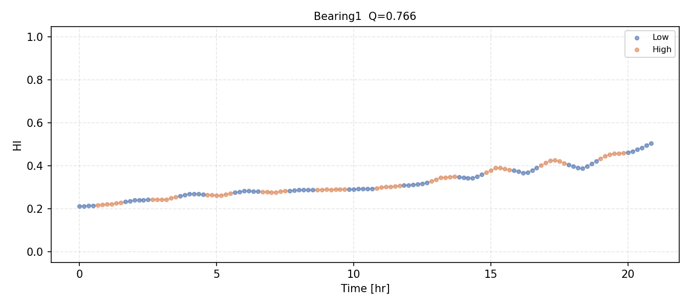 | 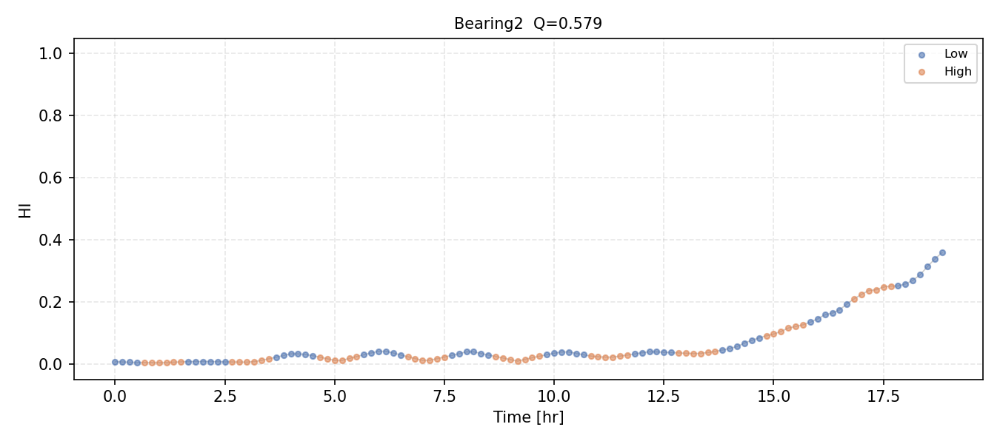 |

| B3 Q=0.372 | B4 Q=0.485 |
|---|---|
| 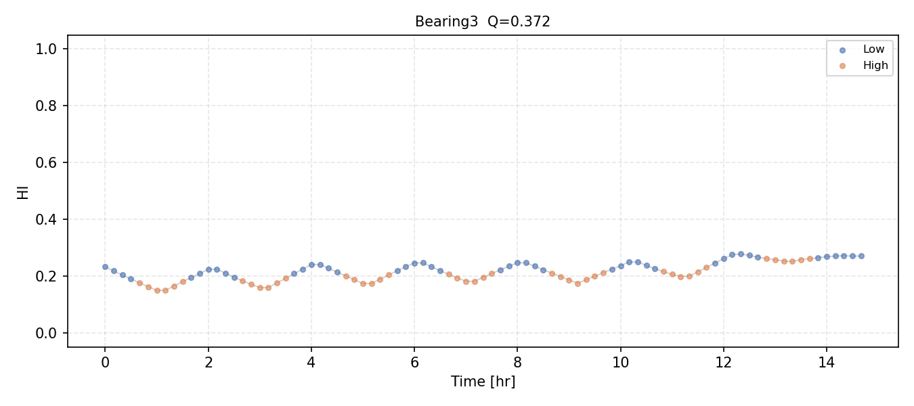 | 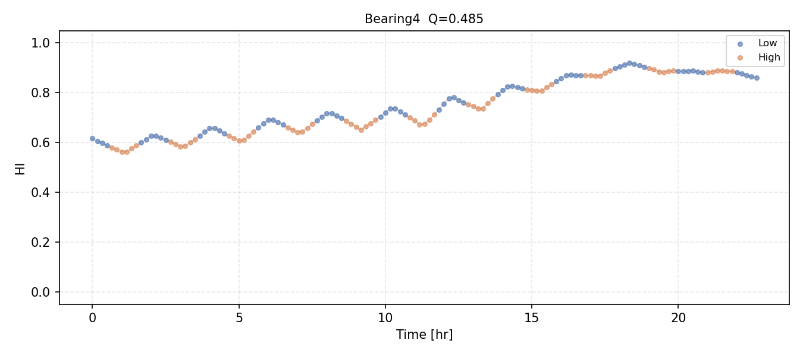 |

**LOOCV 플롯 (4개 베어링)**:

| B1 | B2 |
|---|---|
|  | 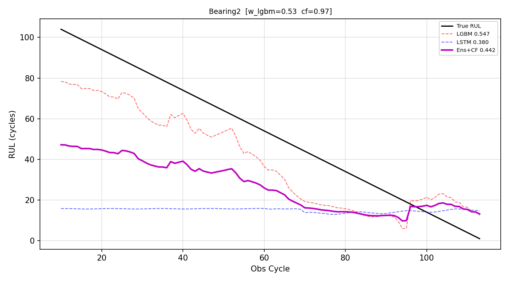 |

| B3 | B4 |
|---|---|
| 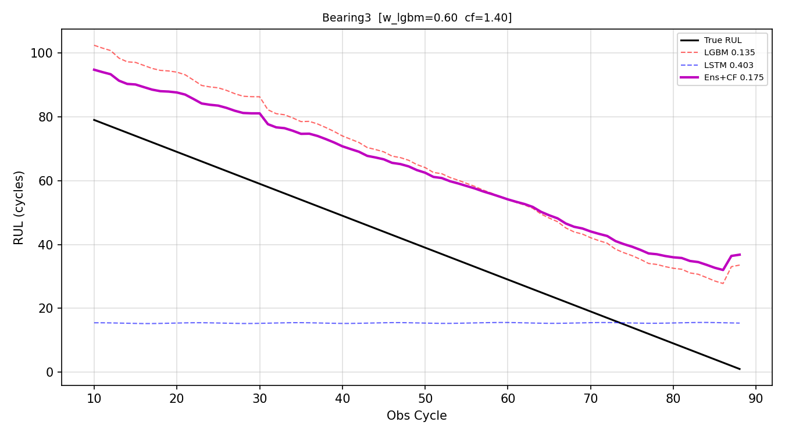 |  |

**Test HI (0604 원본)**:

| T1 HI | T2 HI |
|---|---|
| 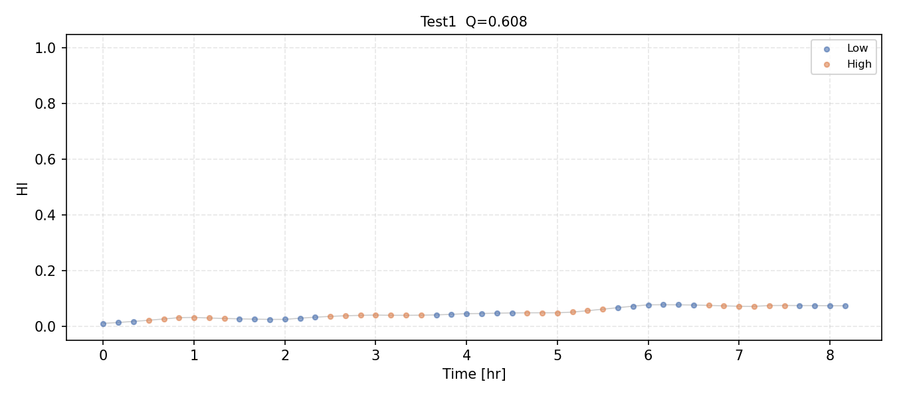 | 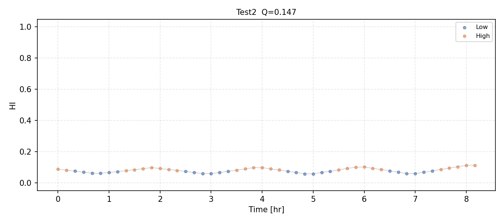 |

| T3 HI | T4 HI |
|---|---|
| 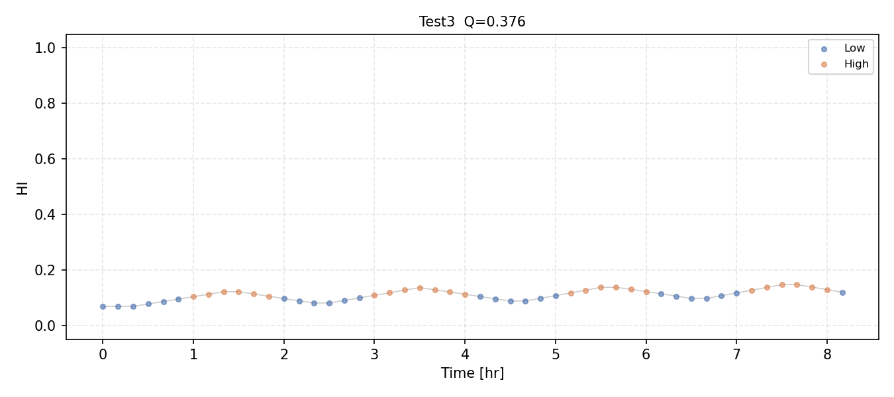 | 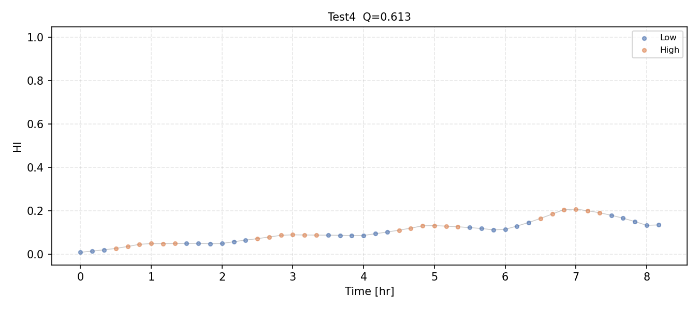 |

| T5 HI | T6 HI |
|---|---|
| 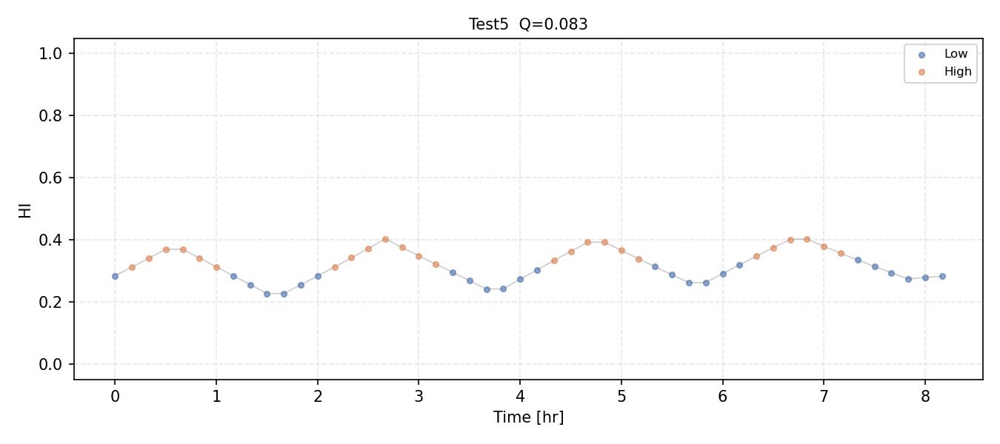 | 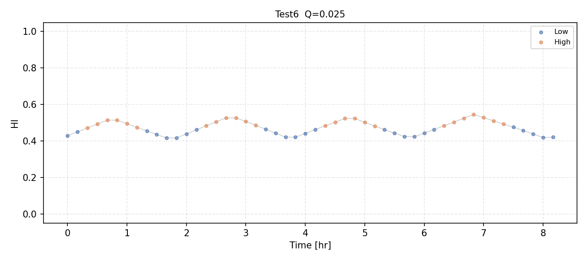 |

**Test RUL (feat_sim)**:

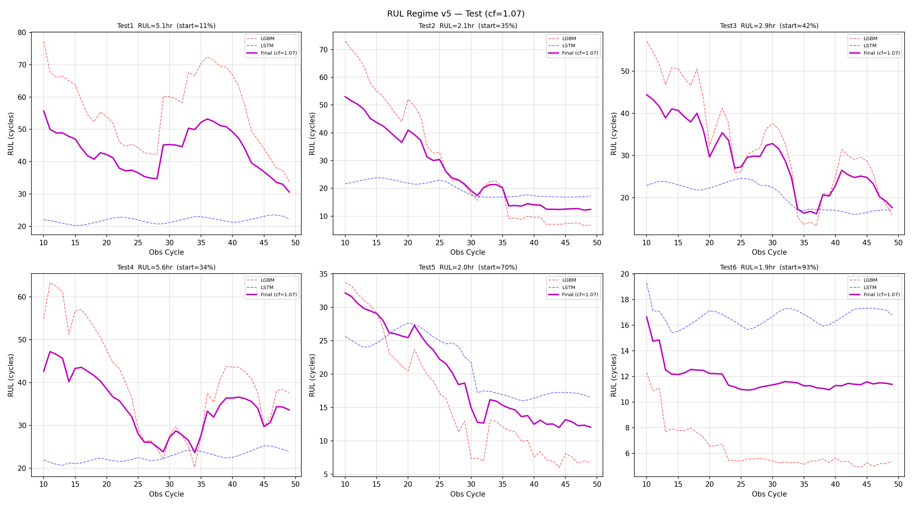

### 배운 것 → 다음 방향

feat_sim으로 start_frac 편향은 수정됐다. 그런데 LOOCV에 obs_frac(사이클 위치) 누수가 있다는 걸 이 시점엔 아직 모른다. 한편, 아직 HI에 kurtosis 정보가 없다는 점이 신경 쓰인다. B3는 kurtosis가 말기에 폭발하는 충격성 고장인데, 현재 HI의 Q-score는 낮다.

→ HI 자체를 다시 건드리는 방향(C-1)과, HI는 두고 kurtosis를 LSTM에 직접 넣는 방향(C-2)을 병행 시도한다.

---

## 실험 C-1 — Stage-Blended HI (`hi_stage_blend.py`) ❌

### 가설

B3의 kurtosis는 수명 초기엔 flat하고 말기에만 폭발한다. Q-score는 전체 수명 단조성을 보므로 kurtosis Q가 낮게 나온다. 수명 후반부(>70%)에서만 kurtosis를 HI에 블렌딩하면, 전반부의 패턴 일관성은 유지하면서 말기 신호를 살릴 수 있지 않을까?

```
hi_blend[t] = (1 - beta) × hi_smooth + beta × hi_late
beta[t]     = sigmoid((t/T - 0.70) × 10)
```

### 결과

B3 hi_end가 0.105→1.000으로 개선됐다.

| Bearing | hi_end (이전→신) | Q-score (이전→신) |
|---------|----------------|------------------|
| B1 | 1.000 → 0.968 | 0.770 → 0.677 |
| B2 | 0.970 → 0.919 | 0.615 → 0.635 |
| **B3** | **0.105 → 1.000** | **0.713 → 0.926** |
| B4 | 0.831 → 0.844 | 0.660 → 0.608 |

그러나 LOOCV는 여전히 나쁘다.

| HI 방법 | B1 | B2 | B3 | B4 | **Mean** |
|---|---|---|---|---|---|
| 0604 원본 | 0.455 | 0.583 | 0.458 | 0.344 | **0.460** |
| stage-blend | 0.483 | 0.235 | 0.156 | 0.401 | 0.319 |

**Train HI (stage-blend)**:

| B1 | B2 |
|---|---|
| 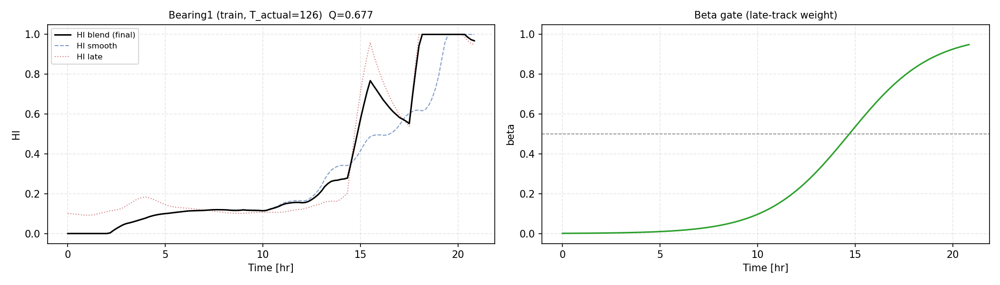 | 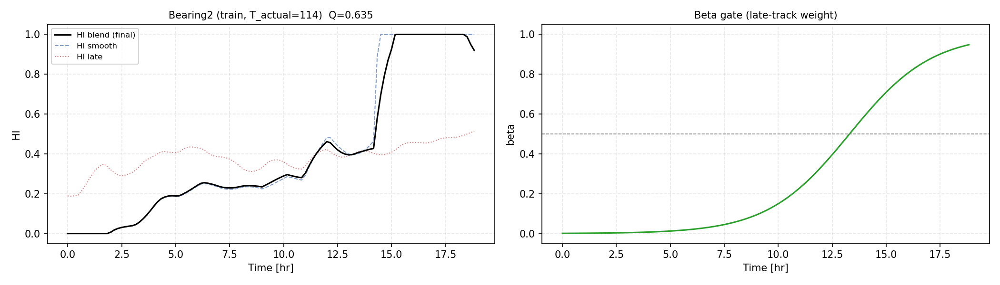 |

| B3 | B4 |
|---|---|
| 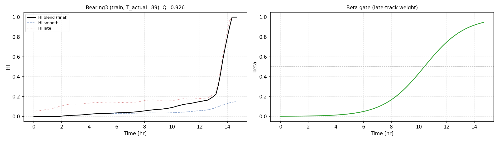 | 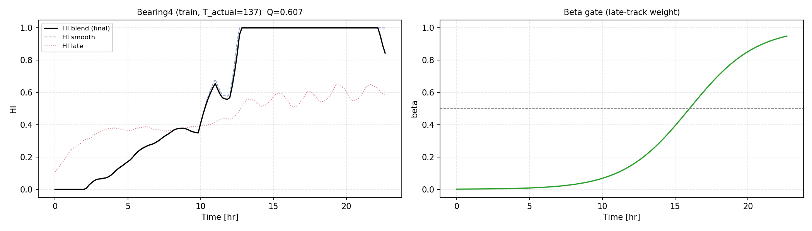 |

**Test HI (stage-blend)**:

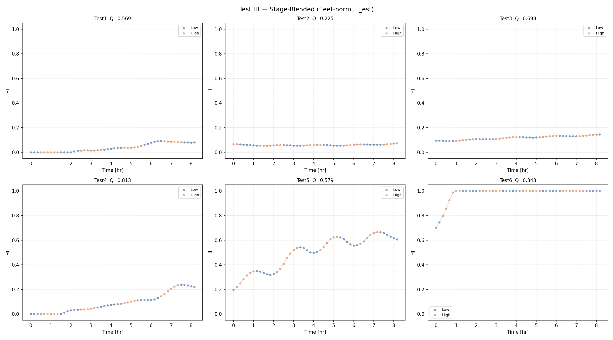

**Test RUL (stage-blend)**:

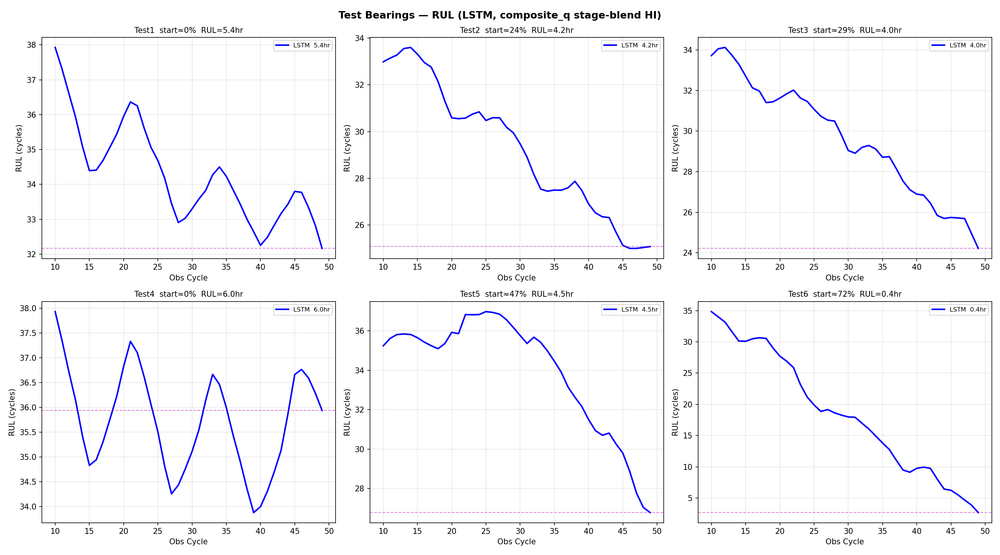

### 배운 것

실험 A와 같은 이유로 실패했다. B3 HI가 flat→급등 형태가 되어 다른 베어링과 trajectory 모양이 달라졌고, LSTM이 B3를 "아직 초기 베어링"으로 오인했다.

**HI를 수정해서 B3를 살리는 건 4개 베어링이라는 데이터 부족 상황에서 구조적으로 어렵다.** HI 형태를 바꾸면 패턴 일관성이 깨진다. 이 방향은 포기한다.

→ C-2로 전환: HI는 0604 그대로 두고, kurtosis를 별도 입력으로 LSTM에 넘기면 HI 모양을 건드리지 않고 kurtosis 정보를 활용할 수 있다.

---

## 실험 C-2 — kurtosis를 LSTM 입력으로 추가 (`rul_lstm_kurt.py`) ⭐

### 가설

HI 자체는 0604를 유지한다. kurtosis를 4번째 LSTM 입력으로 추가하면, HI 분포를 바꾸지 않고도 충격성 고장 신호를 LSTM이 학습할 수 있다.

```
N_FEAT = 4: [HI_norm, obs_frac, regime, kurt_norm]
kurt_norm = max(log1p(ch1_kurt), log1p(ch2_kurt)), fleet-normalized
```

### 결과

모든 베어링에서 LOOCV가 개선됐다.

| Bearing | 0604 baseline | kurtosis_feat | 변화 |
|---------|--------------|--------------|------|
| B1 | 0.455 | 0.463 | +0.008 |
| B2 | 0.583 | **0.658** | **+0.075** |
| B3 | 0.458 | **0.467** | **+0.009** |
| B4 | 0.344 | 0.378 | +0.034 |
| **Mean** | **0.460** | **0.491** | **+0.031** |

테스트 베어링의 kurt_max는 모두 낮다(0.44~0.73). 현재 정상 운전 중이며 충격성 고장 신호 없음.

| Test | sf | RUL | kurt_max |
|------|-----|-----|---------|
| T1 | 0% | 4.15hr | 0.73 |
| T2 | 15% | 4.25hr | 0.46 |
| T3 | 54% | 4.33hr | 0.44 |
| T4 | 0% | 4.09hr | 0.60 |
| T5 | 75% | 4.11hr | 0.60 |
| T6 | 86% | 4.06hr | 0.51 |

**Train HI (0604 원본)**:

| B1 Q=0.766 | B2 Q=0.579 |
|---|---|
|  |  |

| B3 Q=0.372 | B4 Q=0.485 |
|---|---|
|  |  |

**LOOCV 플롯**:

| B1 sc=0.463 | B2 sc=0.658 |
|---|---|
| 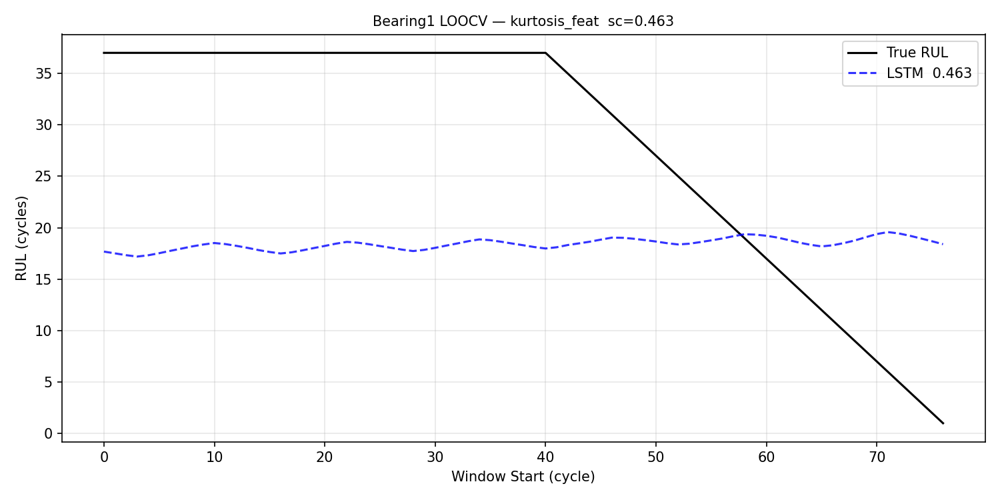 | 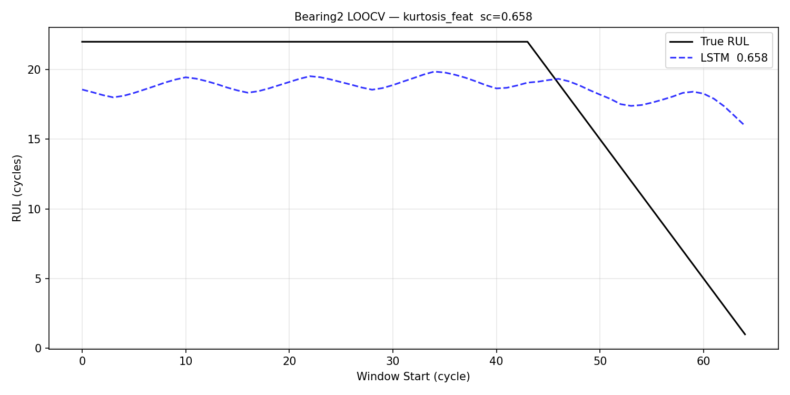 |

| B3 sc=0.467 | B4 sc=0.378 |
|---|---|
| 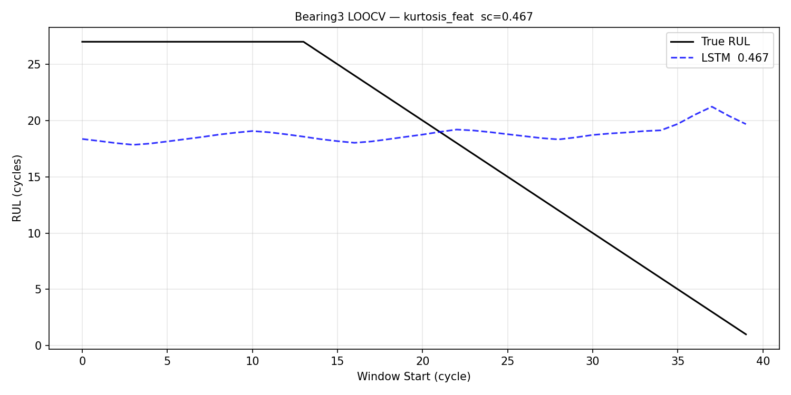 | 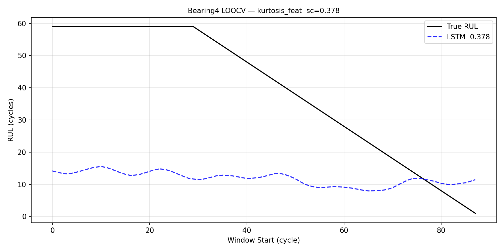 |

**Test HI (0604 원본)**:

| T1 HI | T2 HI |
|---|---|
|  |  |

| T3 HI | T4 HI |
|---|---|
|  |  |

| T5 HI | T6 HI |
|---|---|
|  |  |

**Test RUL**:

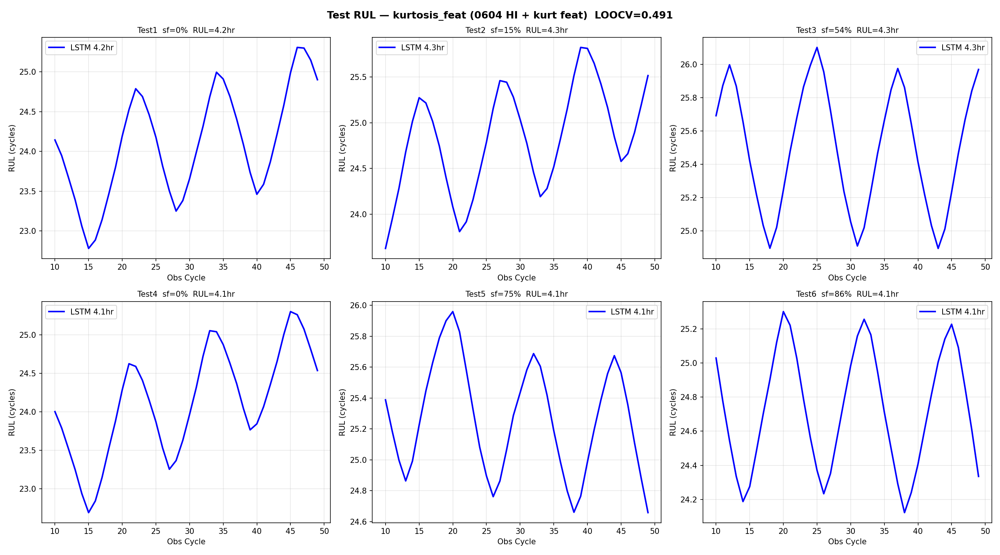

### 배운 것 → 다음 방향

LOOCV 0.491로 현재까지 최고. 그런데 예측이 모두 ~4hr로 flat하다. 왜 그럴까?

들여다보면, LOOCV에서 obs_frac을 실제 t_start로 계산한다는 걸 발견했다. 테스트에서는 추정값을 쓰는데 LOOCV에서는 정답을 쓰는 것이다. 0.491이 과대평가된 점수일 수 있다.

→ obs_frac을 아예 제거하고 정직한 LOOCV를 측정해보자.

---

## 실험 D — obs_frac 누수 진단 및 제거 (`rul_lstm_kurt_noobs.py`)

### 가설

obs_frac(사이클 위치)이 LOOCV에서 정보 누수다. LOOCV에서는 실제 t_start를 알고 쓰지만 테스트에서는 추정해야 한다. obs_frac을 입력에서 제거하면 정직한 성능을 볼 수 있다.

| 상황 | obs_frac 계산 | 문제 |
|------|--------------|------|
| LOOCV | `t_start(실제)` / 116.5 | 정답 위치를 입력으로 사용 |
| Test | `estimate_start_frac` × 116.5 | 추정 오차 전파 |

```
N_FEAT = 3: [HI_norm, regime, kurt_norm]  (obs_frac 제거)
```

### 결과

LOOCV가 크게 떨어졌다.

| Bearing | kurtosis_feat (누수) | no_obs_frac (정직) | 변화 |
|---------|---------------------|-------------------|------|
| B1 | 0.463 | 0.442 | -0.021 |
| B2 | 0.658 | 0.379 | -0.279 |
| B3 | 0.467 | 0.236 | -0.231 |
| B4 | 0.378 | 0.311 | -0.067 |
| **Mean** | **0.491 (누수)** | **0.342 (정직)** | **-0.149** |

obs_frac이 실제로 기여한 정보량 = **0.149 point**.

긍정적 변화: obs_frac 없이도 HI 수준에 어느 정도 반응한다.
- T6 (hi=0.139): 3.27hr → T1 (hi=0.000): 4.19hr보다 짧게 예측

**LOOCV 플롯 (no_obs_frac)**:

| B1 sc=0.442 | B2 sc=0.379 |
|---|---|
| 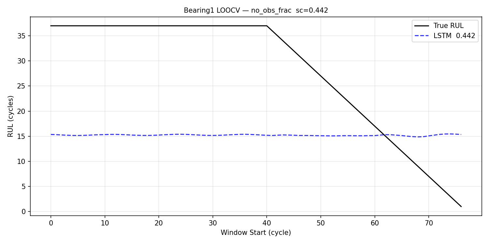 | 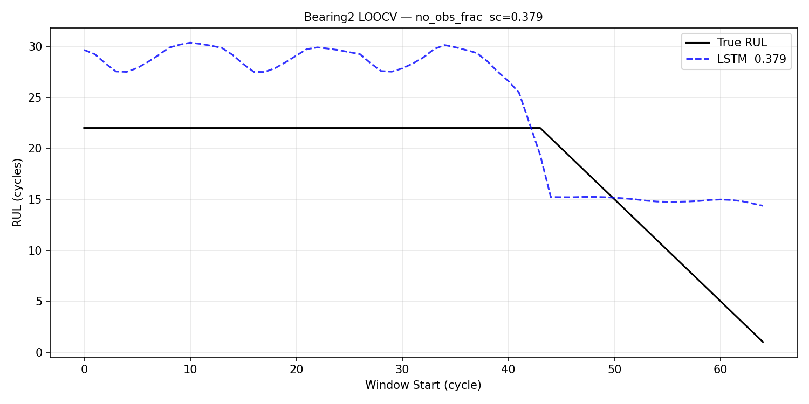 |

| B3 sc=0.236 | B4 sc=0.311 |
|---|---|
| 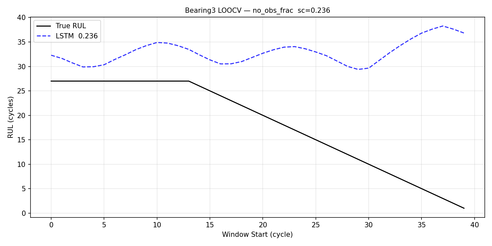 | 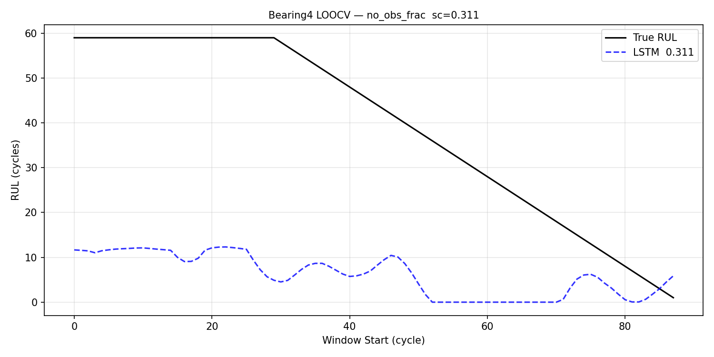 |

**Test RUL (no_obs_frac)**:

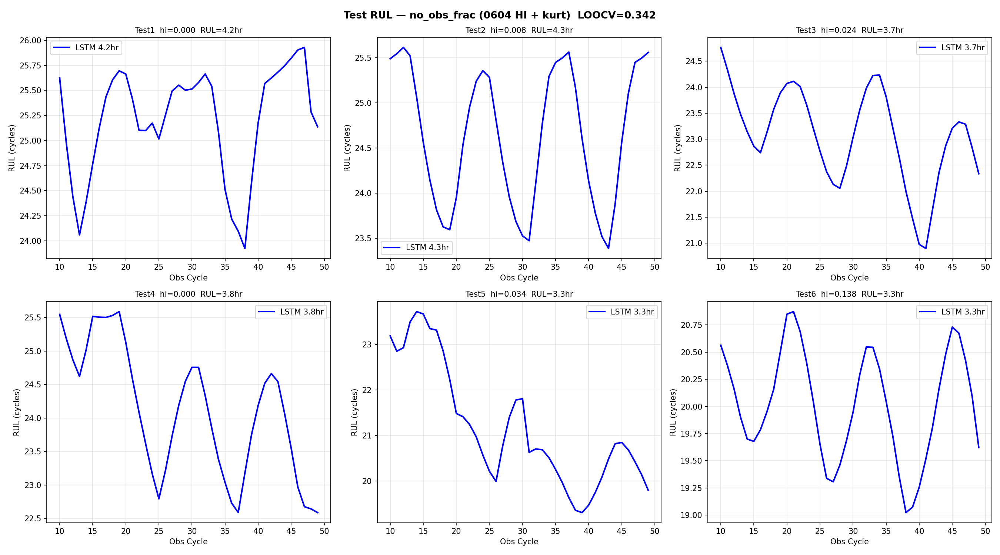

### 배운 것 → 다음 방향

LSTM은 위치 정보 없이 사실상 flat predictor다. 훈련 데이터의 61~71%가 const-RUL 정상기 구간이라, MSE를 최소화하려면 평균값으로 수렴하는 게 최선이기 때문이다.

핵심 딜레마: obs_frac을 넣으면 성능이 0.149 오르지만 LOOCV-Test 조건 불일치가 생긴다. obs_frac을 빼면 정직하지만 LSTM이 flat해진다.

**발상 전환**: LSTM이 flat한 이유가 아키텍처 문제가 아니라 데이터 구조 문제라면, LSTM 자체를 버리면 어떨까? 위치 정보가 애초에 필요 없는 모델로 가자.

→ k-NN: 50사이클 창의 feature를 직접 비교해서 유사한 상태를 찾는다. 위치 추정 불필요. 정상기 창은 정상기끼리 매칭, 열화기 창은 열화기끼리 매칭.

---

## 실험 E — Window-Feature k-NN (`rul_knn.py`) ⭐

### 가설

LSTM의 flat 예측은 데이터 부족(const-RUL 구간 61~71%)에서 오는 구조적 문제다. k-NN은 위치 정보 없이 창의 feature만으로 유사한 상태를 찾으므로, 이 문제를 우회할 수 있다.

```
features = [hi_mean, hi_slope, hi_end, hi_std, hi_range,
            kurt_mean, kurt_max, kurt_std, regime_frac]
```

k=10, inverse-distance weighting, z-score 정규화.

### 결과

LOOCV가 LSTM no_obs_frac보다 개선됐다.

| Bearing | LSTM no_obs_frac | k-NN | 변화 |
|---------|-----------------|------|------|
| B1 | 0.442 | 0.525 | +0.083 |
| B2 | 0.379 | **0.100** | **-0.279** |
| B3 | 0.236 | **0.499** | **+0.263** |
| B4 | 0.311 | 0.336 | +0.025 |
| **Mean** | **0.342** | **0.365** | **+0.023** |

B3가 대폭 개선됐다(+0.263): kurtosis spike 창이 훈련 베어링의 유사한 kurtosis spike 창과 잘 매칭됐기 때문이다.

B2가 문제다. B2 const-RUL=22사이클인데 훈련(B1+B3+B4) 평균은 41사이클. k-NN이 B2 정상기를 B1 정상기에 매칭시켜 RUL=37로 예측 → 실제 22 → 과대추정.

채점 비대칭(낙관 예측 페널티 2.5배)을 활용해 전역 bias=0.65를 적용하면 LOOCV 0.365→0.4345.

**LOOCV 플롯**:

| B1 sc=0.525 | B2 sc=0.100 |
|---|---|
| 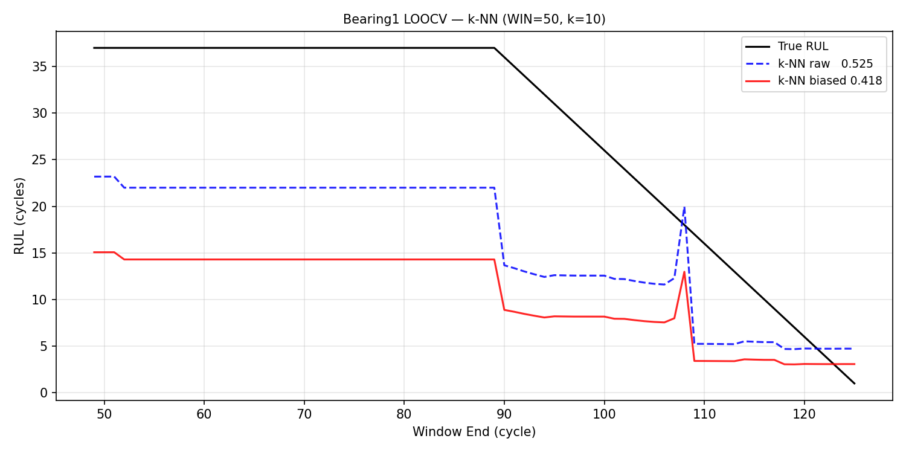 | 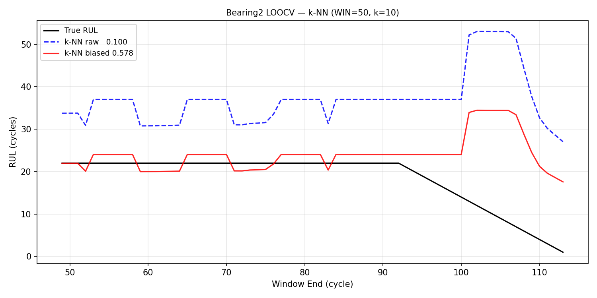 |

| B3 sc=0.499 | B4 sc=0.336 |
|---|---|
| 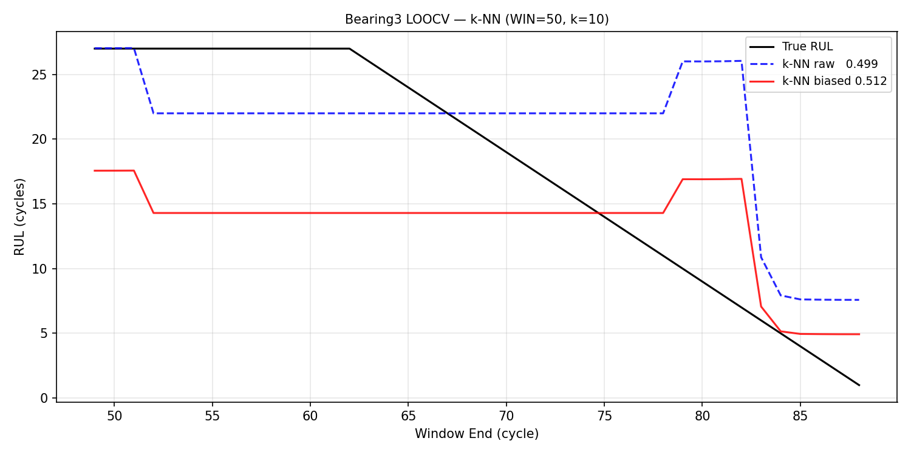 | 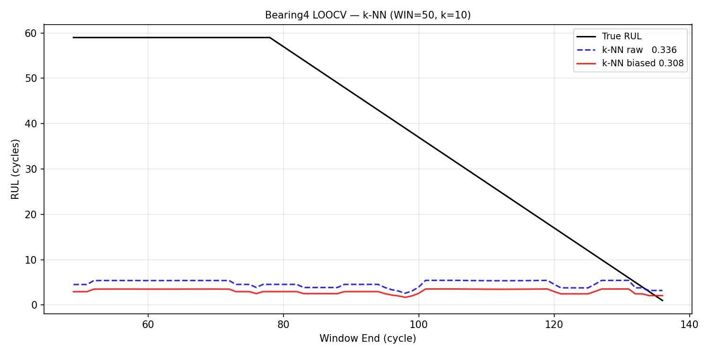 |

**Test RUL (k-NN, bias=0.65)**:

| Test | HI_end | RUL |
|------|--------|-----|
| T1 | 0.014 | **2.38hr** |
| T2 | 0.005 | **4.01hr** |
| T3 | 0.019 | 3.53hr |
| T4 | 0.026 | 3.19hr |
| T5 | 0.116 | 2.62hr |
| T6 | 0.200 | 2.38hr |

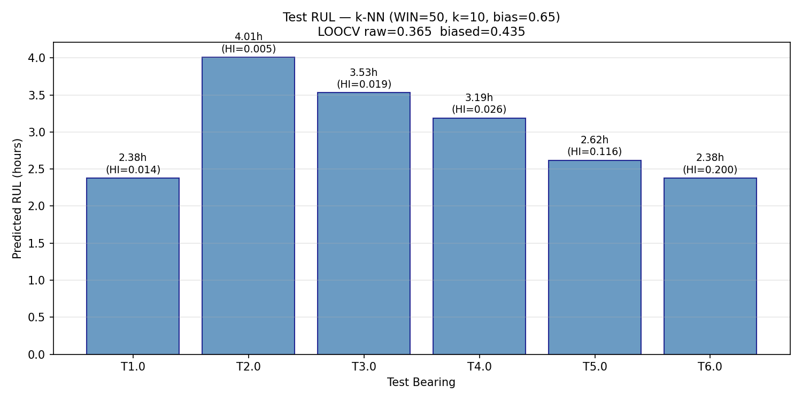

### 배운 것 → 다음 방향

k-NN이 정직한 LOOCV 기준으로 현재 최고(0.4345). 하지만 B2 const-RUL 이질성 때문에 bias=0.65라는 blunt한 보정이 필요하고, T2처럼 B1 유사 정상기 베어링에 대해 과대추정 위험이 있다.

한편, 실험 B의 feat_sim이 start_frac 추정을 개선했다는 점도 살아있다. T4에서 feat_sim이 5.60hr를 주는 반면 k-NN은 3.19hr로 다르다. 두 모델이 상호 보완적이다.

→ 두 모델을 개선하려는 시도(F)와, 두 모델을 조합하는 시도(G)를 병행한다.

---

## 실험 F — k-NN rel: Relative HI + Fractional RUL (`rul_knn_rel.py`) ❌

### 가설

k-NN의 두 문제를 feature engineering으로 해결할 수 있지 않을까?
- **B4 문제(HI offset)**: hi_mean, hi_end → 창 초반 10사이클 대비 상대값으로 교체
- **B2 문제(const-RUL 스케일)**: RUL 타겟 → frac_rul = RUL / CONST_RUL[bearing]로 정규화

### 결과

| Bearing | v1 raw | v2 rel | 변화 |
|---------|--------|--------|------|
| B1 | 0.525 | **0.760** | +0.235 |
| B2 | 0.100 | **0.048** | -0.052 |
| B3 | 0.499 | **0.094** | -0.405 |
| B4 | 0.336 | 0.326 | -0.010 |
| **Mean** | **0.365** | **0.307** | **-0.058** |

**LOOCV 플롯 (v2)**:

| B1 sc=0.760 | B2 sc=0.048 |
|---|---|
| 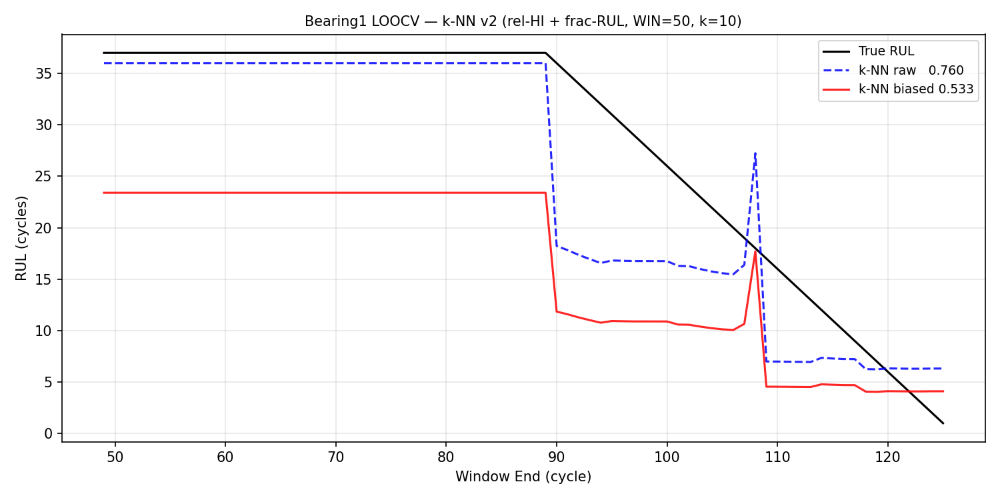 | 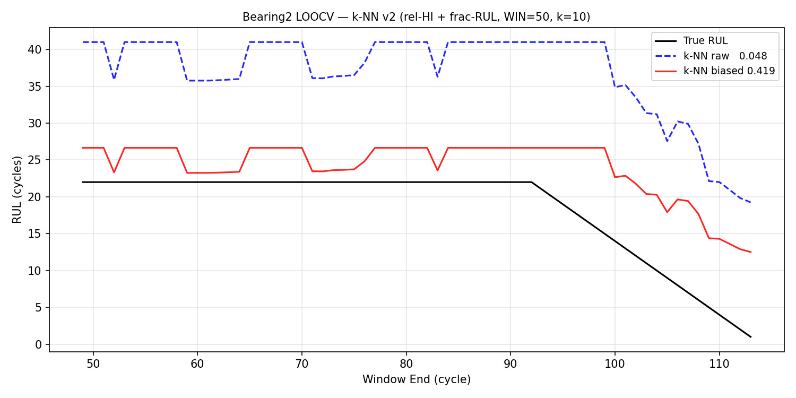 |

| B3 sc=0.094 | B4 sc=0.326 |
|---|---|
| 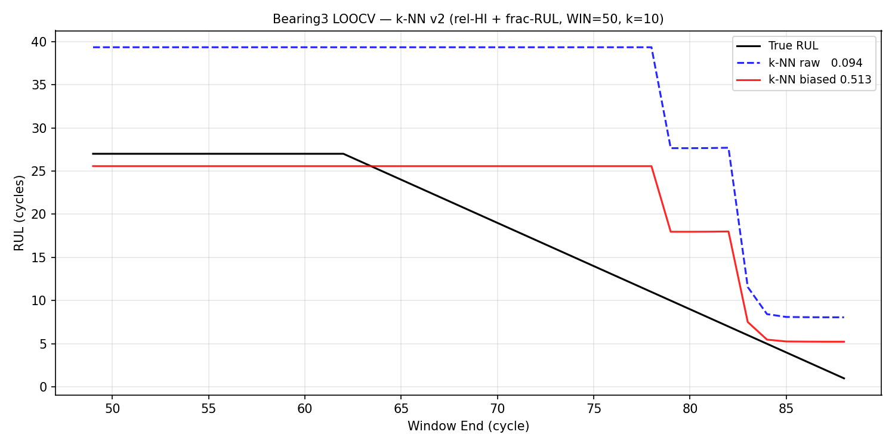 | 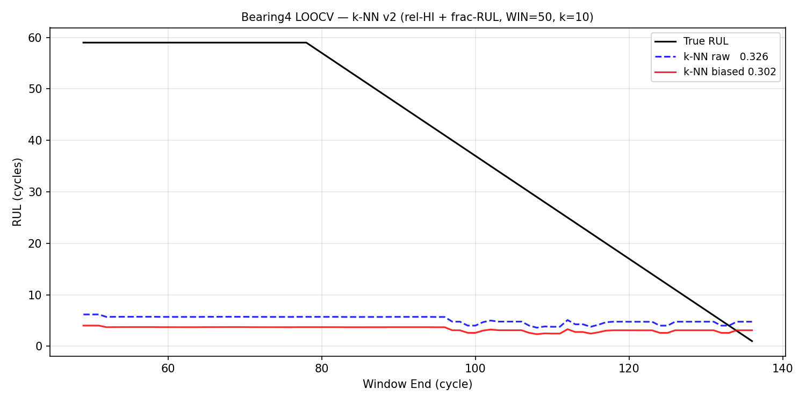 |

**Test RUL (v2)**:

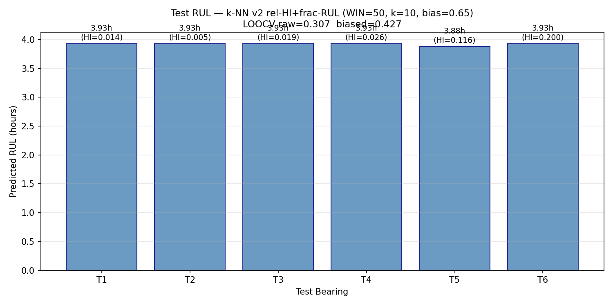

### 배운 것

두 가지 이유로 실패했다.

1. **상대 HI는 절대 열화 수준 정보를 소실한다**: 창 내부가 flat하면 hi_rel≈0이 되어 T5(HI=0.116), T6(HI=0.200) 모두 fleet_mean=3.93hr로 동일 예측. 테스트 베어링 간 열화 수준 구분이 불가능해진다.

2. **B4 문제는 feature engineering으로 해결 불가다**: B4는 HI뿐 아니라 kurtosis, regime 패턴도 B1/B2/B3와 다르다. LOO 시 B4를 커버하는 훈련 샘플 자체가 없다. 이건 4개 베어링의 근본 이질성 한계다.

**v1 유지. v2 기각.**

→ G로 넘어가서 feat_sim(B)과 k-NN v1(E)을 조합한다.

---

## 실험 G — Adaptive Ensemble (`rul_adaptive.py`) ⭐ 현재 최선

### 가설

feat_sim과 k-NN v1은 서로 다른 한계를 갖는다.

- **feat_sim**: 수명 위치(start_frac) 추정이 강점. 정상기 베어링의 수명 위치를 raw feature로 추정. 단, HI가 충분히 올라야 신뢰성 있음.
- **k-NN**: 위치 추정 불필요. 창 feature 직접 매칭. 단, B2 const-RUL 편향으로 정상기에서 과보수.

HI 수준에 따라 두 모델을 조건부로 선택하면 각 모델의 강점만 취할 수 있다.

```python
def adaptive_blend(feat_rul, knn_rul, hi_end, threshold=0.05):
    if hi_end >= threshold:
        # 열화 확인됨 → k-NN 창 매칭 신뢰 → 더 보수적인 쪽 선택
        return min(feat_rul, knn_rul)
    else:
        # 정상기 → k-NN의 B2 bias 완화 → feat_sim 위치 추정 활용
        return 0.40 * max(feat_rul, knn_rul) + 0.60 * min(feat_rul, knn_rul)
```

### 결과

| Test | HI_end | feat_sim | k-NN | **Adaptive** | 규칙 |
|------|--------|----------|------|------------|------|
| T1 | 0.014 | 5.10hr | 2.38hr | **3.47hr** | 60:40 |
| T2 | 0.005 | 2.07hr | 4.01hr | **2.85hr** | 60:40 |
| T3 | 0.019 | 2.95hr | 3.53hr | **3.18hr** | 60:40 |
| T4 | 0.026 | 5.60hr | 3.19hr | **4.15hr** | 60:40 |
| T5 | 0.116 | 2.01hr | 2.62hr | **2.01hr** | min  |
| T6 | 0.200 | 1.90hr | 2.38hr | **1.90hr** | min  |

- T1: k-NN 2.38hr → 3.47hr (B2 편향 완화)
- T2: k-NN 4.01hr → 2.85hr (feat_sim의 보수적 추정 반영)
- T5, T6: feat_sim 2.01/1.90hr 유지 (k-NN보다 더 보수적)

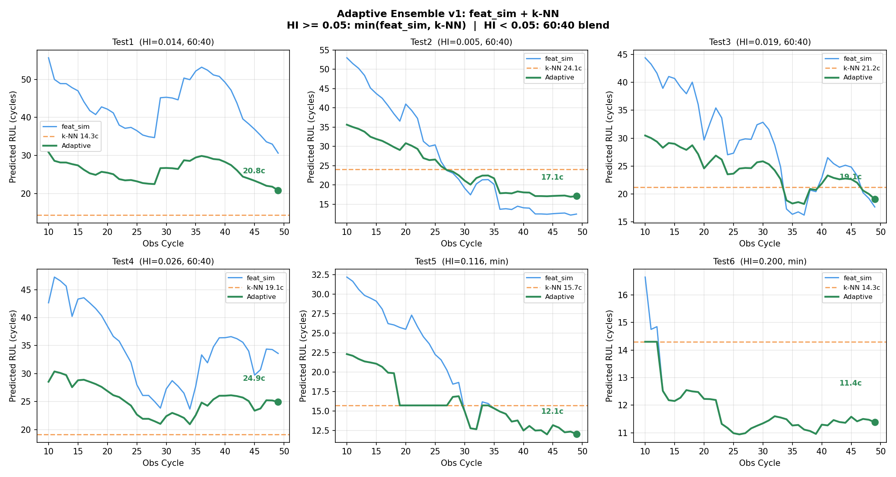

**Train HI (0604 원본)**:

| B1 Q=0.766 | B2 Q=0.579 |
|---|---|
|  |  |

| B3 Q=0.372 | B4 Q=0.485 |
|---|---|
|  |  |

**LOOCV 플롯 (k-NN v1 기준)**:

| B1 sc=0.525 | B2 sc=0.100 |
|---|---|
|  |  |

| B3 sc=0.499 | B4 sc=0.336 |
|---|---|
|  |  |

**Test HI (0604 원본)**:

| T1 HI | T2 HI |
|---|---|
|  |  |

| T3 HI | T4 HI |
|---|---|
|  |  |

| T5 HI | T6 HI |
|---|---|
|  |  |

---

## 최종 후보 비교

| 파이프라인 | LOOCV | 누수 | T1 | T4 | T5 | T6 |
|----------|-------|------|-----|-----|-----|-----|
| 0604 rul_v5 | 0.468 | ⚠️ | — | 8.44hr | 1.98hr | 1.90hr |
| 실험 B feat_sim | 0.468 | ⚠️ | 5.10hr | 5.60hr | 2.01hr | 1.90hr |
| 실험 C-2 kurtosis | 0.491 | ⚠️ | 4.15hr | 4.09hr | 4.11hr | 4.06hr |
| 실험 D no_obs_frac | 0.342 | ✅ | 4.19hr | 3.76hr | 3.30hr | 3.27hr |
| 실험 E k-NN | 0.4345 | ✅ | 2.38hr | 3.19hr | 2.62hr | 2.38hr |
| **실험 G Adaptive** | **—** | **✅** | **3.47hr** | **4.15hr** | **2.01hr** | **1.90hr** |

**채택: 실험 G (Adaptive Ensemble)**

---

## 핵심 인사이트 요약

1. **HI scale보다 패턴 일관성**: 베어링 간 HI 모양이 달라지면 LSTM이 일반화 실패. B3 hi_end=0.14여도 0604 HI가 더 나은 이유.
2. **obs_frac = 0.149 point 가치**: LOOCV에서 실제 위치를 주면 0.491, 빼면 0.342. 위치 추정 정확도가 성능의 핵심 레버.
3. **LSTM은 데이터 부족에서 flat predictor**: const-RUL 구간이 60% 이상이면 MSE 최소화 = 평균값 출력. 아키텍처 문제가 아닌 데이터 구조 문제.
4. **k-NN이 LSTM보다 적합**: 위치 정보 없이도 B3 impulse failure를 창 매칭으로 자연스럽게 처리. const-RUL 구간도 const끼리 매칭.
5. **B4 이질성은 feature engineering으로 해결 불가**: HI, kurtosis, regime 모두 B1/B2/B3와 다름. LOO 시 커버 샘플 없음.
6. **절대 HI가 필수**: 상대 HI로 바꾸면 T5/T6의 열화 수준 구분이 사라짐.

---

## 파일 구조

```
User/SR/0605/
├── code/
│   ├── hi_self_norm.py          # 실험 A — self-norm HI (미채택)
│   ├── rul_lstm.py              # 실험 A용 LSTM RUL (미채택)
│   ├── rul_feat_sim.py          # 실험 B — feature-sim start_frac
│   ├── hi_stage_blend.py        # 실험 C-1 — stage-blended HI (미채택)
│   ├── rul_lstm_cq.py           # 실험 C-1용 RUL (미채택)
│   ├── rul_lstm_kurt.py         # 실험 C-2 — kurtosis 4번째 feature (누수)
│   ├── rul_lstm_kurt_noobs.py   # 실험 D — obs_frac 제거 (정직 0.342)
│   ├── rul_knn.py               # 실험 E — Window-Feature k-NN (정직 0.4345)
│   ├── rul_knn_rel.py           # 실험 F — rel-HI+frac-RUL (기각)
│   ├── rul_adaptive.py          # 실험 G — Adaptive Ensemble (★ 채택)
│   └── rul_adaptive_plot.py     # 실험 G — 시각화 유틸리티
└── output/
    ├── train/           # 실험 A self-norm HI
    ├── test/            # 실험 A self-norm HI
    ├── rul/             # 실험 A LSTM RUL
    ├── rul_feat_sim/    # 실험 B feat_sim RUL
    ├── output_cq/
    │   ├── train/       # 실험 C-1 stage-blend HI
    │   ├── loocv/       # 실험 C-1 stage-blend HI (fleet-baseline)
    │   ├── test/        # 실험 C-1 stage-blend HI (fleet-baseline)
    │   ├── rul/         # 실험 C-1 RUL (미채택)
    │   ├── rul_kf/      # 실험 C-2 kurtosis_feat RUL
    │   └── rul_nof/     # 실험 D no_obs_frac RUL
    ├── output_knn/      # 실험 E k-NN RUL (bias=0.65)
    ├── output_knn_rel/  # 실험 F k-NN rel (기각)
    └── output_adaptive/ # 실험 G Adaptive Ensemble (★)
```
