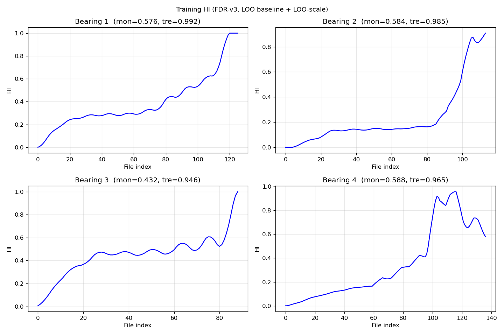
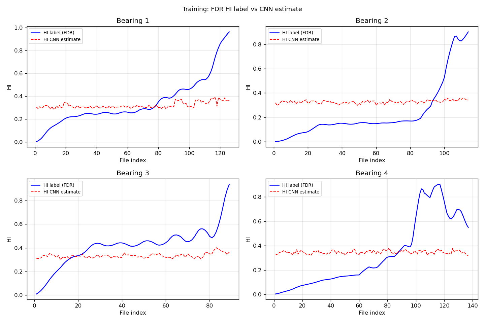
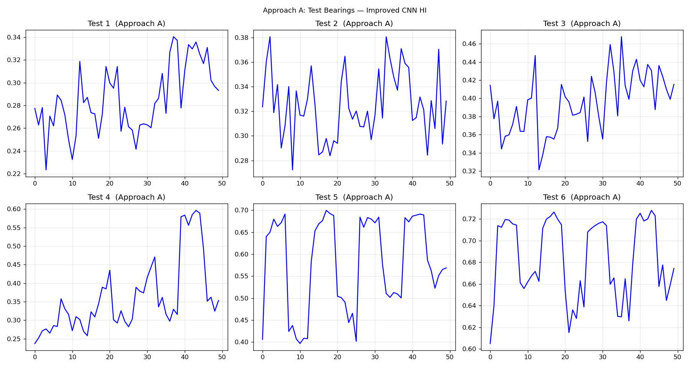
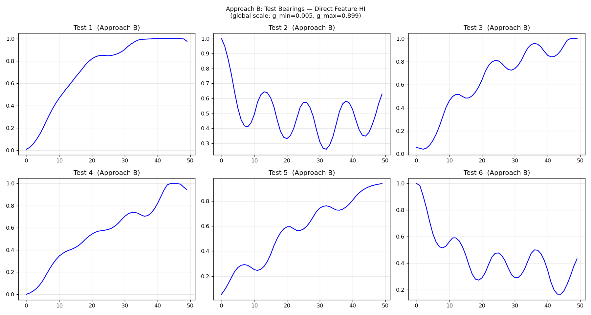
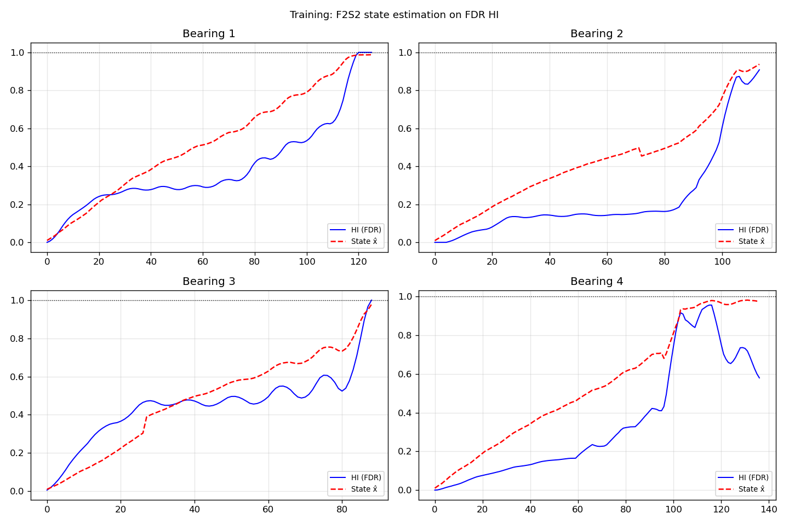
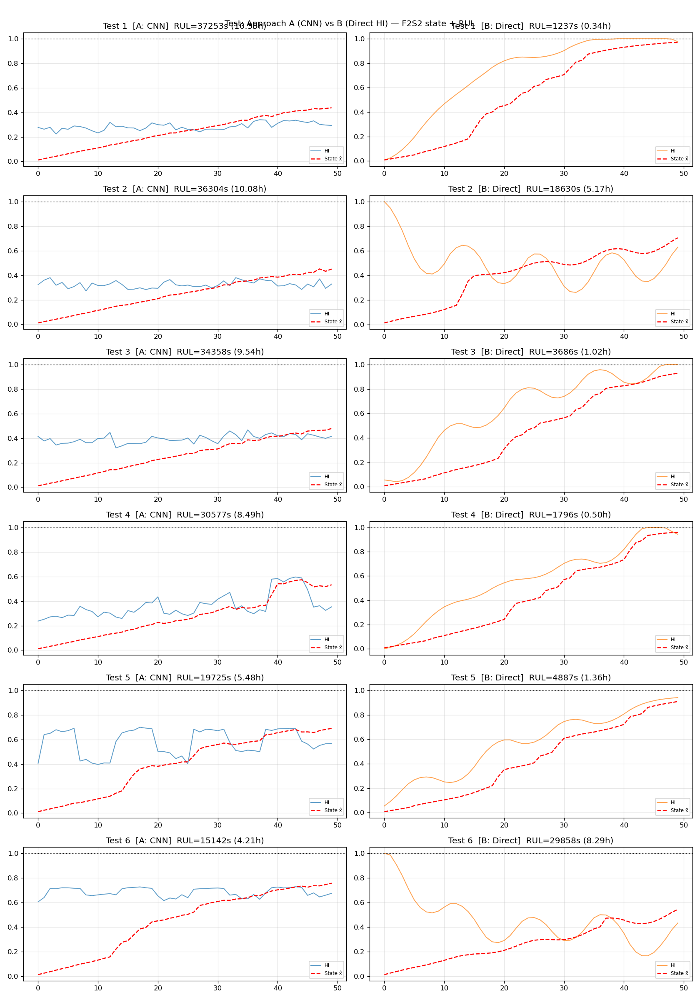

# 0605_ref Progress — DEI-CNN + F2S2 Pipeline

**Date**: 2026-06-05  
**References**: Cheng et al. (2020) "A Deep Learning-Based RUL Prediction Approach" + Li et al. (F2S2)  
**Goal**: Train HI → 1D-CNN → F2S2 Particle Filter → Inverse Gaussian RUL

---

## Pipeline Overview

```
Raw TDMS
  │
  ├── [c1] Feature Extraction (76 features × 4 CH)
  │         → Bearing{b}_features.csv, Test{t}_features.csv
  │
  ├── [c2] Signal Transform (F2S2-style, FIX-1+2) + FDR HI
  │         → Bearing{b}_HI.csv  (LOO baseline + LOO-scale)
  │         → scale_params.csv   (g_min, g_max for val/test)
  │
  ├── [s1a] Approach A — Improved 1D-CNN
  │         Input: 25,600 samples (1 s), K=20 augmentation, Dropout(0.3)
  │         → Test{t}_HI_CNN.csv
  │
  ├── [c2_test] Approach B — Direct Feature HI (no CNN)
  │         RMS k-means condition classify → avg transform → FDR HI
  │         Normalized by global scale (same g_min/g_max as training)
  │         → Test{t}_HI_Direct.csv
  │
  └── [compare_ab] F2S2 + IG RUL
        - Parameters: η, σ_B², a_B, b_B, c (F2S2 §3.2.3)
        - Particle filter (N=2000) → state x̂
        - RUL = IG.ppf(40th percentile) × 600 s
```

---

## Stage 0: Tacholess RPM Estimation

**Methods**: BPFO envelope, Shaft 1X (high-res FFT), BPFI envelope  
**Result**: ALL FAILED (RMSE ≥ 122 rpm, threshold 30 rpm)

| Method | RMSE [rpm] | MAE [rpm] | 결론 |
|--------|-----------|-----------|------|
| BPFI   | 122.1 | 121.5 | 구조 공진(~120 Hz)에 고착 — 항상 857 rpm 출력 |
| Shaft 1X | 127.9 | 110.0 | 방향은 맞으나 범위 압축 (730→765, 975→810) |
| BPFO   | 132.1 | 117.8 | 잡음 과다, 피크 불명확 |

**원인**: 노이즈 환경 + 베어링 초기 구간 고장 주파수 성분 미약  
**대응**: Test에 평균 RPM 폴백(825 rpm), CNN/직접 HI 추론이 RPM 불필요

---

## Stage 1-c1: Feature Extraction

```
25,600 Hz, 1분 취득, 10분 주기
4채널 (CH1~4) × 19 features = 76 features per file
```

| Set | N files | Features |
|-----|---------|----------|
| Train 1-4 | 126, 114, 89, 137 | 76 |
| Test 1-6 | 50 each | 76 |

---

## Stage 1-c2: Signal Transform + FDR HI

**Leakage 수정 사항 (원본 대비)**:
- **FIX-1** `estimate_transform_params`: 전체 구간 → 초기 15%만 사용
- **FIX-2** 저장 시 global baseline → LOO baseline (exclude_bid=b)
- **추가** LOO-consistent global scale: 다른 3개 베어링 raw 분포로 정규화

**Grid search 결과**: br=0.20, alpha=0.10, Q=0.771

**Training HI (LOO baseline + LOO scale)**:



| Bearing | Monotonicity | Trendability | Range |
|---------|-------------|--------------|-------|
| B1 | 0.616 | 0.992 | [0.000, 1.000] |
| B2 | 0.611 | 0.985 | [0.000, 0.908] |
| B3 | 0.432 | 0.946 | [0.006, 1.000] |
| B4 | 0.588 | 0.965 | [0.000, 0.956] |

**Global scale params** (for test/validation):
- `g_min = 0.00496`, `g_max = 0.8985`
- Saved to `output/hi/scale_params.csv`

---

## Stage 1-A: Improved 1D-CNN (Approach A)

**Architecture** (adjusted for 25,600-sample input):
```
Input (1, 25600) → Conv1(64, k=100, s=50) → MaxPool(2) 
→ Conv2(64, k=2) → MaxPool(2) → FC(8128→256, Dropout) → FC(256→64, Dropout) → Sigmoid
```

**Training**: K=20 augmentation → 9,320 samples, Adam(lr=1e-4), CosineAnnealing, 400 epochs  
**val MSE**: 0.040 (원본 0.057 → 28% 개선, but still flat)

**훈련 HI label vs CNN 추정**:



**문제**: CNN 출력이 0.3~0.5 평탄 — 60초 신호에서 0.1초 창(2560)→1초 창(25,600)으로
개선했으나 466개 훈련 샘플로 열화 트렌드 학습 어려움

**Test HI (Approach A)**:



---

## Stage 1-B: Direct Feature HI (Approach B)

**방법**:
1. ch1_rms + ch3_rms로 K-means(k=2) 조건 분류
2. 훈련 베어링 평균 변환 파라미터(a, b) 적용
3. FDR HI (훈련 4개 전체 baseline)
4. 동일 global scale 적용 (g_min/g_max)

**Test HI (Approach B)**:



| Test | HI 패턴 | HI@50 | 비고 |
|------|---------|-------|------|
| 1 | S-커브 0→0.98 | 0.94 | 명확한 열화 트렌드 |
| 2 | 진동(0.3~1.0) | 0.68 | RPM 아티팩트 의심 |
| 3 | S-커브 0→1.0 | 0.95 | 명확한 열화 트렌드 |
| 4 | S-커브 0→0.95 | 0.89 | 명확한 열화 트렌드 |
| 5 | 완만 증가→0.92 | 0.92 | 열화 진행 중 |
| 6 | 진동(0.2~1.0) | 0.54 | RPM 아티팩트 의심 |

---

## Stage 2: F2S2 Parameter Estimation

**State transition** (MLE on failure times):
- η = 0.008342 cycle⁻¹, σ_B² = 0.000246

**Measurement function** (F2S2 §3.2.3, LOESS boundary + c 최적화):
```
y_k = a_B · x_k^c + b_B + ε
a_B = 0.8554,  b_B = 0.0000,  c = 1.4400,  σ²_m = 0.0214
```
- b_B = mean(ỹ₁) (초기 HI)
- a_B = mean(ỹ_K − ỹ₁) (HI 범위)
- c: Σ(x̂_k − k/K)² 최소화 → 상태 가장 선형에 가깝게

**원본 대비 개선**: x≈t/K 선형 근사 → 경계 조건 + c 최적화

---

## Stage 2: F2S2 LOOCV (80% lifetime cutoff)

**훈련 상태 추정**:



| Bearing | x̂@80% | pred [s] | true [s] | Er [%] | 분석 |
|---------|---------|---------|----------|--------|------|
| B1 | 0.786 | 12,622 | 15,600 | **+19%** | 근접, 소폭 과소예측 |
| B2 | 0.579 | 27,164 | 13,800 | **−97%** | 과대예측, plateau HI |
| B3 | 0.639 | 24,120 | 10,800 | **−123%** | 과대예측, plateau HI |
| B4 | 0.941 | 2,886 | 16,800 | **+83%** | 과소예측, HI 조기 피크 |

**B2/B3 과대예측 원인** (구조적 한계):
- HI가 수명 80~90%까지 plateau (~0.18) 유지 후 급상승
- 측정 함수 역변환: HI=0.18 → x̂_implied=0.36
- 사전 drift: 91사이클 × 0.008 = 0.73
- σ²_m = 0.02: 측정 업데이트 약해 state가 prior(0.73) 쪽으로 → x̂=0.58
- 어떤 σ²_m을 써도 B2/B3 plateau 구간에서 상태 정보 부재 → 근본 해결 불가

**B4 과소예측 원인**:
- HI가 cycle ~110에서 0.97까지 피크 후 0.65로 감소 (비단조)
- 피크 시점에서 x̂ ≈ 1.0 → RUL ≈ 0으로 오판

---

## Stage 3: Test RUL Predictions (Current)

**A vs B 비교 (40th percentile)**:



| Test | A: CNN (h) | B: Direct (h) | B 상태 x̂ |
|------|-----------|---------------|---------|
| 1 | 10.33 | **0.85** | 0.939 |
| 2 | 10.12 | **5.68** | 0.679 |
| 3 | 9.56 | **0.73** | 0.945 |
| 4 | 8.41 | **1.66** | 0.893 |
| 5 | 4.80 | **1.14** | 0.922 |
| 6 | 4.08 | **8.38** | 0.539 |

**A**: CNN 출력 평탄 → prior 주도 → 4~10시간 (정보 부족)  
**B**: 명확한 S-커브 베어링 (T1,3,4,5) 거의 고장 직전 → 단시간 예측  
**신뢰도**: Test 2, 6은 RPM 아티팩트로 HI 진동 → 불확실

---

## Current Issues & Diagnosis

| 문제 | 원인 | 현재 상태 |
|------|------|---------|
| B2/B3 LOOCV 과대예측 (-97%, -123%) | Plateau HI + 선형 Wiener 불일치 | 미해결 |
| B4 LOOCV 과소예측 (+83%) | 비단조 HI (피크 후 감소) | 미해결 |
| Test 2, 6 HI 진동 | RPM 조건 분류 오류 + 신호 변환 불완전 | 부분 해결 |
| CNN 출력 평탄 | 466샘플 + 1초 창 부족 | 미해결 |

---

## FPT (First Prediction Time) — 구현 완료

**개념**: plateau 구간을 skip하고, HI가 처음 threshold(0.25)를 넘는 시점부터 PF 시작

```python
FPT = first k s.t. HI[k:k+3] >= 0.25  (3 consecutive cycles)
Before FPT: x̂_k = η · τ_k  (pure prior drift, no measurement)
At FPT: particles ~ N(η · τ_FPT, σ²_B · τ_FPT)
After FPT: standard particle filter with measurement update
```

**LOOCV 비교 (80% lifetime cutoff)**:

| | Standard PF | FPT PF | FPT 시점 |
|--|------------|--------|---------|
| B1 | +17.3% | **+16.9%** | cycle 23 |
| B2 | -96.3% | **-94.4%** | 0 (미감지) |
| B3 | -123.9% | **-100.9%** | cycle 11 |
| B4 | +87.4% | **+83.5%** | cycle 74 |
| **avg score** | **0.284** | **0.294** | — |

**FPT B2 미감지 원인**: B2 plateau가 0.15~0.18로 threshold 0.25 미만 → FPT=0(fallback)  
**B3 개선**: -124% → -101%, B4 소폭 개선

**Test RUL (Approach B + FPT)**:


| Test | FPT | x̂_final | RUL_B+FPT | RUL_A | 비고 |
|------|-----|---------|-----------|-------|------|
| 1 | 6 | 0.969 | **0.34h** | 10.4h | 고장 임박 |
| 2 | 0 | 0.706 | **5.17h** | 10.1h | 진행 중 |
| 3 | 8 | 0.928 | **1.02h** | 9.5h | 고장 임박 |
| 4 | 8 | 0.959 | **0.50h** | 8.5h | 고장 임박 |
| 5 | 5 | 0.910 | **1.36h** | 5.5h | 고장 임박 |
| 6 | 0 | 0.543 | **8.29h** | 4.2h | 진행 중 |

**해석**: T1,3,4,5는 50사이클에서 HI=0.93~0.97로 고장 직전 → 단시간 예측이 물리적으로 합당.
T2,6은 HI 진동(RPM 아티팩트)으로 불확실.

---

## 현재 한계 정리

| 문제 | 상태 |
|------|------|
| B2 plateau (HI<0.25 for 90 cycles) | **미해결** — 어떤 σ²_m, percentile 조정으로도 개선 불가 |
| B4 비단조 HI (peak→drop) | **부분 개선** — 여전히 +83% over-prediction |
| CNN 출력 평탄 | **한계** — 학습 데이터 부족 (466샘플) |
| Test 2,6 RPM 아티팩트 | **부분 완화** — FPT=0, 표준 PF 사용 |

**경쟁 점수 함수 특성** (과대예측 페널티 2.5배):
- B2 score = 0.5^(94/20) = **0.038** (LOOCV)
- B3 score = 0.5^(101/20) = **0.030** (LOOCV)
- B1 score = 0.5^(17/50) = **0.793**
- B4 score = 0.5^(83/50) = **0.315**

---

## Files

```
code/
  c1_extract_features.py   Feature extraction (TDMS → CSV)
  c2_hi_pipeline.py        Signal transform + FDR HI (LOO-scale)
  c2_test_hi.py            Test HI via direct features (Approach B)
  s1a_cnn_improved.py      Improved CNN (Approach A)
  compare_ab.py            F2S2 + RUL comparison (A vs B)

output/hi/
  Bearing{1-4}_HI.csv      Training HI (LOO-scaled)
  Test{1-6}_HI_{CNN,Direct}.csv
  scale_params.csv         g_min, g_max for val/test normalization

output/predictions/
  f2s2_params.csv          η, σ_B², a_B, b_B, c, σ²_m
  loocv_training.csv       LOOCV results at 80% lifetime
  comparison_summary.csv   Test RUL for both approaches
```
