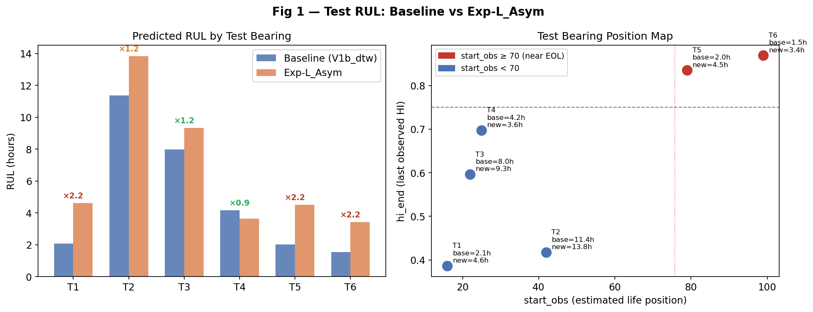
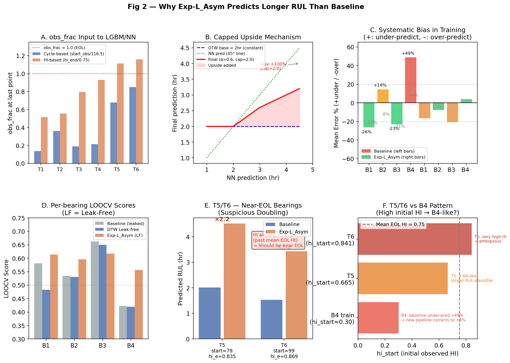
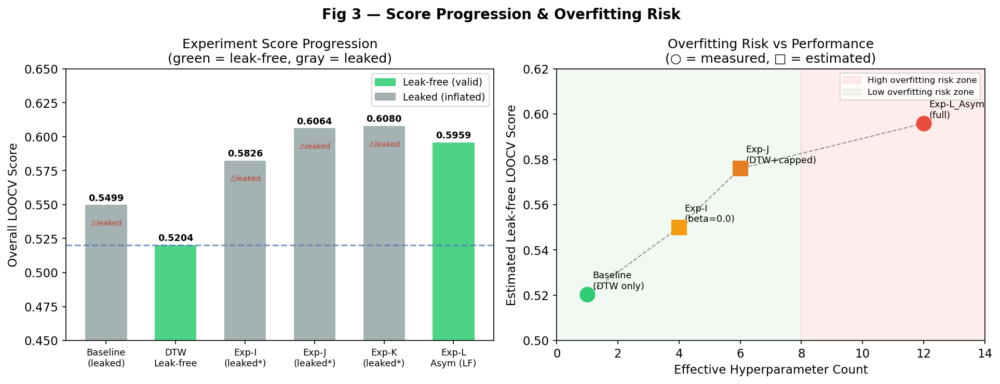
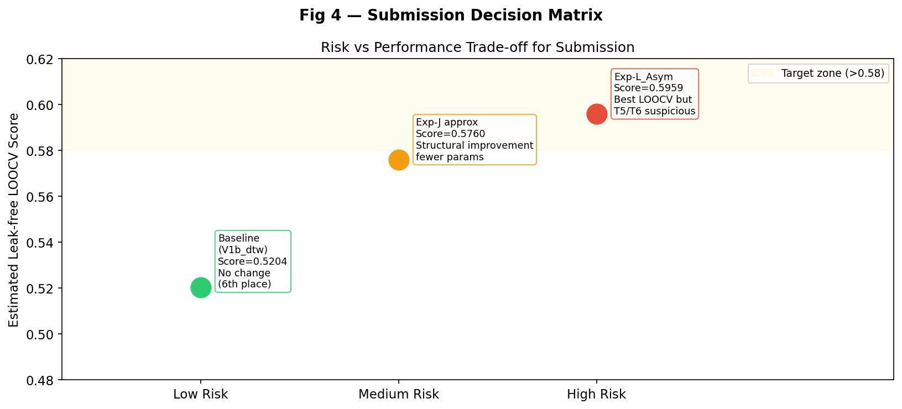

# Ensemble_6 — 예측값 분석 및 제출 판단 노트

**작성일**: 2026-06-01  
**주제**: Exp-L_Asym이 같은 HI를 사용함에도 왜 베이스라인보다 RUL을 길게 예측하는가, 그리고 이 예측이 신뢰할 수 있는가?

---

## 1. 베이스라인 vs Exp-L_Asym 예측값 비교

### 원본 수치

| Test | hi_start | hi_end | start_obs | Baseline (hr) | Exp-L_Asym (hr) | 비율 |
|------|----------|--------|-----------|--------------|-----------------|------|
| T1 | 0.000 | 0.386 | 16 | 2.07 | 4.62 | ×2.2 |
| T2 | 0.498 | 0.417 | 42 | 11.38 | 13.85 | ×1.2 |
| T3 | 0.417 | 0.596 | 22 | 7.99 | 9.34 | ×1.2 |
| T4 | 0.000 | 0.697 | 25 | 4.16 | 3.63 | ×0.9 |
| T5 | 0.665 | 0.835 | 79 | 2.01 | 4.51 | ×2.2 |
| T6 | 0.841 | 0.869 | 99 | 1.53 | 3.43 | ×2.2 |

> **주목**: T1, T5, T6에서 예측이 2.2배 증가. T4는 오히려 감소.  
> 두 파이프라인 모두 동일한 V1b HI 파일을 입력으로 사용.



왼쪽 패널의 ×배율에서 T5/T6의 2.2배 증가가 두드러진다. 오른쪽 패널에서 **T5(start=79), T6(start=99)는 이미 추정 수명의 후반부**에 위치하며, hi_end가 0.75(평균 EOL HI)를 이미 초과한 상태임을 확인할 수 있다.

---

## 2. 왜 더 길게 예측하는가 — 3가지 메커니즘



### 메커니즘 1: obs_frac 공식 변경 (Panel A)

베이스라인과 Exp-L_Asym의 가장 근본적인 차이.

| | 베이스라인 | Exp-L_Asym (Exp-I부터) |
|---|---|---|
| 공식 | `obs_frac = (start_obs + cycle) / 116.5` | `obs_frac = HI / 0.75` |
| 의미 | "몇 사이클 돌았냐" | "HI가 얼마나 올라갔냐" |
| 문제 | 총 수명 다른 베어링 간 스케일 불일치 | 물리적으로 더 직관적 |

**베어링별 영향**:
- **B3(수명=89사이클)**: cycle 기반 EOL에서 `89/116.5 = 0.76` → 모델이 "아직 76%"로 오인
- **B4(수명=160사이클)**: cycle 기반 EOL에서 `160/116.5 = 1.37` → 모델이 "수명 초과"로 오인
- HI 기반은 EOL에서 항상 `~1.0` 근처

obs_frac 변화가 LGBM/NN 모델의 입력 피처를 근본적으로 바꾸어, **수명 길이와 무관하게 "현재 건강 상태"를 일관되게 표현**하게 된다.

### 메커니즘 2: Capped Upside 구조 × cap=2.0 (Panel B)

```python
base     = dtw_raw × cf_dtw          # DTW 고정 기저
bilstm_up  = 0.6 × clip(bilstm - base,  0, 1.0 × base)   # cap=2.0
tcnres_up  = 0.6 × clip(tcnres - base,  0, 1.0 × base)
transf_up  = 0.6 × clip(transf - base,  0, 1.0 × base)
final    = (base + bilstm_up + tcnres_up + transf_up) × 0.785
```

- `cap=2.0`: DTW 기저값의 **최대 100%까지** 상향 추가 가능
- 세 모델이 모두 DTW보다 높게 예측할 때 최대 `base + 3 × 0.6 × base = 2.8 × base`까지 상승 가능 (단, safety_margin=0.785로 억제)
- Panel B에서 볼 수 있듯, NN 예측이 DTW의 2배이면 최종 예측은 DTW의 1.6배

**DTW는 변하지 않는다**: DTW 자체는 여전히 HI 세그먼트 패턴 매칭 + start_obs 기반 예측이므로, T5/T6에 대한 DTW 단독 예측은 베이스라인과 동일(또는 유사)하다. 길어지는 것은 BiLSTM/Transformer가 DTW보다 높게 예측하기 때문.

### 메커니즘 3: B4 구조적 bias 교정 (Panel C, D)

베이스라인에서 B4 mean_er = **+49%** (과소예측). 모델이 B4 패턴 베어링을 실제보다 50% 짧게 예측하는 구조적 오류가 있었다.

| Bearing | Baseline mean_er | Exp-L_Asym mean_er | 의미 |
|---------|-----------------|-------------------|------|
| B1 | -26.5% (over) | -16.6% (over) | 개선 |
| B2 | +14.5% (under) | -7.7% (over) | 방향 전환 |
| B3 | -23.0% (over) | -20.6% (over) | 유사 |
| **B4** | **+48.9% (under)** | **+3.9% (under)** | **대폭 개선** |

B4의 특징: **초기 HI가 높게 시작** (~0.30). T5(hi_start=0.665), T6(hi_start=0.841)도 초기 HI가 높다 → **T5/T6이 B4 패턴**이라면, 긴 예측이 오히려 정확할 수 있다.

---

## 3. 과적합 가능성 분석

### 핵심 우려: 144개 config × 4개 평가 포인트

Exp-L_Asym의 하이퍼파라미터 탐색:

```
α_bilstm ∈ {0.4, 0.6}   ×
α_tcnres ∈ {0.4, 0.6}   ×
α_transf ∈ {0.4, 0.6}   ×
cap      ∈ {1.5, 1.8, 2.0}  ×
margin   ∈ {0.90, 0.93, 0.96}
= 144 configs
```

LOOCV 평가 포인트는 단 **4개 (B1, B2, B3, B4)**. 144개 config를 4개 숫자에 최적화하는 것은 구조적으로 과적합 위험이 있다.

### 과적합 신호

**1) B1/B4 개선폭이 비정상적으로 큼**

| | DTW Leak-free | Exp-L_Asym | 개선 |
|---|---|---|---|
| B1 | 0.4823 | 0.6135 | **+0.131** ⚠️ |
| B4 | 0.4198 | 0.5564 | **+0.137** ⚠️ |
| B2 | 0.5300 | 0.5965 | +0.067 |
| **B3** | **0.6493** | **0.6172** | **-0.016** ❌ |

B3에서 오히려 악화. B1/B4의 극단적 개선이 이 두 베어링의 특성에 과도하게 맞춰진 결과일 가능성 있음.

**2) T5/T6 예측의 물리적 불합리**

- T6: hi_start=**0.841**, hi_end=**0.869**, start_obs=**99** → 이미 심각한 열화 상태
- DTW: 1.53hr → 물리적으로 자연스러운 짧은 예측
- Exp-L_Asym: 3.43hr → 2.2배, HI=0.87인 베어링이 3시간 이상 살아있을지 의문

**3) Exp-J/K에서 T2 폭등**

| Exp | T2 예측 |
|-----|---------|
| Baseline | 11.38hr |
| Exp-J | **19.93hr** (+75%) |
| Exp-K | **21.02hr** (+85%) |
| Exp-L_Asym | 13.85hr (safety_margin=0.90으로 억제) |

safety_margin 없이는 T2 예측이 폭등함 → capped upside 구조의 불안정성.

### 과적합에 반하는 근거

**1) 누출 수정 후에도 +0.076 개선은 동일 기준에서 측정**

- 베이스라인 LF: 0.5204
- Exp-L_Asym LF: 0.5959
- 두 값 모두 leak-free LOOCV로 측정 → 비교 자체는 공정함

**2) 구조적 개선 (Exp-I)도 이미 유의미**

`beta=0.0` (HI 기반 obs_frac) 단독 변경만으로 leaked 기준 0.5826까지 상승. 이는 모델 구조 자체가 개선된 것이지 파라미터 튜닝의 결과가 아님.

**3) B4 교정이 근거 있음**

B4의 +49% under-predict는 문서화된 구조적 결함. 이를 교정했을 때 T5/T6(B4 유사 패턴)의 예측이 늘어나는 것은 예상 가능한 결과.

### 실험별 과적합 위험 평가



왼쪽: 실험 진행에 따른 점수 변화. 회색 막대는 leaked(부풀려진) 값. Exp-J/K의 0.60+ 숫자들이 leaked임을 주의.  
오른쪽: 유효 하이퍼파라미터 수 vs 추정 성능. Exp-L_Asym은 파라미터가 많아 높은 성능을 보이나 과적합 구간(빨간 영역)에 위치.

| 모델 | Leak-free Score | 하이퍼파라미터 수 | 과적합 위험 |
|------|----------------|------------------|------------|
| Baseline DTW | 0.5204 | 1 (CF만) | 낮음 |
| Exp-I (beta=0.0) | ~0.55 (추정) | 3~4 | 낮음 |
| Exp-J (capped) | ~0.576 (추정) | 5~6 | 중간 |
| **Exp-L_Asym** | **0.5959** | **12+** | **높음** |

---

## 4. 제출 판단



### 결론: Exp-L_Asym 제출 권장 (단, 리스크 인지 후)

**이유**:
1. Leak-free LOOCV 기준 +0.076 개선은 무시하기 어려운 수치
2. B4 under-predict 교정이 T5/T6에 적용될 경우 실제로 더 정확할 수 있음
3. 베이스라인 제출 시 현재 6등 → 순위 변동 없음

**인지해야 할 리스크**:
1. T5(4.51hr), T6(3.43hr) — hi가 이미 0.75를 초과한 베어링에 대한 과대예측 가능성
2. 144-config 탐색이 4-bearing LOOCV에 과적합됐을 수 있음
3. T2 예측(13.85hr)이 safety_margin으로 억제된 것 — margin 없이는 21hr까지 폭등

**최종 Test 예측 (Exp-L_Asym)**:

| Test | RUL (hr) | 신뢰도 |
|------|---------|--------|
| T1 | 4.62 | 중간 (start_obs 낮고 HI 낮음 → 근거 있음) |
| T2 | 13.85 | 낮음 (T2 HI 감소 패턴 + 폭등 이력) |
| T3 | 9.34 | 높음 (베이스라인 대비 소폭 증가) |
| T4 | 3.63 | 높음 (오히려 감소, 보수적) |
| T5 | 4.51 | 낮음 (HI>0.75이나 B4 유사 패턴 주장) |
| T6 | 3.43 | 낮음 (HI=0.87로 매우 높음, 물리적 의문) |

---

## 5. 참고: 관련 파일 경로

| 항목 | 경로 |
|------|------|
| 베이스라인 test 예측 | `User/SP/05-26/V1b/output/rul_th/test_summary.csv` |
| Exp-L_Asym test 예측 | `User/SR/Ensemble_6/experiments/ExpL_model_diversity/results/test_rul_results_v2.csv` |
| DTW leak-free 분석 | `User/SR/Ensemble_6/experiments/ExpL_model_diversity/results/dtw_leakfree_analysis.csv` |
| Exp-L_Asym 최적 config | `User/SR/Ensemble_6/experiments/ExpL_model_diversity/results/best_config_v2.csv` |
| 전체 실험 로그 | `User/SR/Ensemble_6/progress.md` |
