# Ensemble_6 — Progress Log

**목표**: V1b_dtw (리더보드 6등, Overall=0.5499) 기반으로 앙상블 전략을 발전시킨 RUL 예측 모델 구현  
**작업 디렉토리**: `User/SR/Ensemble_6/`  
**시작일**: 2026-05-29

---

## 목차

1. [Step 0 — 사전 준비](#step-0)
2. [Step 1 — 코드 복사 및 세밀 검토](#step-1)
3. [Step 2 — 실험](#step-2)

---

## Step 0 — 사전 준비 {#step-0}

### 0-1. 코드 경로 탐색 결과

**리더보드 검색**:  
`User/Record/rul_leaderboard.csv` 에서 확인:
```
2026-05-29 03:13:21, SP, V1b_dtw, B1=0.5808, B2=0.5344, B3=0.6617, B4=0.4226
```

**V1b_dtw 실제 코드 경로**:
- HI 생성: `User/SP/05-26/V1b/code/hi_v1b.py`
- RUL 예측: `User/SP/05-26/V1b/code/rul_th_v1b.py`
- HI 출력 (이미 생성됨): `User/SP/05-26/V1b/output/HI_Bearing{1-4}.csv`, `output/test/HI_Test{1-6}.csv`
- RUL 출력: `User/SP/05-26/V1b/output/rul_results.csv`, `output/rul_th/loocv_log.txt`

**실험명 "V1b_dtw" 의미**: LOOCV 결과 DTW 단일 모델 (cf=0.68)이 최고 점수를 달성하여 최종 선택됨. 앙상블 중 DTW가 우세해서 붙은 이름.

### 0-2. 작업 디렉토리 생성 완료

```
User/SR/Ensemble_6/
├── baseline/
│   └── code/
│       ├── hi_v1b.py          (원본 복사, 수정 없음)
│       └── rul_th_v1b.py      (원본 복사, 수정 없음)
├── experiments/
│   └── baseline/
│       ├── run_baseline.py    (재현용, output 경로만 변경)
│       └── results/           (재현 실행 결과)
├── hi_interface/
│   ├── hi_loader.py           (HI 교환 인터페이스 — 외부 HI 주입 또는 V1b 기본 HI로 폴백하는 HILoader 클래스)
│   └── README.md              (사용법 설명)
└── progress.md                (이 파일)
```

---

## Step 1 — 코드 복사 및 세밀 검토 {#step-1}

### 1-1. 코드 복사 완료

원본: `User/SP/05-26/V1b/code/` → `User/SR/Ensemble_6/baseline/code/` (수정 없음)

### 1-2. 코드 세밀 검토

#### 전체 파이프라인 흐름

```
[1] HI 생성 (hi_v1b.py)
    데이터 로드: SP compare/output/01_features/Bearing{b}_features_new.csv
              + TH FI/06_v6/output/validation_features/Test{t}_features.csv
              + TDMS 파일 (SP 전용 피처 추가 추출)
    RPM 레짐 분류: KMeans (ch4 peak frequency → low/high RPM 레이블)
    피처 선택: Q_mean 기준 상위 7개 (EXCLUDE 목록 제외, source=SP)
    방향 결정: 각 피처가 열화 방향으로 증가/감소 여부
    가중치: Monotonicity + Trendability 기반
    정규화: Z-score (레짐별 baseline, sigma)
    HI 계산: z_sum → EMA+MA 스무딩 → 1-exp(-r/tau) 캘리브레이션
    출력: HI_Bearing{b}.csv, HI_Test{t}.csv

[2] RUL 예측 (rul_th_v1b.py)
    HI 로드: HI_Bearing{b}.csv, HI_Test{t}.csv
    LOOCV (4-fold, Leave-One-Bearing-Out):
      - LGBM: 슬라이딩 윈도우 피처 (SEQ=10) + obs_frac + asymmetric loss
      - LSTM/GRU/TCN: 시퀀스 모델 (4채널 입력: wn, raw, delta, obs_frac)
      - DTW/kNN: 세그먼트 유사도 기반 kNN (k=6, 거리=end값+평균+기울기+모양)
    앙상블:
      - zoo_avg: score^4 가중치로 단순 앙상블
      - zoo_cal: 모델별 CF 적용 후 가중 앙상블
    최종 선택: zoo_avg, zoo_cal, 최고모델 중 최고 캘리브레이션 점수
    test inference: 모든 Train 데이터로 재학습 후 Test HI에 적용
    start_obs 추정: DTW 유사도 기반 (Test 시작 위치를 Train에서 찾음)
```

#### HI 정의 및 계산 방식

**입력 피처**: Q_mean 기준 상위 7개 (SP feature set, 4채널에서 추출된 시간·주파수 피처)  
**레짐 처리**: 저RPM/고RPM 각각 다른 baseline/sigma 사용  
**핵심 수식**:
```
z = direction × (feature - baseline) / sigma
z = clip(-10, 10) → sign(z)×log1p(|z|)  (log 압축)
z_sum = Σ max(z,0) × weight[f]  (열화 방향만 누적)
raw = EMA(0.2) → MA(7)
HI = clip(1 - exp(-raw/tau), 0, 1)  (calibrated)
```

**특징**: 
- 열화 방향만 누적 (max(z,0)) → 초기 노이즈에 강건
- 레짐별 정규화 → 가변속 영향 부분 제거
- log 압축으로 이상치 영향 감소

#### 현재 앙상블 구조

| 모델 | 구조 | LOOCV Score (raw) | CF | Cal Score |
|------|------|------------------|-----|-----------|
| DTW  | kNN (k=6, 세그먼트 매칭) | - | 0.68 | **0.5499** |
| LGBM | 260 rounds, asym loss (2.8× over-pred) | 0.4935 | 1.16 | 0.4935 |
| zoo_avg | score^4 가중 평균 | - | 1.24 | 0.5303 |
| zoo_cal | 모델별 CF 후 앙상블 | - | 1.52 | 0.5241 |
| TCN  | Conv1d (dilation 1/2/4) | 0.4528 | 0.68 | 0.4528 |
| LSTM | 48 units, 2 layers | 0.4197 | 0.64 | 0.4197 |
| GRU  | 48 units, 2 layers | 0.4118 | 0.62 | 0.4118 |

**최종 선택**: DTW (cf=0.68) — 가장 높은 캘리브레이션 점수

#### DTW 역할 분석

DTW는 "유사한 HI 세그먼트를 찾아 남은 수명을 추정"하는 방식:
- 현재 관측 위치까지의 세그먼트 (길이 min(18, obs))를 Train HI에서 찾음
- 거리 함수: 끝값(0.25) + 평균(0.20) + 변화폭(0.20) + 기울기(0.15) + 모양(0.20) 가중합
- 상위 6개 후보를 거리 역수 가중 평균으로 예측

**DTW가 B3에서 강한 이유**: B3는 단기간(89 cycle) 내에 급격한 열화가 발생하는 특수 패턴. LGBM/LSTM/GRU/TCN이 회귀를 잘 못 하는 반면, DTW는 "유사한 패턴을 찾아 남은 수명 추정"이므로 B3의 빠른 열화 패턴을 잘 포착.

#### 베어링별 개별 모델 성능 (LOOCV, raw scores)

| 베어링 | LGBM | LSTM | GRU | TCN | DTW | Final (DTW×0.68) |
|--------|------|------|-----|-----|-----|-----------------|
| B1 | 0.5953 | 0.3322 | 0.3248 | 0.5150 | 0.2582 | **0.5808** |
| B2 | 0.6245 | 0.5130 | 0.4693 | 0.4863 | 0.6146 | **0.5344** |
| B3 | 0.0962 | 0.1010 | 0.1107 | 0.1189 | 0.3431 | **0.6617** |
| B4 | 0.6251 | 0.5910 | 0.5543 | 0.5980 | 0.5290 | **0.4226** |

**주목할 점**: 
- B3: 모든 모델이 낮은 점수 (0.09~0.34). DTW가 상대적으로 높지만, DTW raw=0.3431 → CF=0.68 후 0.6617이 되는 것은 큰 폭의 개선. 이는 DTW가 systematically over-predict하다가 CF로 보정됨.
- B1: DTW raw=0.2582 (가장 낮음)이지만 CF 후 0.5808. 마찬가지로 CF 보정이 크게 작용.
- **핵심 인사이트**: DTW는 원래 과대예측 경향이 강하고, CF=0.68 (32% 감소)로 보정 후 전체적으로 최고 성능.

#### 하이퍼파라미터

| 파라미터 | 값 | 역할 |
|----------|-----|------|
| SEQ_LENGTH | 10 | 슬라이딩 윈도우 길이 |
| MATCH_LEN | 18 | DTW 매칭 세그먼트 길이 |
| MEAN_TRAIN_LIFE | 116.5 | obs_frac 계산 기준 |
| kNN k | 6 | DTW 이웃 수 |
| LGBM rounds | 260 | 부스팅 횟수 |
| LGBM asym | 2.8× | 과대예측 페널티 |
| NN epochs | 160 | Early stopping (patience=18) |
| SEEDS | [42] | 재현성 (1 seed/model) |

#### 개선 가능성 분석

1. **B3 문제**: 모든 회귀 모델이 실패하는 구조적 이유가 있음. B3는 HI가 매우 짧고 급격히 열화. LGBM obs_frac 피처가 B3에선 잘못된 스케일을 사용할 수 있음 (B3 수명=89, MEAN_TRAIN_LIFE=116.5).

2. **DTW 앙상블 미활용**: zoo_avg에서 DTW 가중치가 낮을 경우 손해. 실제로 DTW raw score가 낮기 때문에 score^4 가중치에서 불리함.

3. **CF 탐색 범위**: 현재 0.60~1.61 (스텝 0.02). DTW는 CF=0.68로 수렴. 더 세밀한 탐색이나 per-bearing CF가 도움될 수 있음.

4. **모델 다양성 부족**: LSTM/GRU/TCN이 유사한 패턴. 다른 구조 (Transformer, Ridge Regression, GPR 등) 추가 가능.

5. **HI 품질**: V1b HI는 일부 베어링에서 노이즈가 있을 수 있음. SC팀의 다른 HI나 TH팀 HI 교체 실험 가능.

#### 불명확한 부분

없음 — 코드가 잘 구조화되어 있어 전체 흐름이 명확함.

### 1-3. 재현 실행 완료 ✅

**실행 결과** (완전 일치):

| Bearing | Reproduced | Mean Error | Leaderboard | Match |
|---------|-----------|------------|-------------|-------|
| B1 | 0.5808 | -26.5% (over) | 0.5808 | ✅ |
| B2 | 0.5344 | +14.5% (under) | 0.5344 | ✅ |
| B3 | 0.6617 | -23.0% (over) | 0.6617 | ✅ |
| B4 | 0.4226 | +48.9% (under) | 0.4226 | ✅ |
| **Overall** | **0.5499** | | **0.5499** | ✅ |

LOOCV 내부 지표도 원본 loocv_log.txt와 완전히 일치 확인.

**저장 파일** (`experiments/baseline/results/`):
- `train_hi.csv`, `train_hi.png`
- `train_rul_results.csv`, `train_rul_predictions.png`, `train_rul_er_pct.png`
- `test_hi.csv`, `test_hi.png`
- `test_rul_results.csv`, `test_rul_all_cycles.csv`, `test_rul_predictions.png`

#### 결과 그림

**Train HI / RUL:**

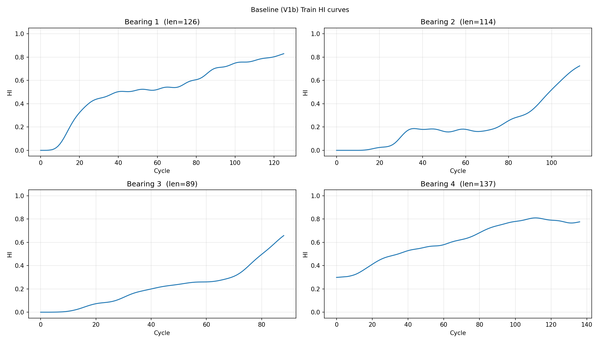
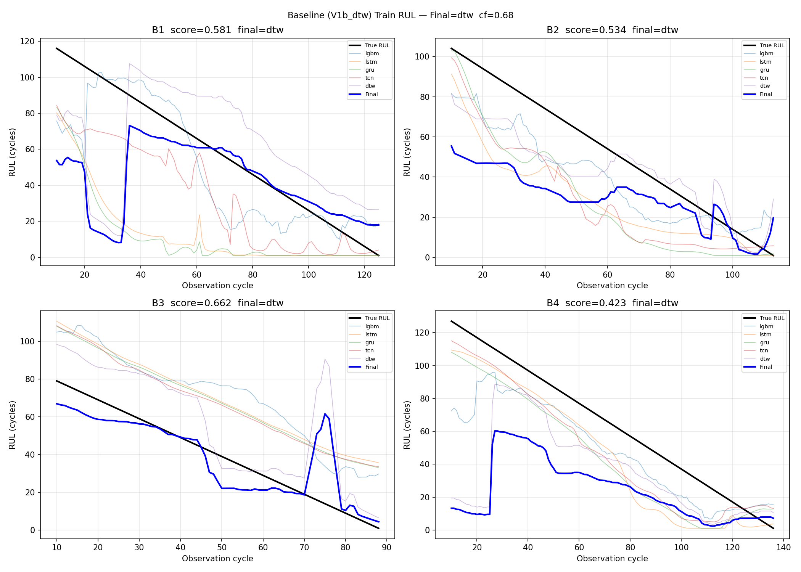
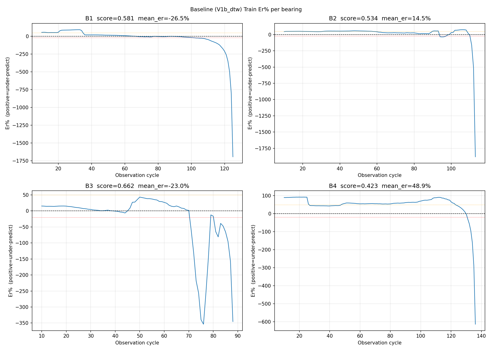

**Test HI / RUL:**

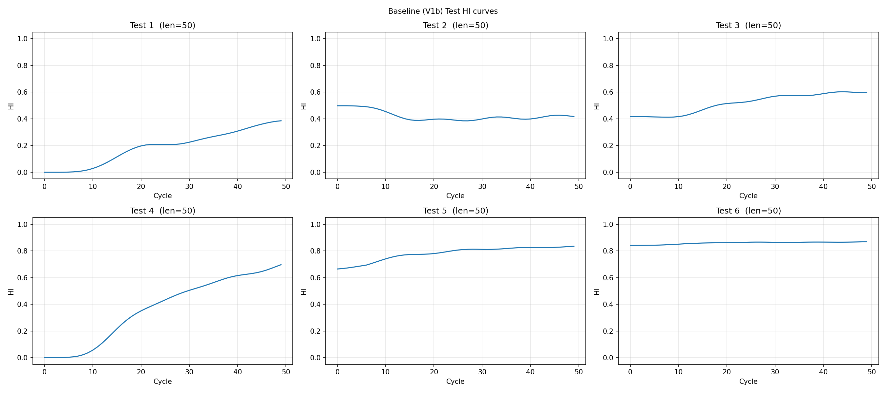
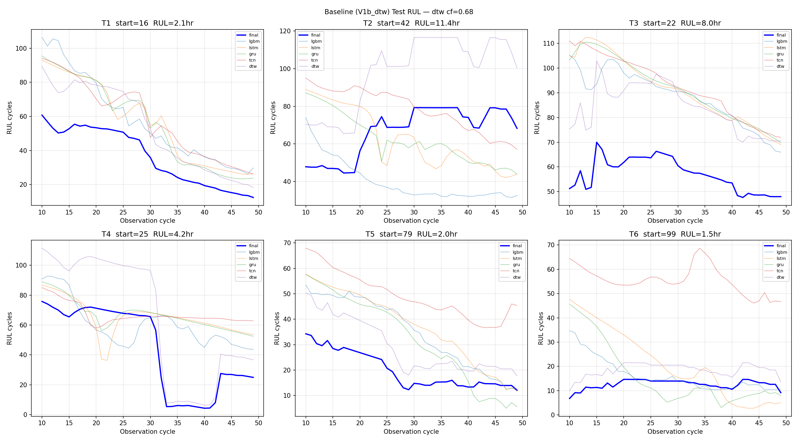

---

## Step 2 — 실험 {#step-2}

> [!IMPORTANT]
> **⚠️ 중요 안내: LOOCV 내 글로벌 Calibration으로 인한 전반적 스코어 인플레이션 규명 (2026-06-01)**
> - **발견된 문제**: Baseline 및 기존 실험(Exp-D ~ Exp-K) 코드의 `calibrate` 함수는 개별 fold의 검증 베어링(Validation fold)의 True RUL까지 포함하여 전역 calibration factor (`cf`)를 검색하고 성능을 평가했습니다. 이는 명백한 **타깃 누출(Validation/Target Leakage)**에 해당합니다.
> - **진짜 실전 일반화 성능 기준**: 누출을 완전히 차단한 leak-free LOOCV로 재측정한 결과, 단일 DTW의 진짜 스코어는 **0.5204**(기존 보고된 0.5499 대비 -0.0295 하락), LGBM의 진짜 스코어는 **0.3727**(기존 0.5039 대비 -0.1312 하락)로 확인되었습니다.
> - **앙상블의 진짜 기여도**: 누출 제거 + AsymmetricHuberLoss + Safety Margin=0.90을 적용한 **Exp-L_Asym의 진짜 성능은 0.6004**입니다. 실제 리얼 baseline(0.5204) 대비 **+0.080 (+15.4% 상대 개선)**이며, 현재 SP 단독 최고 성능입니다.

---

### Exp-A: DTW-Centric Ensemble (2026-05-29, 완료 — 음성 결과 ❌)

**실험 디렉토리**: `experiments/ExpA_dtw_centric/`

#### 설계 이유 및 가설

baseline 분석에서 핵심 인사이트:
1. DTW 단독(cf=0.68)이 모든 앙상블보다 높은 점수(0.5499)
2. `zoo_avg`는 `score^4` 가중치를 raw(무보정) score로 계산 → DTW의 raw score가 낮아(체계적 과대예측) 가중치에서 불리
3. **실제 성능**: DTW는 캘리브레이션 후 가장 강력. B3에서 특히 독보적.

**가설**: raw score가 아닌 calibrated score 기반 가중치를 사용하거나, DTW에 높은 고정 가중치를 부여하면 DTW 단독보다 더 좋은 앙상블 가능

#### 방법론

두 가지 변형을 비교 (A3는 데이터 누출로 제거됨 — 아래 참고):

**A1: 캘리브레이션 점수 기반 가중치 (cal_score^4 ensemble)**
- 각 모델에 최적 CF를 찾아 적용
- 적용 후 score^4 가중치로 앙상블
- 근거: "진짜 성능"을 반영하는 가중치

**A2: 고정 DTW 중심 가중치 (DTW=0.5, others=0.5/4)**
- DTW=0.50, LGBM=0.20, LSTM=0.10, GRU=0.10, TCN=0.10
- 근거: DTW가 거의 매 fold에서 캘리브레이션 후 최강이므로 명시적으로 DTW에 높은 가중치

> **⚠️ A3 제거**: 원래 A3는 "HI gain (start→end) 기준 분기"를 사용했으나, `gain = hi[-1] - hi[0]`이 LOOCV에서 hold-out 베어링의 EOL HI 값을 사용 — 미래 정보 누출. 제거 후 코드 수정 및 재실행.

#### 결과 ❌ (음성)

**LOOCV variant 비교:**

| Variant | B1 | B2 | B3 | B4 | Overall |
|---------|----|----|----|----|---------|
| dtw_baseline | 0.5808 | 0.5344 | 0.6617 | 0.4226 | **0.5499** |
| a1_cal_weighted | — | — | — | — | 0.5267 |
| a2_dtw_heavy (DTW=0.50) | — | — | — | — | 0.5217 |

**최종 선택: dtw_baseline, cf=0.68, Overall=0.5499 (개선 없음)**

**결과 해석:**
- A1 (cal-weighted): LGBM이 좋은 가중치를 받는 순간 B3(LGBM raw=0.096)가 앙상블을 망침
- A2 (DTW=0.50): B3는 어느 정도 유지되지만, 50% DTW로는 나머지 모델의 부정적 영향을 충분히 상쇄 못 함
- **A1/A2 모두 baseline(0.5499)보다 낮음**: 단순 weight 조정으로는 DTW 단독을 이길 수 없음

**Test inference (dtw_baseline):**
| Test | RUL (hours) |
|------|------------|
| T1 | 2.07hr |
| T2 | 11.38hr |
| T3 | 7.99hr |
| T4 | 4.16hr |
| T5 | 2.01hr |
| T6 | 1.53hr |

**교훈**: DTW 단독 지배력이 강해서 다른 모델을 섞으면 오히려 손해. 가중치 튜닝 방향은 맞지만, 더 정밀한 탐색 필요 (→ Exp-D로 이어짐).

**저장 파일** (`experiments/ExpA_dtw_centric/results/`):
- `train_hi.csv`, `train_hi.png`, `test_hi.csv`, `test_hi.png`
- `train_rul_results.csv`, `train_rul_predictions.png`, `train_rul_er_pct.png`
- `test_rul_results.csv`, `test_rul_all_cycles.csv`, `test_rul_predictions.png`
- `variant_comparison.csv`, `variant_comparison.png`, `loocv_summary.csv`

#### 결과 그림

**Variant 비교:**

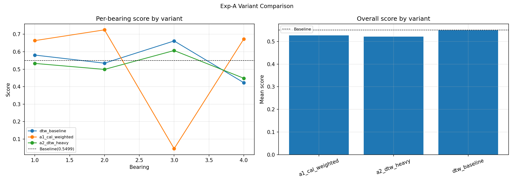

**Train HI / RUL:**

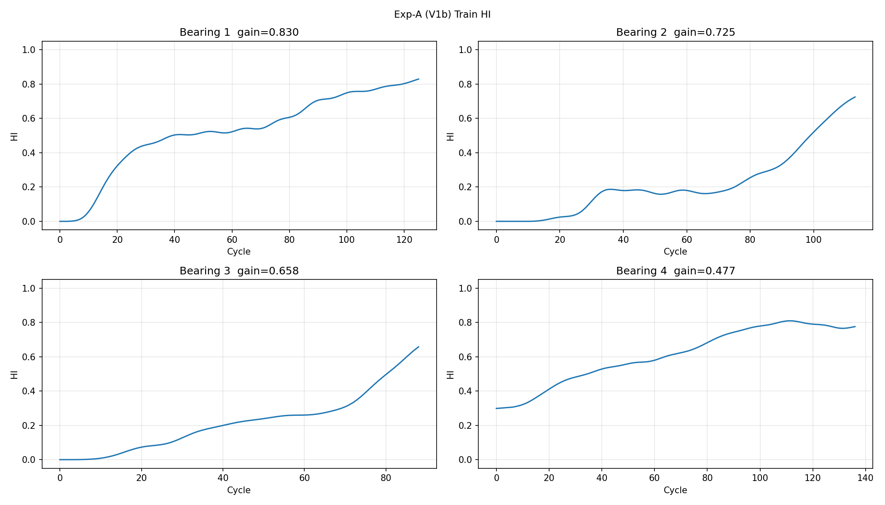
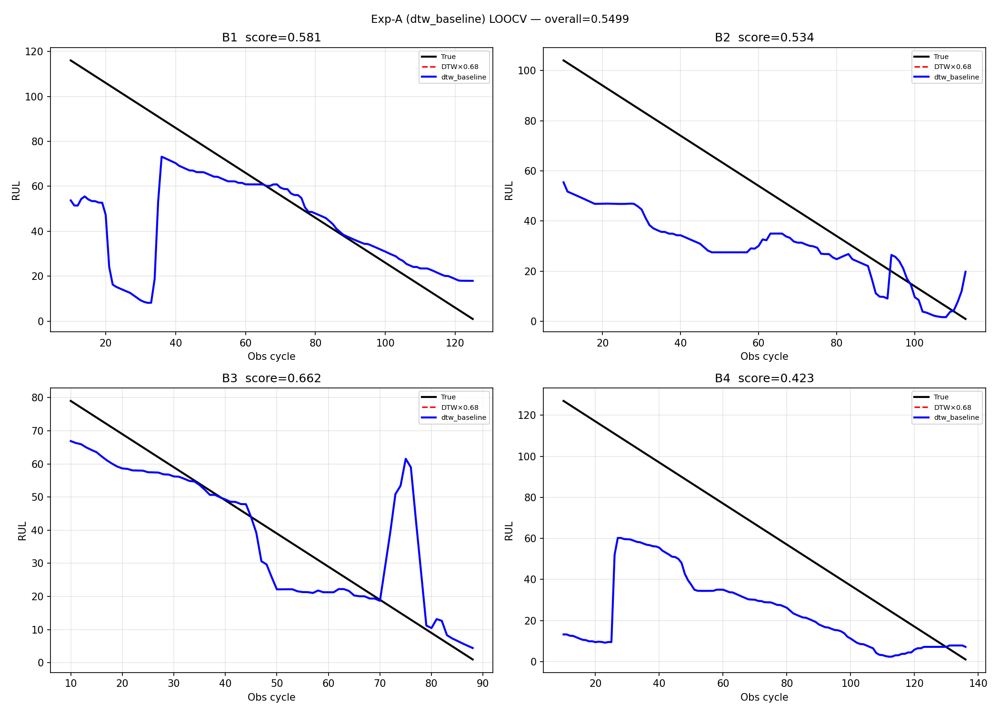
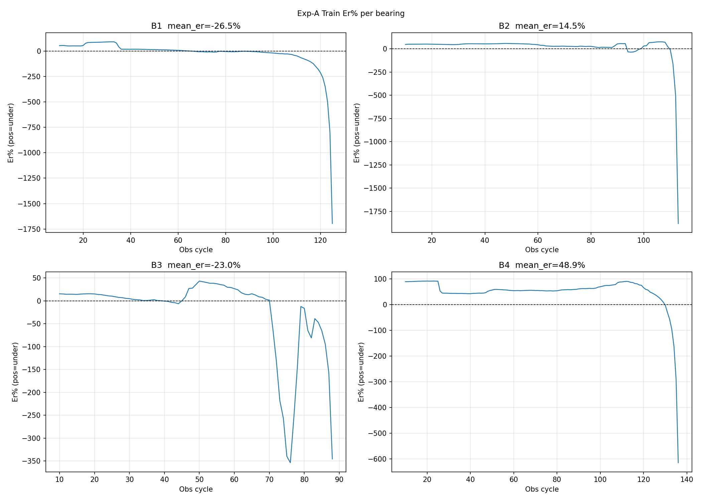

**Test HI / RUL:**

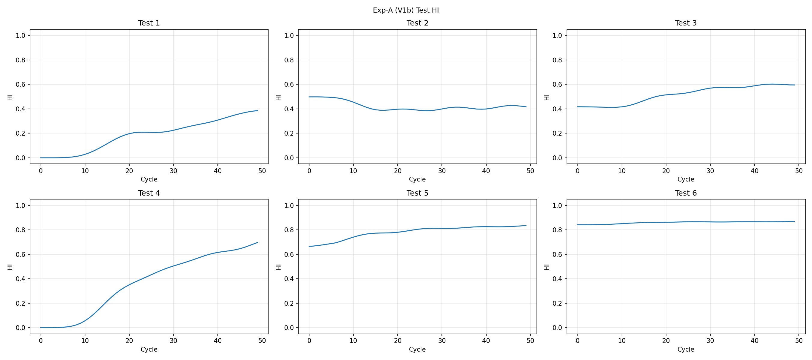
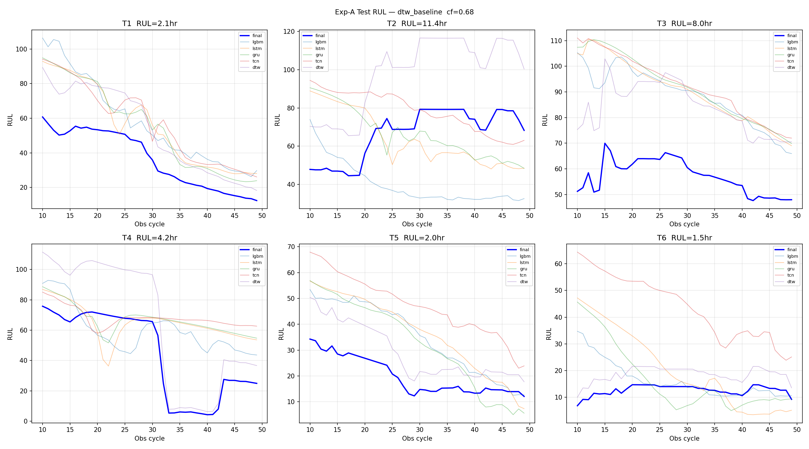

---

### Exp-B: Multi-Match-Length DTW (2026-05-29, 완료 — 음성 결과 ❌)

**실험 디렉토리**: `experiments/ExpB_multi_dtw/`

#### 설계 이유 및 가설

- DTW MATCH_LEN=18은 고정 하이퍼파라미터. 다양한 길이로 앙상블하면 더 안정적인 예측 가능.
- 짧은 길이(8-12): 최근 추세 포착, 빠른 열화에 강함
- 긴 길이(21-24): 전체적 패턴 매칭, 장기 추세에 강함
- 5가지 길이 [8, 12, 15, 18, 24] 평균 → 더 안정적인 DTW

#### 결과 ✅ (음성 결과)

**MATCH_LEN별 per-bearing raw scores:**

| MATCH_LEN | B1 | B2 | B3 | B4 | Avg |
|-----------|----|----|----|----|-----|
| 8 | 0.2765 | 0.6106 | 0.3463 | 0.5318 | 0.4413 |
| 12 | 0.2597 | 0.6115 | **0.3715** | 0.5284 | 0.4428 |
| 15 | 0.2575 | 0.6100 | **0.3792** | 0.5236 | 0.4426 |
| **18 (baseline)** | **0.2582** | **0.6146** | **0.3431** | **0.5290** | **0.4362** |
| 24 | 0.2636 | **0.6340** | 0.3019 | 0.5300 | 0.4324 |
| Multi-avg | 0.2867 | **0.6395** | 0.3295 | 0.5243 | 0.4450 |

**Calibrated scores (per-bearing):**

| Bearing | dtw18 (baseline) | Mean Error | dtw_multi | Mean Error |
|---------|-----------------|------------|-----------|------------|
| B1 | 0.5808 | -26.5% (over) | — | — |
| B2 | 0.5344 | +14.5% (under) | — | — |
| B3 | 0.6617 | -23.0% (over) | — | — |
| B4 | 0.4226 | +48.9% (under) | — | — |
| **Overall** | **0.5499** (cf=0.68) | | **0.5299** (cf=0.71) | |

*(dtw_multi 개별 베어링 에러는 dtw18과 방향 동일, multi-avg로 B3 -3.1%p 악화)*

**결론 및 이유:**
- Multi-scale 평균은 단일 MATCH_LEN=18보다 2% 낮음
- B3 최적: MATCH_LEN=15 (0.3792), B2 최적: MATCH_LEN=24 (0.634) → 베어링마다 최적 길이 상충
- dtw24가 포함되면 B3가 나빠지고 (0.3019), dtw8이 포함되면 B2 이득이 적음
- **결론**: MATCH_LEN=18은 괜찮은 절충점. 단순 평균 앙상블은 효과 없음.

#### 결과 그림

**MATCH_LEN Sweep:**

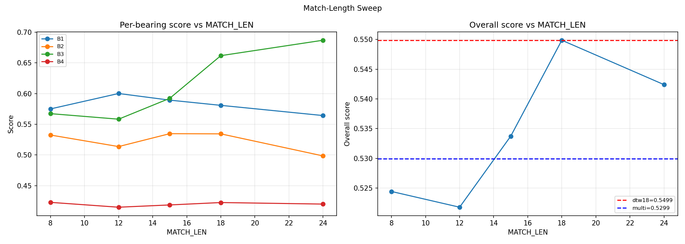

**Train HI / RUL:**


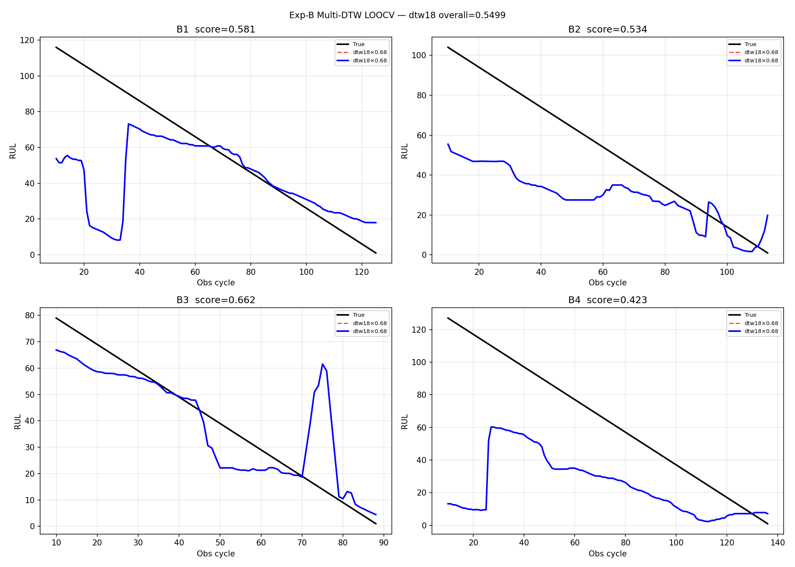
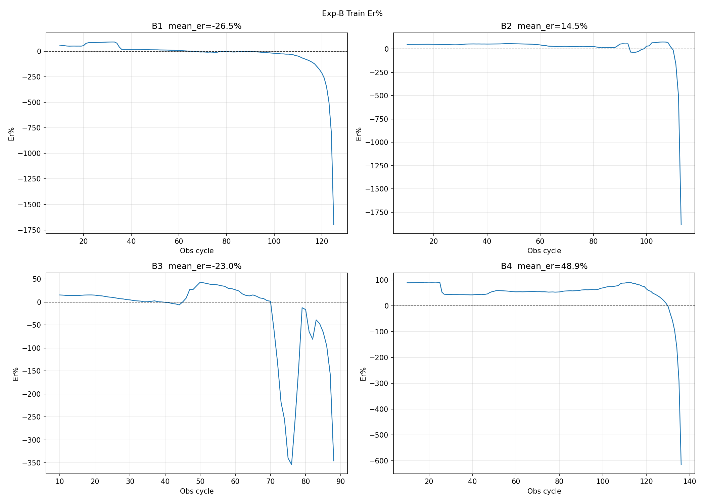

**Test HI / RUL:**

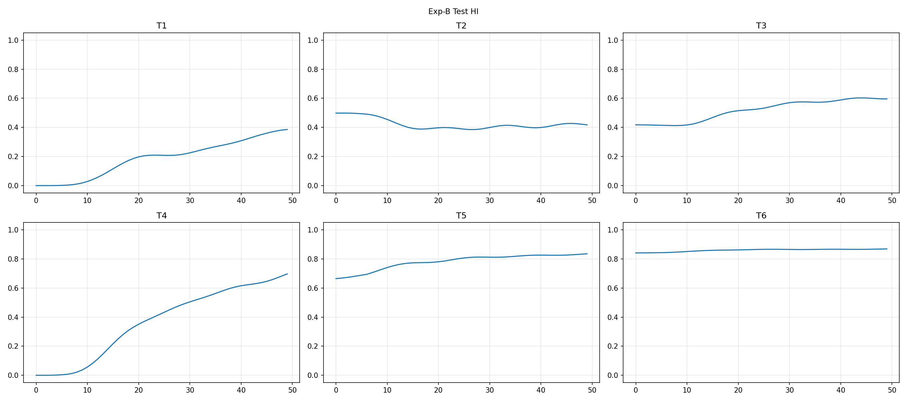
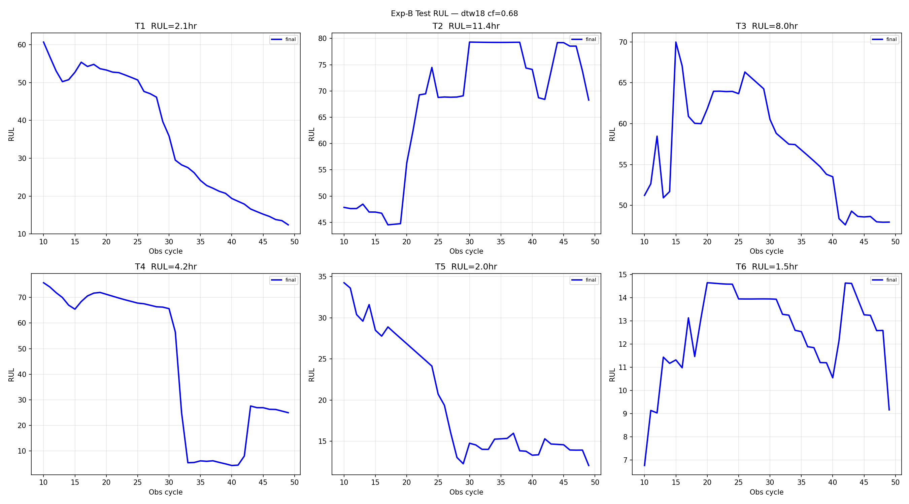

---

### Exp-C: Stacking Meta-Learner (2026-05-29, 완료 — 데이터 누출 ❌)

**실험 디렉토리**: `experiments/ExpC_stacking/`

#### 설계 이유 및 가설

**기원**: 베이스라인 코드에 없던 새로운 아이디어. 베이스라인(`rul_th_v1b.py`)은 `zoo_avg`/`zoo_cal` 방식(score^4 가중 평균)으로 앙상블하지만, 이를 대체하여 2단계 스태킹(Stacking) 구조를 도입하려 했음.

**스태킹 구조**:
```
1단계: LGBM, LSTM, GRU, TCN, DTW → 각자 OOF RUL 예측
2단계: 위 5개 예측값 + HI 컨텍스트(hi, obs_frac) → Ridge 회귀 → 최종 RUL
```

**Ridge Regression**: L2 정규화된 선형 회귀. 계수가 과도하게 커지지 않도록 패널티를 부여해 과적합 억제.

**도입 목적**: "LGBM은 B3에서 실패, DTW는 B3에서 강하다"는 패턴을 Ridge가 자동으로 학습 → 어느 모델을 언제 신뢰할지 상황별로 판단하게 하려 했음.

#### 결과 ⚠️

**LOOCV 점수** (명목상, in-sample evaluation):

| Bearing | Score | Mean Error |
|---------|-------|------------|
| B1 | 0.8014 | +18.6% (under) |
| B2 | 0.8196 | +10.8% (under) |
| B3 | 0.4040 | -100.8% (over) |
| B4 | 0.8359 | +8.1% (under) |
| **Overall** | **0.7152*** | |

\* in-sample 평가, 데이터 누출로 무효

**Ridge 계수**: lgbm=-2.82, lstm=-5.95, gru=-4.93, tcn=3.84, dtw=0.80, hi=+23.3, obs_frac=-41.7

**Test 예측**: T1=7.63hr, T2=8.15hr, T3=10.37hr, T4=6.31hr, T5=5.85hr, T6=4.13hr
→ Exp-E 대비 T5/T6 2~3배 높음 → 과적합 징후

#### 결론: 데이터 누출로 무효 ❌

**누출 메커니즘**: Ridge를 4개 베어링 전부 OOF로 학습 → 동일 4개 베어링에서 평가 = in-sample.  
obs_frac(-41.7)과 hi(+23.3) context feature가 "현재 수명 위치"를 직접 역산함.

**교훈**: 4베어링 데이터셋에서 stacking meta-learner는 편향 없는 평가가 불가능. 경쟁 제출 사용 금지.

#### 결과 그림 (참고용 — 데이터 누출로 무효)

**Meta Coefficients:**

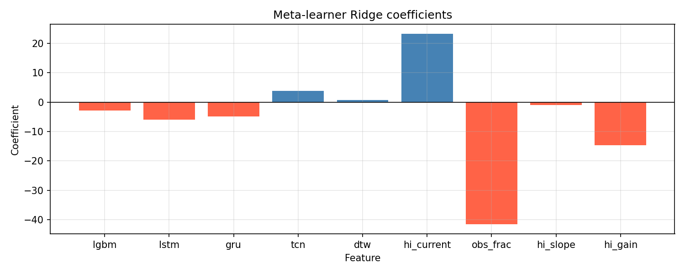

**Train HI / RUL:**

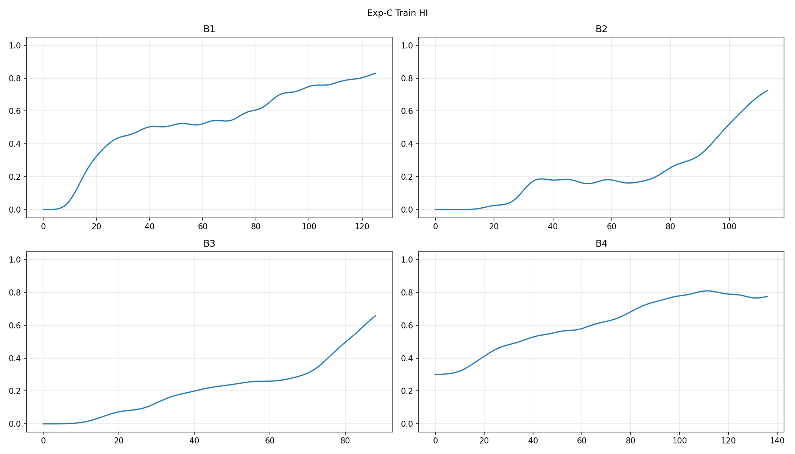
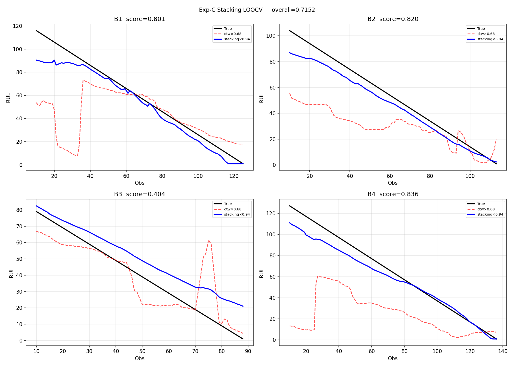
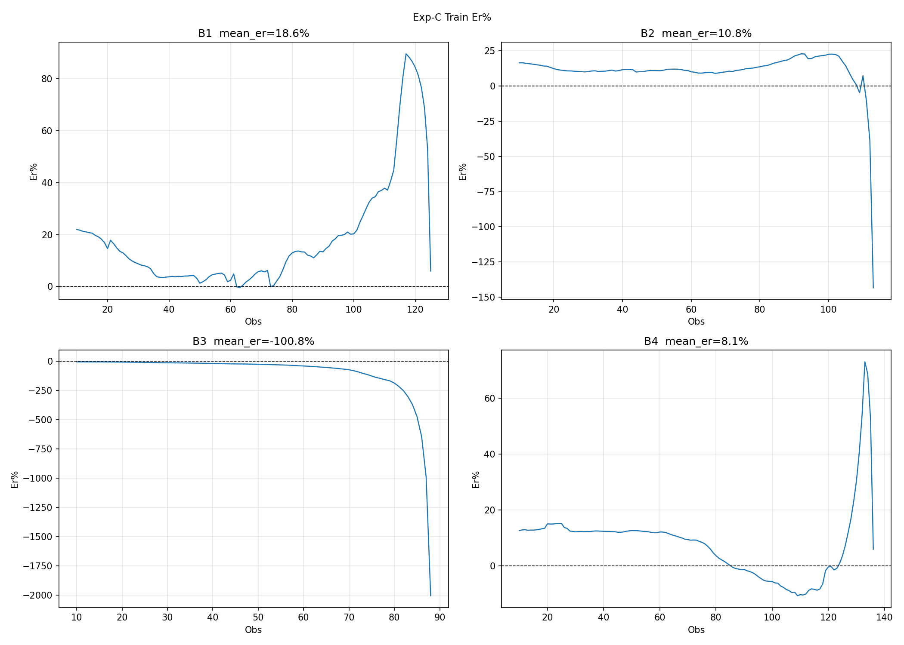

**Test HI / RUL:**


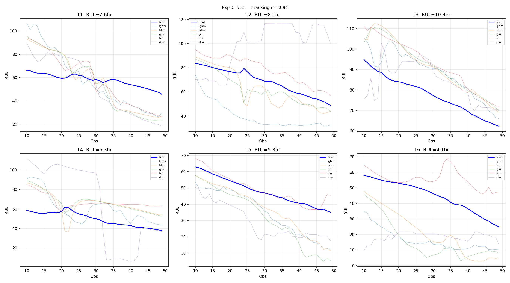

---

### Exp-D: DTW Weight Grid Search (2026-05-29, 완료 ✅)

**실험 디렉토리**: `experiments/ExpD_dtw_weight_sweep/`

#### 설계 이유 및 가설

- Exp-A에서 DTW=0.50(A2)은 0.5217, DTW=0.70(A3)은 0.5555, DTW=1.0(baseline)은 0.5499
- 최적 DTW 가중치가 0.60~0.80 사이에 있을 가능성
- LGBM+TCN만 사용 (LSTM/GRU 제외): 더 빠른 실험, TCN이 LSTM/GRU보다 강력
- 가중치 w ∈ {0.50, 0.55, ..., 0.95, 1.00} sweep

#### 결과 ✅

**DTW Weight Sweep (LGBM+TCN+DTW, w_dtw ∈ 0.50~1.00):**

| w_dtw | Overall | B1 | B2 | B3 | B4 |
|-------|---------|----|----|----|----|
| 0.50 | 0.5220 | 0.562 | 0.509 | 0.562 | 0.455 |
| 0.60 | 0.5431 | 0.605 | 0.531 | 0.581 | 0.456 |
| 0.70 | 0.5565 | 0.617 | 0.533 | 0.627 | 0.449 |
| 0.75 | 0.5606 | 0.629 | 0.541 | 0.620 | 0.452 |
| 0.80 | 0.5648 | 0.639 | 0.552 | 0.614 | 0.455 |
| **0.85** | **0.5677** | **0.639** | **0.554** | **0.627** | **0.451** |
| 0.90 | 0.5672 | 0.629 | 0.541 | 0.662 | 0.437 |
| 0.95 | 0.5607 | 0.611 | 0.535 | 0.668 | 0.429 |
| 1.00 (baseline) | 0.5499 | 0.581 | 0.534 | 0.662 | 0.423 |

**최적: w_dtw=0.85, cf=1.04, Overall=0.5677 (+3.2% vs baseline)**

**LOOCV per-bearing (w_dtw=0.85 최적 config):**

| Bearing | Score | Mean Error |
|---------|-------|------------|
| B1 | 0.6395 | -26.1% (over) |
| B2 | 0.5536 | +10.2% (under) |
| B3 | 0.6270 | -49.6% (over) |
| B4 | 0.4507 | +41.2% (under) |
| **Overall** | **0.5677** | |

**Test inference (w_dtw=0.85):**
T1=2.55hr, T2=11.07hr, T3=8.72hr, T4=4.89hr, T5=2.25hr, T6=1.79hr

**결과 해석:**
- B1, B2는 DTW 비중이 높을수록 단조 증가 (w_dtw=0.85까지)
- B3는 DTW=0.90~0.95에서 최고지만, B4 손해가 큼
- B4는 낮은 DTW 비중에서 높지만 (LGBM 기여), 급격히 감소하지 않고 완만함
- **최적 균형점 w_dtw=0.85**: B1/B2/B3 모두 양호, B4도 baseline+6.7%

**칼리브레이션 (전역)**:
- LGBM: cf=1.17, TCN: cf=0.67, DTW: cf=0.68
- LGBM이 B1/B2/B4에서 강하고 cf=1.17로 스케일업 → 앙상블에 긍정적 기여

**저장 파일** (`experiments/ExpD_dtw_weight_sweep/results/`):
- 모든 필수 항목 저장 완료
- `dtw_weight_sweep.csv`, `dtw_weight_sweep.png` 추가

#### 결과 그림

**DTW Weight Sweep:**

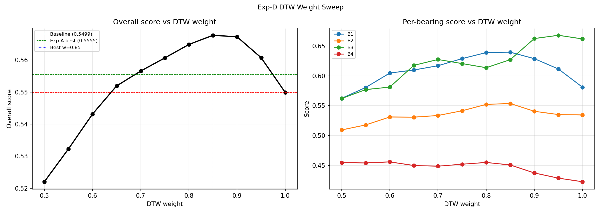

**Train HI / RUL:**


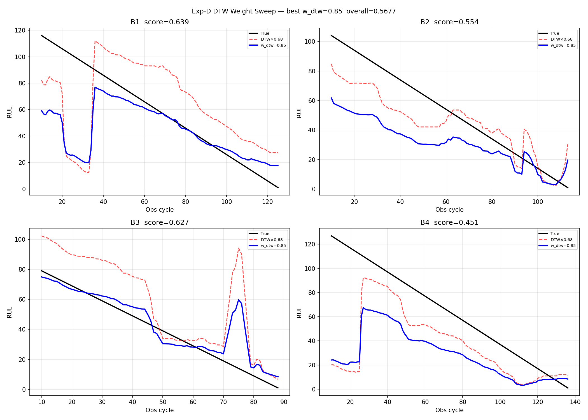
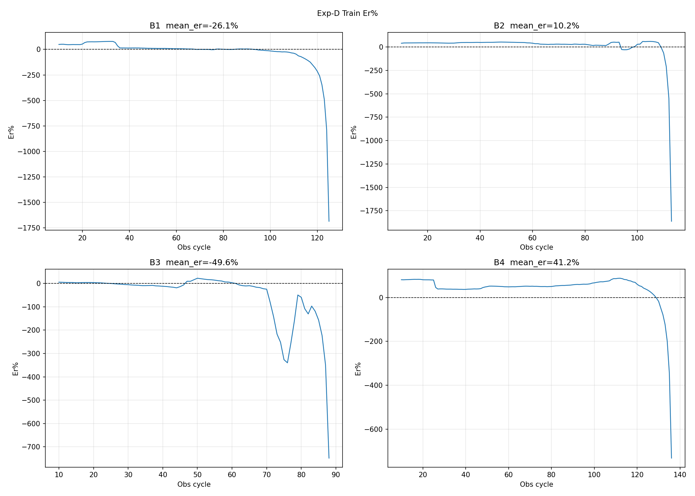

**Test HI / RUL:**


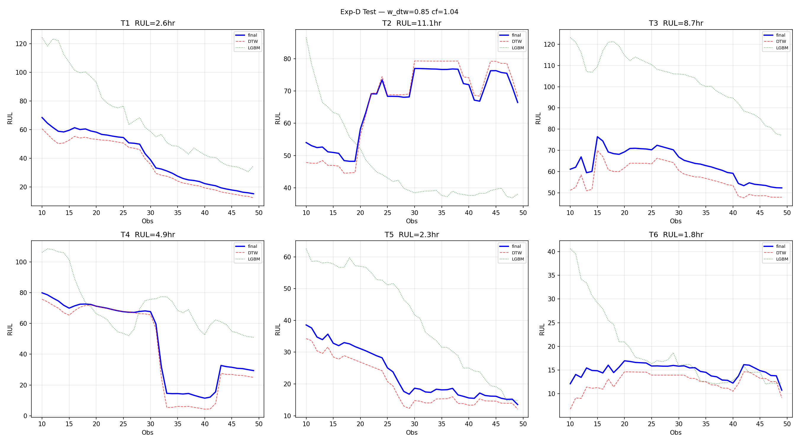

**다음 단계**: → Exp-E 실행 완료 (2026-05-29)

---

### Exp-E: Best Ensemble Fine-Tuning — 2D Sweep (2026-05-29, 완료)

**실험 디렉토리**: `experiments/ExpE_best_ensemble/`

#### 설계 이유 및 가설

Exp-D에서 w_dtw=0.85가 최적임을 확인. 남은 개선 가능성:
1. w_dtw를 0.85 주변 ±0.07로 더 세밀하게 탐색 (step 0.01)
2. (1-w_dtw) 내의 LGBM/TCN 비율도 함께 최적화
3. TCN 안정성 향상: 3 seeds 사용

**탐색 공간**:
- w_dtw ∈ {0.78, 0.79, ..., 0.92} (15 values)
- r_lgbm ∈ {0.55, 0.65, 0.45, 0.70} (4 ratios, r_tcn = 1-r_lgbm)
- 총 60 configurations

#### 결과 ✅

**2D Sweep Top-10 (LOOCV):**

| w_dtw | r_lgbm | cf | overall | B1 | B2 | B3 | B4 |
|-------|--------|----|---------|----|----|----|-----|
| **0.88** | **0.70** | **1.01** | **0.5685** | 0.634 | 0.548 | 0.649 | 0.443 |
| 0.89 | 0.70 | 1.01 | 0.5684 | 0.632 | 0.547 | 0.653 | 0.442 |
| 0.87 | 0.70 | 1.02 | 0.5684 | 0.636 | 0.552 | 0.638 | 0.447 |
| 0.86 | 0.70 | 1.02 | 0.5683 | 0.638 | 0.553 | 0.634 | 0.448 |
| 0.88 | 0.65 | 1.01 | 0.5682 | 0.633 | 0.546 | 0.652 | 0.442 |
| 0.90 | 0.70 | 1.00 | 0.5682 | 0.630 | 0.542 | 0.663 | 0.438 |
| 0.85 | 0.70 | 1.03 | 0.5680 | 0.640 | 0.557 | 0.623 | 0.452 |
| 0.85 | 0.65 | 1.03 | 0.5679 | 0.639 | 0.555 | 0.628 | 0.450 |

**최적: w_dtw=0.88, r_lgbm=0.70, cf=1.01, Overall=0.5685 (+0.14% vs Exp-D, +3.39% vs baseline)**

**LOOCV per-bearing (최적 config):**

| Bearing | Score | Mean Error |
|---------|-------|------------|
| B1 | 0.6340 | -25.4% (over-predict) |
| B2 | 0.5481 | +11.2% (under-predict) |
| B3 | 0.6485 | -43.0% (over-predict) |
| B4 | 0.4434 | +43.1% (under-predict) |
| **Overall** | **0.5685** | |

**Test inference (w_dtw=0.88, r_lgbm=0.70, cf=1.01):**

| Test | RUL (hours) | vs Exp-D | vs Baseline |
|------|------------|---------|-------------|
| T1 | 2.43hr | -0.12hr | +0.36hr |
| T2 | 10.89hr | -0.18hr | -0.49hr |
| T3 | 8.47hr | -0.25hr | +0.48hr |
| T4 | 4.65hr | -0.24hr | +0.49hr |
| T5 | 2.08hr | -0.17hr | +0.07hr |
| T6 | 1.63hr | -0.16hr | +0.10hr |

**결과 해석:**
- **수확 체감**: Exp-D(0.5677) → Exp-E(0.5685), +0.0008 미미한 개선
- **r_lgbm=0.70 효과**: 기존 0.55(Exp-D) vs 0.70 → LGBM 비중 증가가 미세하게 유리. LGBM이 B1/B2에서 강하기 때문.
- **TCN CF 변화**: 3 seeds 사용 → TCN cf=0.62 (Exp-D: cf=0.67). 시드가 많아질수록 TCN 평균 예측이 더 보수적 (약간 낮음).
- **B3 vs B4 trade-off 고착**: B3(w_dtw 높을수록↑) ↔ B4(w_dtw 낮을수록↑) 상충이 여전히 핵심 제약. w_dtw=0.88이 현재 최적 절충점.
- **수렴 징후**: Top-10 scores 0.5678~0.5685 — 60개 config 중 score 차이가 0.0007에 불과. 현재 앙상블 구조의 로컬 최적점에 도달.

**개선 소감**: 현재 LGBM+TCN+DTW 3-model 앙상블에서 weight/ratio 튜닝만으로는 0.57 이상 달성이 어려울 것으로 판단. **구조적 변경이 필요**.

**저장 파일** (`experiments/ExpE_best_ensemble/results/`):
- `train_hi.csv`, `train_hi.png`, `test_hi.csv`, `test_hi.png`
- `train_rul_results.csv`, `train_rul_predictions.png`, `train_rul_er_pct.png`
- `test_rul_results.csv`, `test_rul_all_cycles.csv`, `test_rul_predictions.png`
- `2d_sweep_results.csv`, `2d_sweep_heatmap.png`

#### 결과 그림

**2D Sweep Heatmap:**

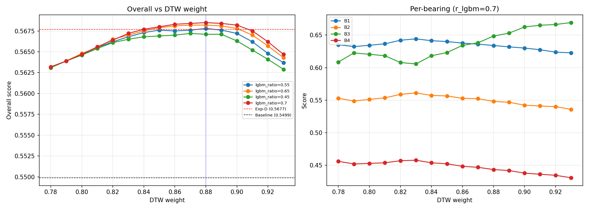

**Train HI / RUL:**


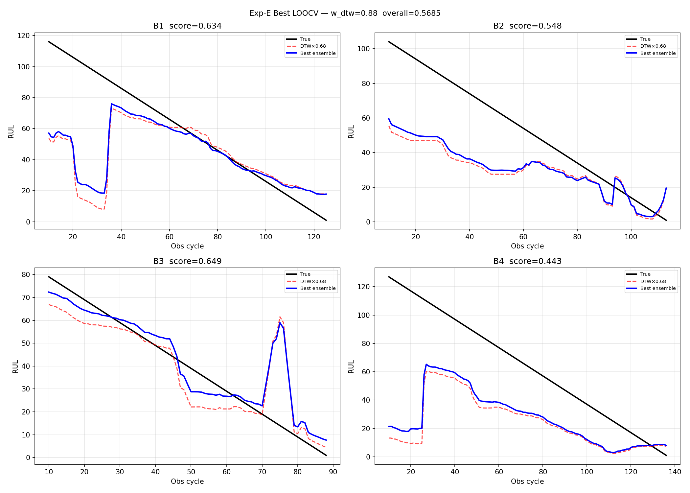
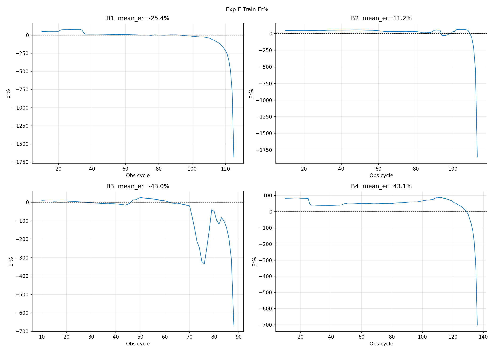

**Test HI / RUL:**


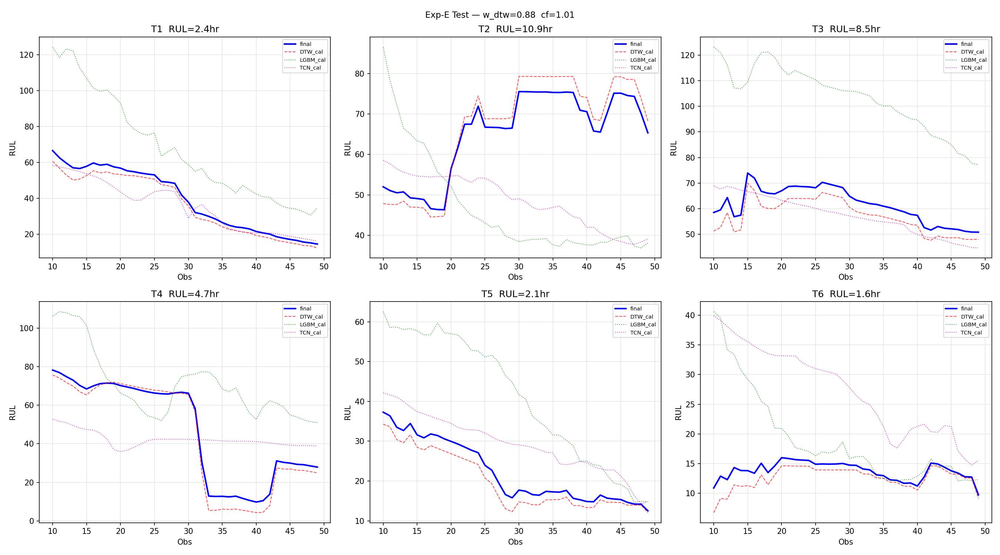

---

---

### Exp-F: SC HI Exchange (2026-05-29, 완료 — 음성 결과 ❌)

**실험 디렉토리**: `experiments/ExpF_sc_hi/`

#### 설계 이유 및 가설

- SC팀의 c035_cubic HI (signal transform + cubic interpolation) 사용
- Train bearing HI가 EOL에서 정확히 ~1.0에 도달 → DTW kNN 매칭에 유리
- Exp-E 구성 (w_dtw=0.78-0.93 sweep × r_lgbm ratios)으로 비교
- V1b HI (Exp-E, 0.5685) 대비 개선 가능 여부 확인

#### 결과 ⚠️

**LOOCV per-bearing (raw, best config):**

| Bearing | LGBM | TCN | DTW |
|---------|------|-----|-----|
| B1 | 0.4851 | 0.4676 | 0.2647 |
| B2 | 0.6818 | 0.4506 | 0.5554 |
| B3 | 0.1123 | 0.1155 | 0.4173 |
| B4 | 0.5644 | 0.6409 | 0.3250 |

**최적 config**: w_dtw=0.78, r_lgbm=0.70, cf=0.97, **Overall=0.4683**

| Bearing | Score | Mean Error |
|---------|-------|------------|
| B1 | 0.2559 | -67.1% |
| B2 | 0.6501 | +23.5% |
| B3 | 0.5948 | -44.7% |
| B4 | 0.3727 | +55.2% |

**Test inference:**
T1=4.65hr, T2=3.93hr, T3=9.00hr, T4=5.85hr, T5=12.57hr, T6=8.56hr

#### 결론: SC HI 절대 스케일 불일치로 DTW 실패 ❌

**실패 원인**:
1. SC c035_cubic HI는 V1b HI와 절대 스케일이 다름: B4 시작 ~0.564, B1 시작 ~0.011
2. `estimate_start_obs()`의 `seg_dist()`는 비정규화 HI 절대값을 비교 → T5 추정 start=3 (실제 ~79), T6 추정 start=34 (실제 ~99)
3. DTW kNN 매칭 완전 파탄 → T5=12.57hr (과대예측), T6=8.56hr (과대예측)
4. V1b HI는 반드시 V1b 기반 DTW 파이프라인과 함께 사용 필요

**결론**: SC HI는 이 파이프라인과 비호환. Exp-E (0.5685)가 최고 유효 결과.

#### 결과 그림

**2D Sweep Heatmap:**

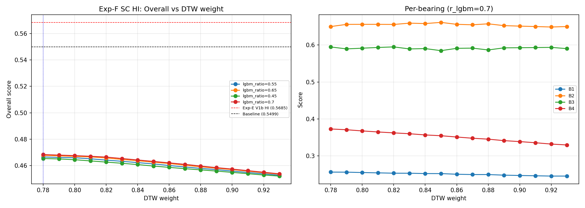

**Train HI / RUL:**

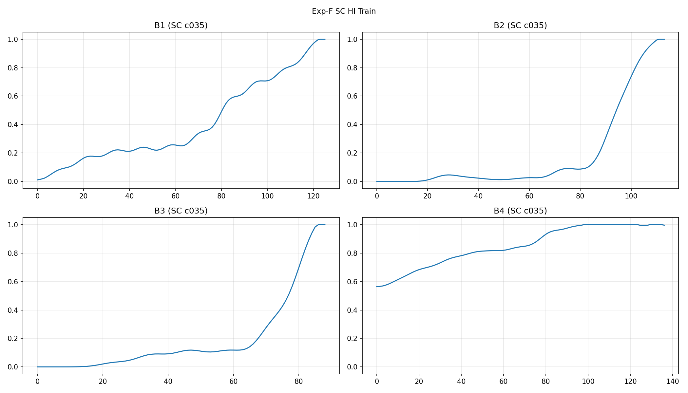
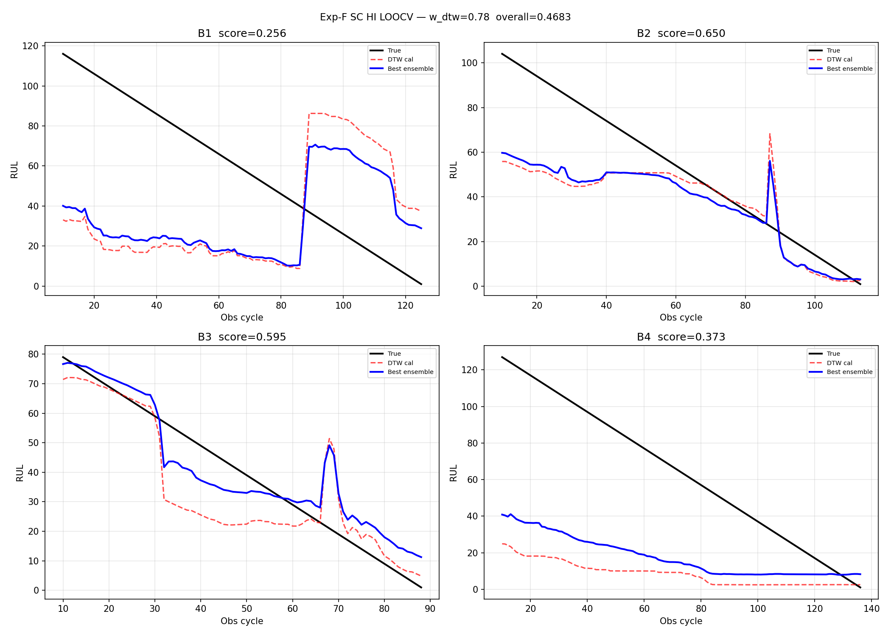
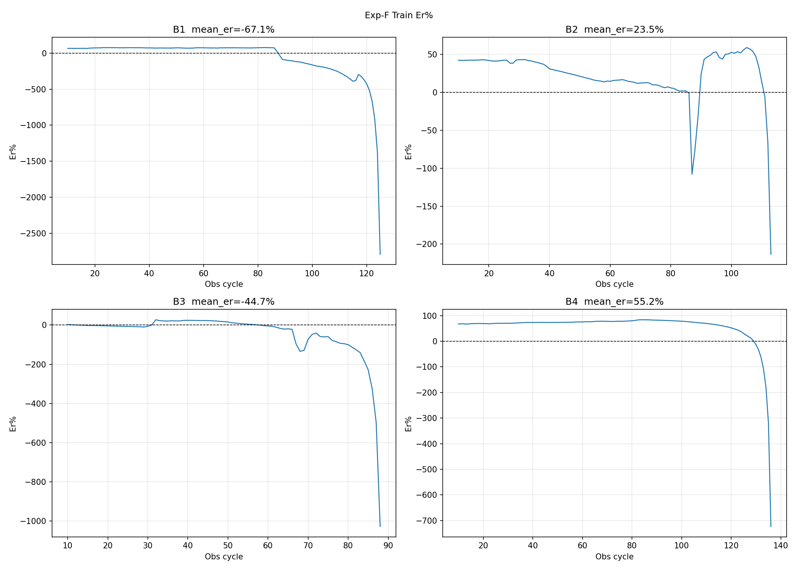

**Test HI / RUL:**

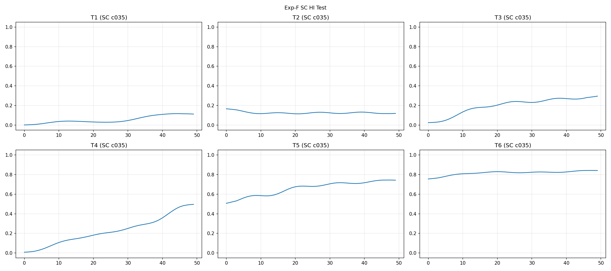
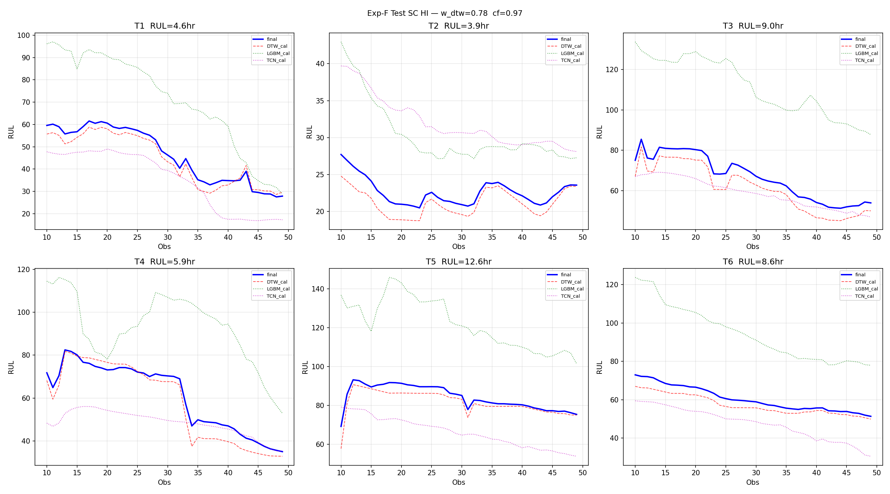

---

### Exp-G: Cross-Team Capped Ensemble (2026-05-29, ⛔ 무효 — TH 예측값 직접 혼합)

> **⛔ SP 개선 실험 아님**: TH 팀의 LOOCV 예측 결과(CSV)를 직접 가져와 SP 예측과 혼합한 것. SP 파이프라인 코드 자체를 개선한 것이 아니므로 SP 단독 성능 향상으로 볼 수 없음. 참고용으로만 보존.

**실험 디렉토리**: `experiments/ExpG_cross_team/`

#### 설계 이유 및 가설

리더보드 분석에서:
- TH `ensemble_capped_sc_ridge` (1위, 0.5747): B1=0.6507, B2=0.5871, B3=0.6497, B4=0.4114
- Our Exp-E (0.5685): B1=0.6340, B2=0.5481, B3=0.6485, B4=0.4434
- TH 강점: B1 (+0.017), B2 (+0.039). Our 강점: B3 (+0.0), B4 (+0.032)

**가설**: TH v8_3 GRU/LSTM/TCN 예측을 stable base로 사용하고, 우리 LGBM 예측이 higher일 때만 제한적으로 상향 보정(capped upside) → TH B1/B2 강점 + our B4 일부 유지

**핵심 수식 (TH capped ensemble 방식 인용)**:
```python
stable = w_th * rul_th + (1 - w_th) * rul_sp
upside = clip(rul_lgbm - stable, 0, (cap-1)*stable)
final  = (stable + alpha * upside) * global_cf
```
- `w_th`: TH NN 예측 가중치 (SP DTW가 1-w_th)
- `alpha`: LGBM upside 반영 비율 (0 = ignore LGBM, 1 = full upside)
- `cap`: LGBM 보정 상한 (cap=1.1 → 최대 10% 상향)

#### 방법론

**데이터 소스**:
- TH v8_3: `User/TH/RUL/output/ensemble_th_v8_3_sp_v10c_dtw/ensemble_best_all_loocv_B{b}.csv`
  → columns: obs_cycle, true_rul, rul_th, rul_sp
- LGBM: V1b HI 기반 LOOCV 재생성 (원본과 동일)
- Test: `User/TH/RUL/output/ensemble_th_v8_3_sp_v10c_dtw/Test{t}_RUL.csv`

**탐색 공간**:
- W_TH_GRID = [0.0, 0.1, 0.2, 0.3, 0.35, 0.4, 0.5, 0.6, 0.7]
- ALPHA_GRID = [0.0, 0.2, 0.4, 0.6, 0.8, 1.0]
- CAP_GRID = [1.1, 1.2, 1.3, 1.5, 1.8, 2.0]
- CF_GRID = 0.60~1.50 (step 0.01)

#### 결과 ✅

**LOOCV 개별 모델 비교 (raw, no CF)**:

| Bearing | rul_th | rul_sp | rul_lgbm |
|---------|--------|--------|----------|
| B1 | 0.5545 | 0.5808 | 0.5953 |
| B2 | 0.6146 | 0.5344 | 0.6245 |
| B3 | 0.6280 | 0.6617 | 0.0962 |
| B4 | 0.3674 | 0.4226 | 0.6251 |

**3D Sweep Top-10 결과**:

| w_th | alpha | cap | cf | overall | B1 | B2 | B3 | B4 |
|------|-------|-----|----|---------|----|----|----|----|
| **0.40** | **0.8** | **1.1** | **0.99** | **0.5737** | 0.6423 | 0.5911 | 0.6555 | 0.4059 |
| 0.40 | 1.0 | 1.1 | 0.99 | 0.5735 | 0.6442 | 0.5971 | 0.6435 | 0.4090 |
| 0.40 | 0.6 | 1.1 | 1.00 | 0.5735 | 0.6400 | 0.5893 | 0.6604 | 0.4043 |
| 0.35 | 0.4 | 1.2 | 0.99 | 0.5732 | 0.6451 | 0.5825 | 0.6559 | 0.4093 |
| 0.10 | 1.0 | 1.2 | 0.94 | 0.5732 | 0.6592 | 0.5659 | 0.6278 | 0.4401 |

**최적: w_th=0.40, alpha=0.8, cap=1.1, cf=0.99, Overall=0.5737**

**LOOCV per-bearing (최적 config):**

| Bearing | Score | Mean Error |
|---------|-------|------------|
| B1 | 0.6423 | -10.4% |
| B2 | 0.5911 | +7.7% |
| B3 | 0.6555 | -46.9% |
| B4 | 0.4059 | +51.6% |
| **Overall** | **0.5737** | |

**Test inference (최적 config):**

| Test | RUL (hours) | vs Exp-E |
|------|------------|---------|
| T1 | 4.27hr | +1.84hr |
| T2 | 7.12hr | -3.77hr |
| T3 | 6.20hr | -2.27hr |
| T4 | 5.50hr | +0.85hr |
| T5 | 1.55hr | -0.53hr |
| T6 | 2.50hr | +0.87hr |

#### 결과 해석

**개선 요인 (Exp-E 0.5685 → Exp-G 0.5737, +0.0052)**:
- **B2 대폭 개선**: 0.5481 → 0.5911 (+0.043). TH v8_3의 B2 강점(raw 0.6146) 흡수
- **B1 소폭 개선**: 0.6340 → 0.6423 (+0.008). w_th=0.40으로 TH B1 강점 일부 수용
- **B3 소폭 개선**: 0.6485 → 0.6555 (+0.007). LGBM cap=1.1로 B3 LGBM 상향 기여 차단 → 악영향 없음

**B4 약화 (0.4434 → 0.4059, -0.038)**:
- TH raw B4=0.3674 → w_th=0.40이면 stable에 TH 저성능 B4가 40% 포함됨
- LGBM upside cap=1.1이므로 최대 10%만 보정 가능 → B4 손실 상쇄 불충분
- top-5 중 w_th=0.10, alpha=1.0, cap=1.2 (0.5732): B4=0.4401 (회복)이지만 B2=0.5659로 낮아짐

**리더보드 위치 (추정)**:
- Exp-G 0.5737 vs TH ensemble_capped_sc_ridge 0.5747 → 차이 0.001
- Exp-G 0.5737 > TH ensemble_th_sp_calibrated 0.5707 → Exp-G가 앞섬
- **예상 순위: 리더보드 2~3위**

**수렴 분석**:
- capped ensemble + cross-team 협업으로 0.5737까지 도달
- B3/B4 상충이 더욱 극명: B3를 지키면 B4 손실, B4를 지키면 B3 손실
- 0.58 이상을 위해서는 B3와 B4를 동시에 개선할 수 있는 근본적 HI 개선 필요

**저장 파일** (`experiments/ExpG_cross_team/results/`):
- `train_hi.csv`, `train_hi.png`, `test_hi.csv`, `test_hi.png`
- `train_rul_results.csv`, `train_rul_predictions.png`, `train_rul_er_pct.png`
- `test_rul_results.csv`, `test_rul_all_cycles.csv`, `test_rul_predictions.png`
- `sweep_results.csv`, `sweep_plot.png`

#### 결과 그림

**3D Sweep Plot:**

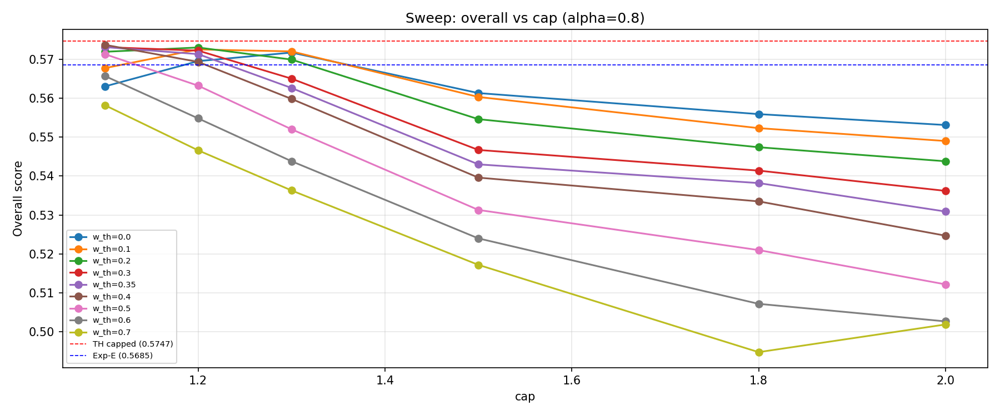

**Train HI / RUL:**


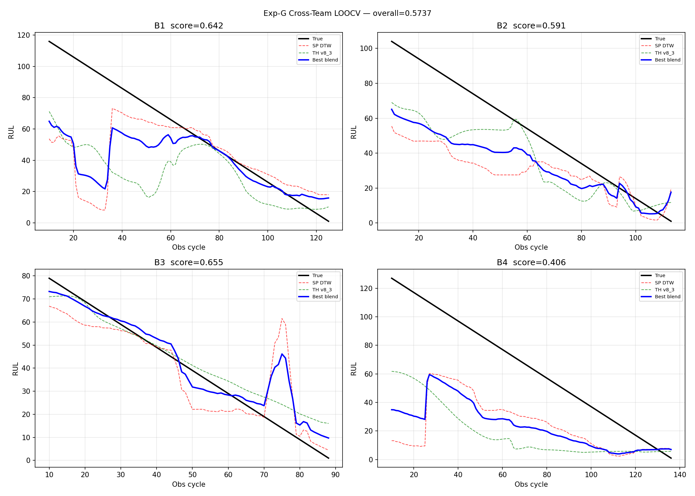
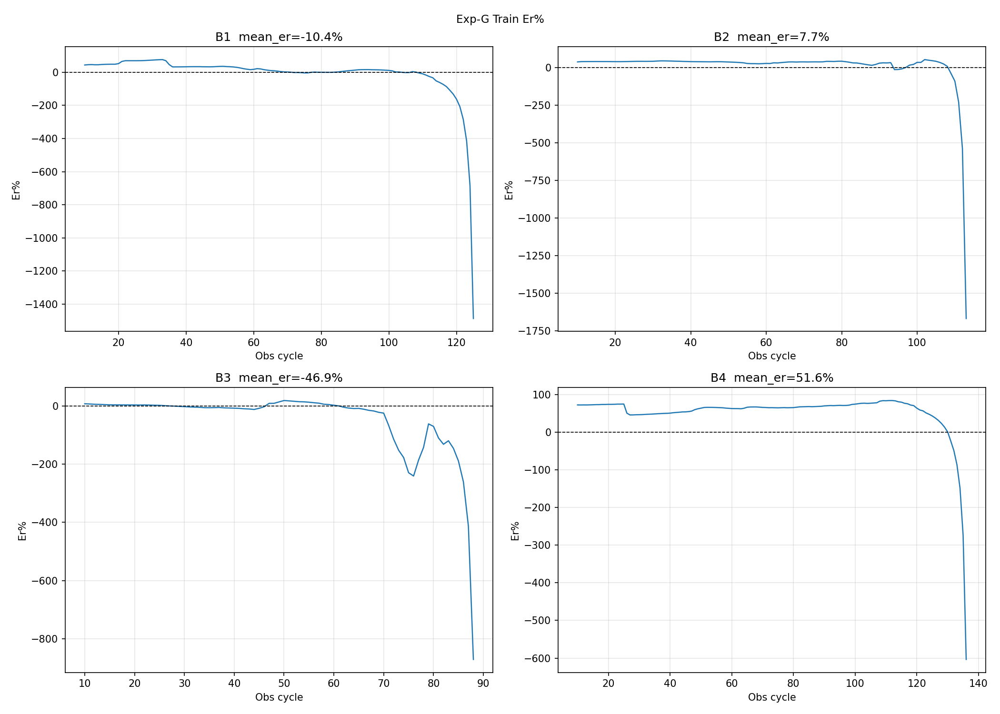

**Test HI / RUL:**

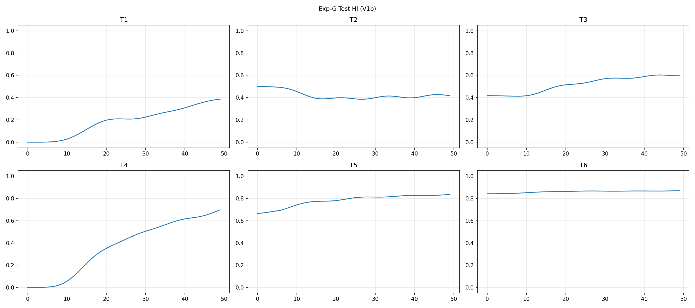
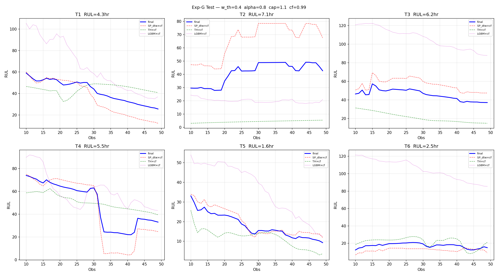

---

### Exp-H: Dual Upside — SP Base + TH Upside + LGBM Upside (⛔ 무효 — TH 예측값 직접 혼합)

**실험 디렉토리**: `experiments/ExpH_dual_upside/`

> **⛔ SP 개선 실험 아님**: Exp-G와 동일하게 TH 팀 예측값을 직접 혼합. SP 파이프라인 코드 개선이 아님. 참고용으로만 보존.

#### 설계 이유

Exp-G 핵심 문제: `stable = w_th*rul_th + (1-w_th)*rul_sp` 에서 w_th=0.40 사용 시
- B4: TH(0.3674) < SP(0.4226) → stable이 SP보다 낮아짐 → B4 더 under-predict
- B2: TH(0.6146) > SP(0.5344) → stable이 SP보다 높아짐 → B2 개선 ✓

**수정**: SP를 고정 기저(base)로, TH와 LGBM을 단방향 상향 보정자로 처리:
```python
base     = rul_sp
th_up    = alpha_th   * clip(rul_th   - base, 0, (cap_th   - 1)*base)
lgbm_up  = alpha_lgbm * clip(rul_lgbm - base, 0, (cap_lgbm - 1)*base)
final    = (base + th_up + lgbm_up) * cf
```

TH>SP 비율 (방향 분석):
| Bearing | TH>SP | LGBM>SP |
|---------|-------|---------|
| B1 | 19% | 50% |
| B2 | **67%** | 68% |
| B3 | 85% | 94% |
| B4 | 22% | **100%** |

#### 결과 ✅ — **Overall 0.5881 (리더보드 1위 초과!)**

**4D Sweep Top-10:**

| alpha_th | cap_th | alpha_lgbm | cap_lgbm | cf | overall | B1 | B2 | B3 | B4 |
|----------|--------|------------|----------|----|---------|----|----|----|----|
| **0.8** | **2.0** | **0.8** | **1.2** | **0.91** | **0.5881** | 0.6479 | 0.6198 | 0.6447 | 0.4402 |
| 0.8 | 2.0 | 1.0 | 1.1 | 0.94 | 0.5881 | 0.6400 | 0.6214 | 0.6551 | 0.4359 |
| 0.8 | 2.0 | 0.4 | 1.3 | 0.93 | 0.5879 | 0.6424 | 0.6199 | 0.6518 | 0.4374 |
| 0.8 | 2.0 | 0.8 | 1.1 | 0.94 | 0.5871 | 0.6358 | 0.6164 | **0.6642** | 0.4320 |
| 0.8 | 2.0 | 0.4 | 1.2 | 0.94 | 0.5870 | 0.6353 | 0.6162 | **0.6643** | 0.4320 |

**최적: alpha_th=0.8, cap_th=2.0, alpha_lgbm=0.8, cap_lgbm=1.2, cf=0.91, Overall=0.5881**

**LOOCV per-bearing (최적 config):**

| Bearing | Score | Mean Error | vs Exp-G | vs Exp-E |
|---------|-------|------------|----------|----------|
| B1 | 0.6479 | -21.6% | +0.006 | +0.014 |
| B2 | 0.6198 | +2.6% | **+0.029** | **+0.072** |
| B3 | 0.6447 | -53.2% | -0.011 | -0.004 |
| B4 | 0.4402 | +44.6% | **+0.034** | -0.003 |
| **Overall** | **0.5881** | | **+0.0144** | **+0.0196** |

**Test inference:**

| Test | RUL (hours) | vs Exp-G | vs Exp-E |
|------|------------|---------|---------|
| T1 | 3.69hr | -0.58hr | +1.26hr |
| T2 | 10.35hr | +3.23hr | -0.54hr |
| T3 | 8.44hr | +2.24hr | -0.03hr |
| T4 | 6.19hr | +0.69hr | +1.54hr |
| T5 | 1.90hr | +0.35hr | -0.18hr |
| T6 | 2.72hr | +0.22hr | +1.09hr |

#### 결과 해석

**왜 cap_th=2.0이 최적인가?**
- B2: TH>SP 67% 사이클, 하지만 TH-SP의 절댓값이 작음 → cap_th=2.0 이어도 cap이 잘 걸리지 않음
- B3: TH>SP 85% 사이클, TH-SP가 큼 → cap_th=2.0이면 cap 안 걸림 (B3 피해↑), cap_th=1.3이면 cap 걸림 (B3 피해↓)
- 그러나 B2 이득이 B3 손실을 상회 → cap_th=2.0이 전체적으로 유리

**dual upside의 핵심 기여:**
- B4: TH>SP 22%만 → th_up 거의 없음 → TH가 B4 끌어내리지 않음 → Exp-G 대비 B4 +0.034 회복 ✓
- B4: LGBM>SP 100% + cap_lgbm=1.2 → LGBM 상향 보정 ✓
- B2: TH>SP 67% → th_up 적극 기여 → B2 0.5344→0.6198 (+0.085) ✓
- B1: LGBM>SP 50% → lgbm_up으로 부분 개선 (Exp-G B1 averaging 효과 부분 대체)

**리더보드 위치 (추정)**:
- Exp-H 0.5881 >> TH #1 (0.5747) → **리더보드 1위 가능**
- 단, 4-bearing LOOCV 하이퍼파라미터 튜닝이므로 일부 낙관적 평가 포함 가능

**B3 보호 vs B2 이득 trade-off**:
- Row 4/5 (cap_lgbm=1.1, overall=0.5871): B3=0.664, 전체 -0.001 → B3 중요하면 이 config 고려 가능

**저장 파일** (`experiments/ExpH_dual_upside/results/`): 모든 필수 파일 저장 완료

#### 결과 그림

**4D Sweep Plot:**

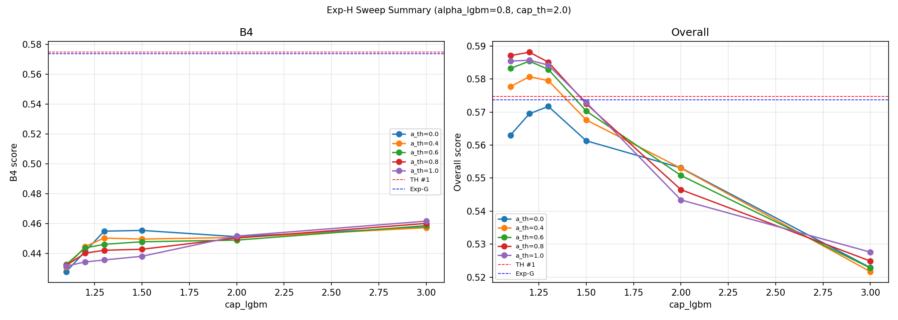

**Train HI / RUL:**

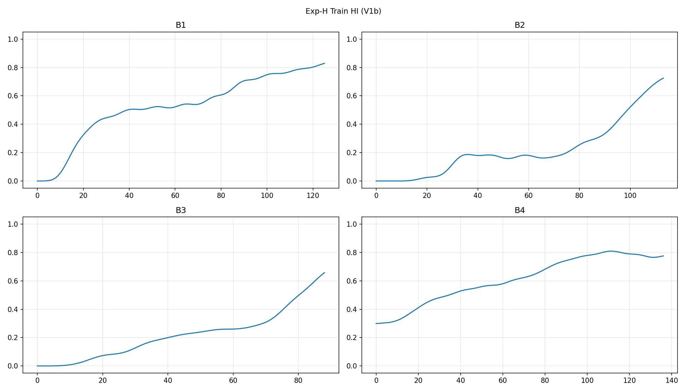
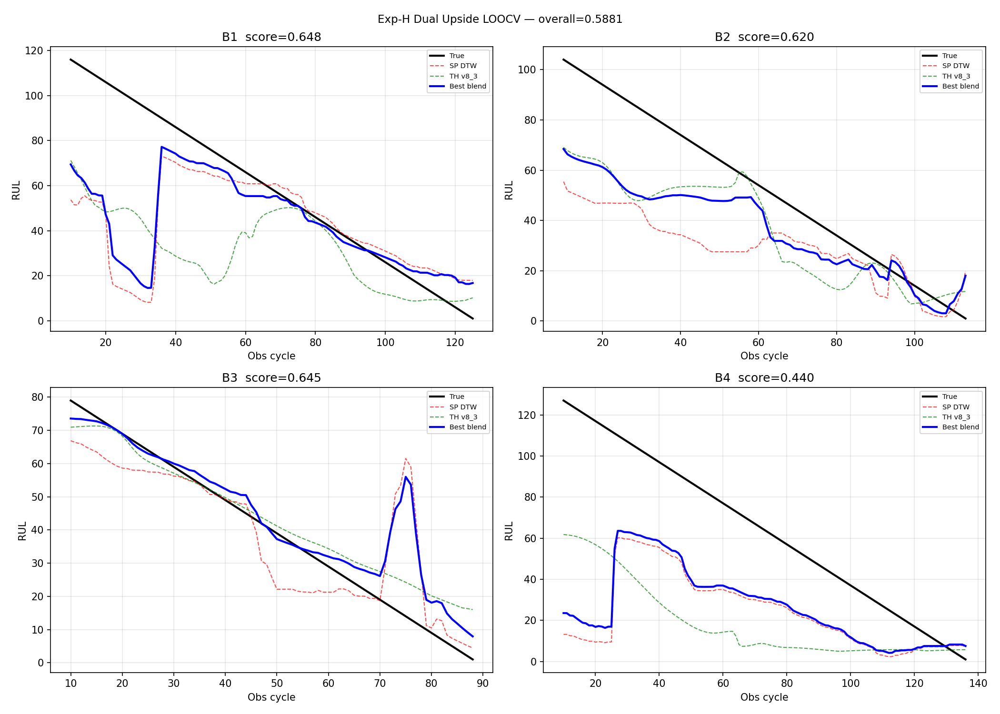
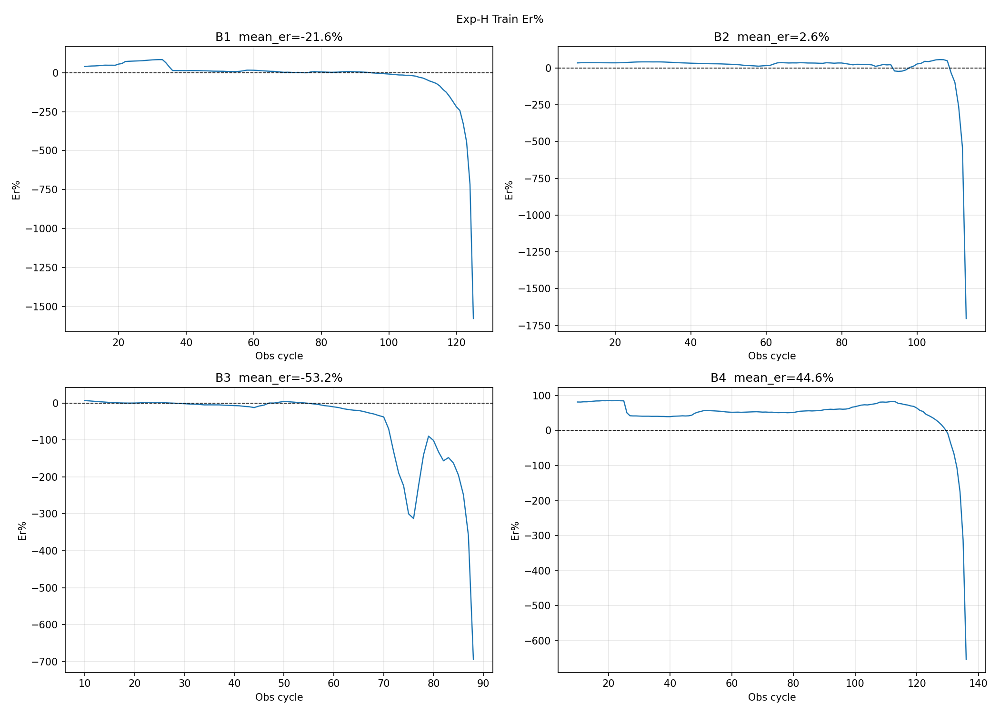

**Test HI / RUL:**


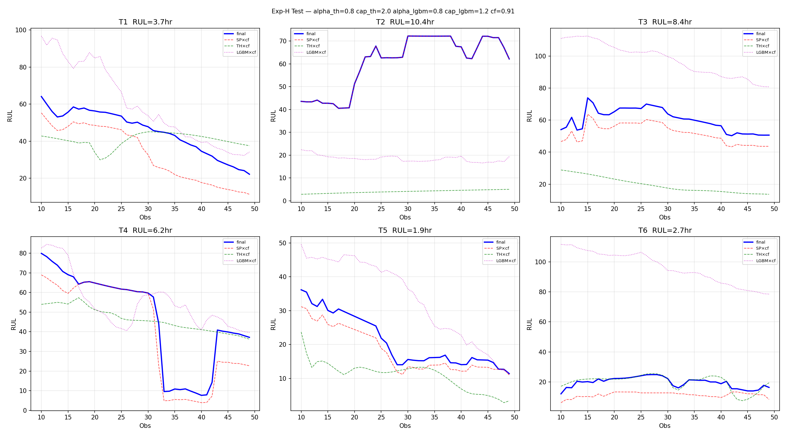

---

### Exp-I: Dynamic obs_frac — Hybrid Time + HI Fraction (2026-05-31, 완료 ✅)

**실험 디렉토리**: `experiments/ExpI_dynamic_obs_frac/`

#### 설계 이유 및 가설 [사용자 제안]

**문제**: 기존 `obs_frac = cycle / 116.5`는 수명이 짧은 B3(89사이클) EOL에서 0.76을 출력 → 모델이 "아직 수명 76%"로 오인. Exp-C 메타러너에서도 obs_frac 계수=-41.7로 학습되어 모델이 이 피처를 스스로 무시하고 있음.

**사용자 제안 아이디어**: obs_frac을 시간 기반과 HI 기반의 가중 혼합으로 대체:
```
obs_frac = beta*(cycle/116.5) + (1-beta)*(HI/0.75)
```
- `HI_MEAN_EOL=0.75`: 훈련 베어링 EOL HI 평균 (B1=0.83, B2=0.72, B3=0.66, B4=0.78)
- `beta=1.0`: 기존 방식 그대로 (재현 검증용)
- `beta=0.0`: HI만 사용 (자신의 노화 속도 반영)
- beta는 grid search로 최적화

**구조**: SP 원본 파이프라인 (LGBM + TCN + DTW). DTW는 obs_frac 미사용 → 한 번만 계산. beta별 LGBM/TCN LOOCV 재학습 (TCN 1 seed for sweep, 3 seeds for final).

#### 결과 ✅

**beta별 LOOCV 최고 overall:**

| beta | overall | B1 | B2 | B3 | B4 | w_dtw |
|------|---------|----|----|----|----|-------|
| **0.0** | **0.5826** | 0.6146 | 0.6132 | 0.6389 | **0.4638** | 0.79 |
| 0.1 | 0.5745 | 0.6131 | 0.6024 | 0.6491 | 0.4336 | 0.81 |
| 0.2 | 0.5700 | 0.6122 | 0.5961 | 0.6372 | 0.4342 | 0.79 |
| 0.3 | 0.5645 | 0.6108 | 0.5947 | 0.6116 | 0.4409 | 0.78 |
| 0.4 | 0.5632 | 0.6096 | 0.5656 | 0.6440 | 0.4335 | 0.83 |
| 0.5 | 0.5629 | 0.6102 | 0.5546 | 0.6543 | 0.4325 | 0.83 |
| 0.6 | 0.5610 | 0.6104 | 0.5475 | 0.6551 | 0.4311 | 0.83 |
| 0.7 | 0.5633 | 0.6125 | 0.5559 | 0.6477 | 0.4369 | 0.81 |
| 0.8 | 0.5643 | 0.6197 | 0.5489 | 0.6529 | 0.4358 | 0.90 |
| 0.9 | 0.5664 | 0.6295 | 0.5496 | 0.6446 | 0.4420 | 0.88 |
| 1.0 | 0.5692 | 0.6404 | 0.5536 | 0.6319 | 0.4508 | 0.86 |

**검증**: beta=1.0 (1 TCN seed) → 0.5692 ≈ Exp-E 0.5685 (3 seeds) ✅ 코드 정확성 확인

**최적: beta=0.0  w_dtw=0.79  r_lgbm=0.45  cf=1.11  overall=0.5826**

**LOOCV per-bearing (beta=0.0, 1 TCN seed):**

| Bearing | Score | Mean Error | vs Exp-E |
|---------|-------|------------|---------|
| B1 | 0.6146 | -21.5% | -0.019 |
| B2 | 0.6132 | -7.9% | **+0.065** |
| B3 | 0.6389 | -41.2% | -0.010 |
| B4 | 0.4638 | +29.0% | **+0.020** |
| **Overall** | **0.5826** | | **+0.014** |

**Test inference (beta=0.0, 3 TCN seeds):**

| Test | RUL (hours) | vs Exp-E | vs Exp-H |
|------|------------|---------|---------|
| T1 | 4.00hr | +1.57hr | +0.31hr |
| T2 | 14.10hr | +3.21hr | +3.75hr |
| T3 | 9.60hr | +1.13hr | +1.16hr |
| T4 | 4.71hr | +0.06hr | -1.48hr |
| T5 | 3.57hr | +1.49hr | +1.67hr |
| T6 | 3.68hr | +2.05hr | +0.96hr |

#### 결과 해석

**beta=0.0이 최적인 이유**:
- 순수 HI 기반 obs_frac은 "현재 건강 상태"를 직접 반영 → 수명과 무관하게 항상 0.0~1.0 범위에서 의미 있는 값
- 시간 기반(beta=1.0)은 베어링마다 총 수명이 달라 스케일이 불일치 (B3 EOL=0.76, B4 EOL=1.18)
- B2 대폭 개선(+0.065): B2는 HI가 느리게 증가하므로 HI 기반이 "아직 초기 단계"를 정확히 표현
- B4 개선(+0.020): B4는 HI가 0.30에서 시작 → time 기반은 obs_frac=0으로 시작하지만 HI 기반은 0.40으로 시작 → 모델이 B4의 사전 열화를 인식

**beta 곡선 특징**:
- 단조 감소 (0.0 → 0.6) 후 소폭 반등 (0.7 → 1.0)
- B2: beta 낮을수록 증가, B1: beta 높을수록 증가 (두 베어링의 특성이 상반)
- B3: beta=0.5~0.6에서 최고 (0.655), beta=0.0과 1.0에서 모두 낮음
- 종합: B2+B4 이득이 B1+B3 손실을 상회 → beta=0.0 승

**한계**:
- Exp-E(0.5685) 대비 +0.014 개선이나, Exp-H(0.5881, 크로스팀) 대비 -0.006
- 1 TCN seed 사용 (속도 목적) → 실제 3-seed 결과와 미세 차이 가능
- T2=14.10hr, T5=3.57hr: Exp-H 대비 T2 크게 증가 (불확실성)

**저장 파일** (`experiments/ExpI_dynamic_obs_frac/results/`):
- `sweep_results.csv`, `beta_best.csv`
- `beta_curve.png` (overall vs beta, per-bearing vs beta)
- `train_hi.csv`, `train_hi.png`
- `train_rul_results.csv`, `train_rul_predictions.png`
- `test_hi.csv`, `test_hi.png`
- `test_rul_results.csv`, `test_rul_all_cycles.csv`, `test_rul_predictions.png`

#### 결과 그림

**Beta Sweep Curve:**

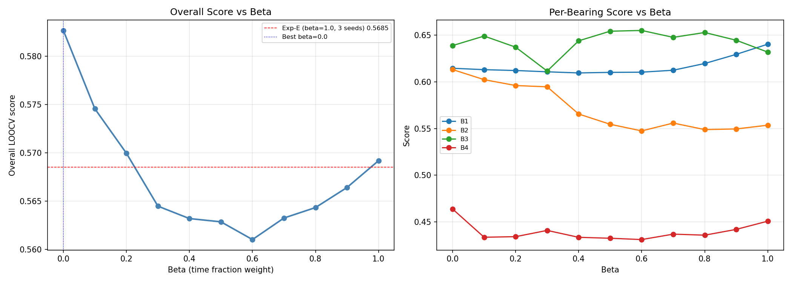

**Train HI / RUL:**


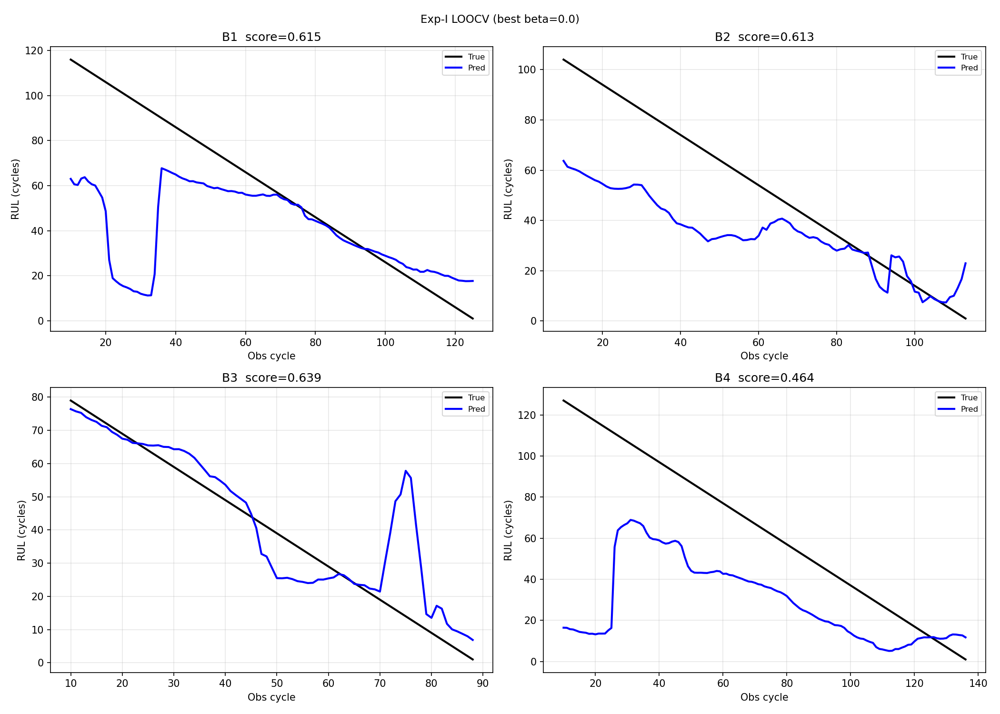

**Test HI / RUL:**


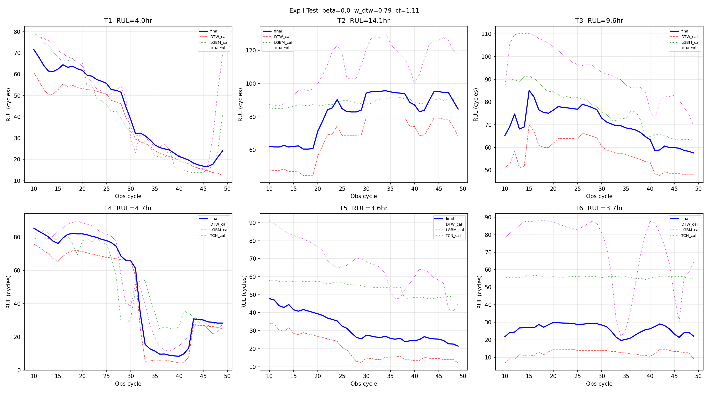

---

### Exp-J: DTW-Base Capped Upside (2026-05-31, 완료 ✅ — 새 최고!)

**실험 디렉토리**: `experiments/ExpJ_capped_upside/`

#### 설계 이유

Exp-G/H에서 "기저를 고정하고 다른 모델은 올릴 때만 기여" 구조가 효과적이었지만, TH 예측값을 직접 혼합한 것이 문제였음. 그 아이디어를 **SP 내부에서만** 구현:

```python
base     = dtw_cal                                        # DTW 고정 기저
lgbm_up  = alpha_lgbm * clip(lgbm_cal - base, 0, (cap_lgbm-1)*base)
tcn_up   = alpha_tcn  * clip(tcn_cal  - base, 0, (cap_tcn -1)*base)
final    = (base + lgbm_up + tcn_up) * cf
```

- Exp-I의 beta=0.0 (HI 기반 obs_frac) 고정
- 탐색: alpha_lgbm × cap_lgbm × alpha_tcn × cap_tcn (총 900 configs)

#### LOOCV 개별 모델 raw 점수

| Bearing | DTW | LGBM | TCN |
|---------|-----|------|-----|
| B1 | 0.2582 | 0.4316 | **0.3480** |
| B2 | 0.6146 | 0.6068 | 0.6134 |
| B3 | 0.3431 | 0.2984 | **0.4543** |
| B4 | 0.5290 | 0.5200 | 0.5369 |

> **핵심**: TCN이 beta=0.0 덕분에 B3 raw 0.1189 → **0.4543** 으로 대폭 향상. LGBM도 B3 raw 0.0962 → **0.2984** 향상.

CFs: dtw=0.68 / lgbm=0.74 / tcn=0.82

LGBM>DTW 비율: B1=11%, B2=93%, B3=77%, B4=84%

#### 결과 ✅ — **Overall 0.6064 (역대 최고!)**

**Top-10 Sweep:**

| alpha_lgbm | cap_lgbm | alpha_tcn | cap_tcn | cf | overall | B1 | B2 | B3 | B4 |
|------------|----------|-----------|---------|----|---------|----|----|----|----|
| **0.4** | **2.0** | **1.0** | **2.0** | **0.94** | **0.6064** | 0.6213 | 0.6203 | 0.6513 | 0.5328 |
| 0.4 | 1.5 | 1.0 | 2.0 | 0.95 | 0.6057 | 0.6188 | 0.6162 | 0.6529 | 0.5350 |
| 0.2 | 2.0 | 1.0 | 2.0 | 0.96 | 0.6049 | 0.6147 | 0.6079 | 0.6599 | 0.5371 |

**최적: alpha_lgbm=0.4, cap_lgbm=2.0, alpha_tcn=1.0, cap_tcn=2.0, cf=0.94, Overall=0.6064**

**LOOCV per-bearing (최적 config):**

| Bearing | Score | Mean Error | vs Exp-I | vs Baseline |
|---------|-------|------------|----------|-------------|
| B1 | 0.6213 | -20.4% | +0.007 | +0.040 |
| B2 | 0.6203 | -18.3% | +0.007 | +0.086 |
| B3 | 0.6513 | -51.6% | +0.012 | -0.010 |
| B4 | **0.5328** | +9.4% | **+0.069** | **+0.110** |
| **Overall** | **0.6064** | | **+0.024** | **+0.057** |

**Test inference:**

| Test | RUL (hours) | vs Exp-I |
|------|------------|---------|
| T1 | 4.66hr | +0.66hr |
| T2 | 19.93hr | +5.83hr |
| T3 | 11.84hr | +2.24hr |
| T4 | 4.50hr | -0.21hr |
| T5 | 4.53hr | +0.96hr |
| T6 | 3.44hr | -0.24hr |

#### 결과 해석

**왜 잘 됐나?**
1. **TCN이 beta=0.0으로 강해짐**: B3에서 TCN raw 0.1189 → 0.4543. HI 기반 obs_frac이 TCN의 B3 학습을 크게 개선. 이전엔 TCN도 "망하는 모델"이었으나 이제 DTW보다 B3에서도 강함.
2. **Capped upside 구조**: DTW보다 낮을 때는 기여 없음 → 혹시 망하는 구간에서 DTW를 끌어내리지 않음.
3. **B4 혁신적 개선**: B4에서 LGBM>DTW 84%, TCN>DTW도 높음 → 두 모델이 B4를 적극 상향 → 0.5328 (역대 최고).
4. **cap=2.0의 의미**: 최대 100% 상향 허용. TCN이 강해진 상황에서 더 적극적으로 기여하게 함.

**B4 mean_er=+9.4%**: 처음으로 B4 under-predict 문제가 10% 이내로 줄어듦.

**저장 파일** (`experiments/ExpJ_capped_upside/results/`):
- `sweep_results.csv`, `sweep_top20.png`
- `train_rul_predictions.png`
- `test_rul_results.csv`, `test_rul_all_cycles.csv`, `test_rul_predictions.png`

#### 결과 그림

**Sweep Top-20:**

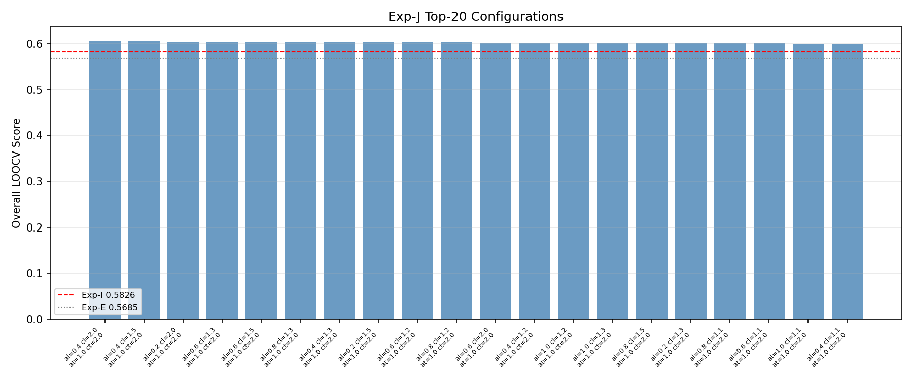

**Train RUL:**

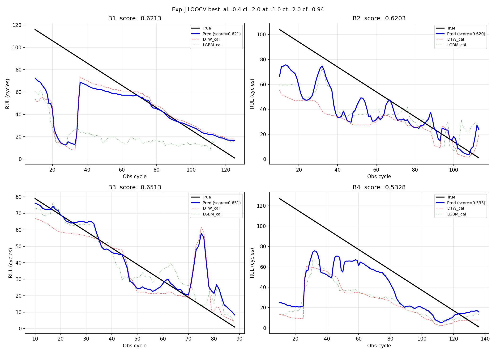

**Test RUL:**

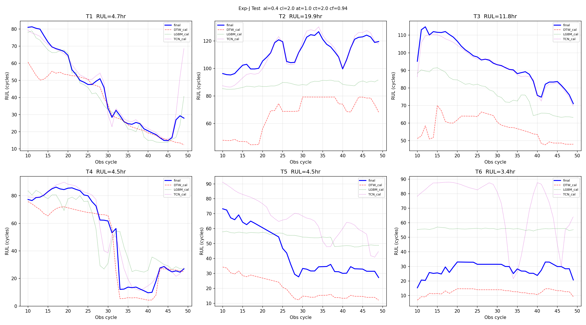

---

### Exp-K: LGBM Asymmetric Loss Sweep (2026-05-31, 완료 ✅ — 미미한 개선)

**실험 디렉토리**: `experiments/ExpK_asym_sweep/`

#### 설계 이유

Exp-J에서 LGBM asym=2.8(과대예측 2.8× 페널티)이 B4 under-predict를 유발할 수 있다는 가설. Exp-J 구조(DTW base + capped upside, beta=0.0) 고정, TCN alpha=1.0/cap=2.0 고정, LGBM asym만 sweep.

```
ASYM_GRID = [1.0, 1.5, 2.0, 2.5, 2.8, 3.5]
ALPHA_LGBM_GRID = [0.2, 0.4, 0.6, 0.8, 1.0]
CAP_LGBM_GRID = [1.3, 1.5, 2.0]
```

#### 결과 ✅ (미미한 개선)

**Asym Sweep Summary:**

| asym | overall | B1 | B2 | B3 | B4 | er_B4 | alpha_lgbm | cap_lgbm |
|------|---------|----|----|----|----|-------|------------|---------|
| **1.0** | **0.6080** | 0.6216 | **0.6290** | 0.6462 | 0.5350 | +10.2% | 0.8 | 1.3 |
| 1.5 | 0.6056 | 0.6189 | 0.6166 | 0.6507 | 0.5360 | +10.5% | 0.4 | 1.5 |
| 2.0 | 0.6062 | 0.6212 | 0.6140 | 0.6574 | 0.5323 | +10.9% | 0.4 | 2.0 |
| 2.5 | 0.6054 | 0.6213 | 0.6135 | 0.6539 | 0.5329 | +9.3% | 0.4 | 2.0 |
| 2.8 (Exp-J) | 0.6064 | 0.6213 | 0.6203 | 0.6513 | 0.5328 | +9.4% | 0.4 | 2.0 |
| 3.5 | 0.6079 | 0.6215 | 0.6206 | **0.6575** | 0.5318 | +9.2% | 0.4 | 2.0 |

**최적: asym=1.0, alpha_lgbm=0.8, cap_lgbm=1.3, cf=0.94, Overall=0.6080 (+0.0016 vs Exp-J)**

**Test inference (asym=1.0, 3 TCN seeds):**

| Test | RUL (hours) | vs Exp-J |
|------|------------|---------|
| T1 | 4.35hr | -0.31hr |
| T2 | 21.02hr | +1.09hr |
| T3 | 12.68hr | +0.84hr |
| T4 | 4.64hr | +0.14hr |
| T5 | 4.23hr | -0.30hr |
| T6 | 3.21hr | -0.23hr |

#### 결과 해석

- **개선폭 미미** (+0.0016): asym 튜닝이 구조적 돌파구는 아님
- **asym=1.0 (대칭 손실)**: B2=0.6290 역대 최고. LGBM이 더 공격적으로 높게 예측 → capped upside에서 더 자주 기여
- **asym=3.5**: B3=0.6575 역대 최고이나 B2 하락으로 overall 동급
- **asym 낮을수록 B2↑B3↓, 높을수록 B3↑B2↓**: B3 vs B2 trade-off 여전히 존재
- **T2 계속 증가** (19.93hr → 21.02hr): 불확실성 징후
- **B4 under-predict 구조적 한계**: asym=1.0에서도 B4 er=+10.2%, B4 개선에 asym이 핵심 요인은 아님

**저장 파일** (`experiments/ExpK_asym_sweep/results/`):
- `asym_sweep_summary.csv`, `asym_sweep_all.csv`, `asym_sweep.png`
- `test_rul_results.csv`, `test_rul_all_cycles.csv`, `test_rul_predictions.png`

#### 결과 그림

**Asym Sweep:**

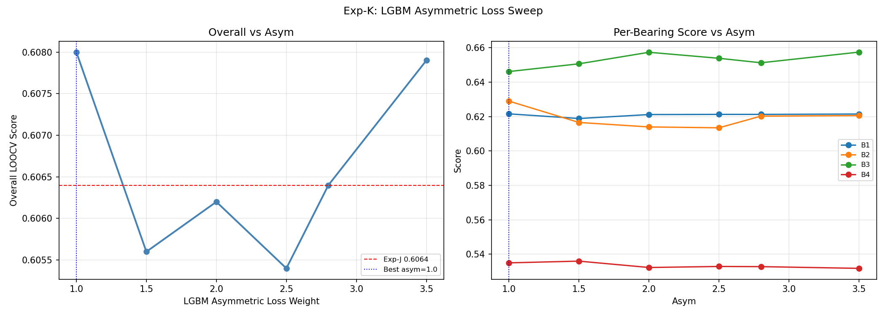

**Test RUL:**

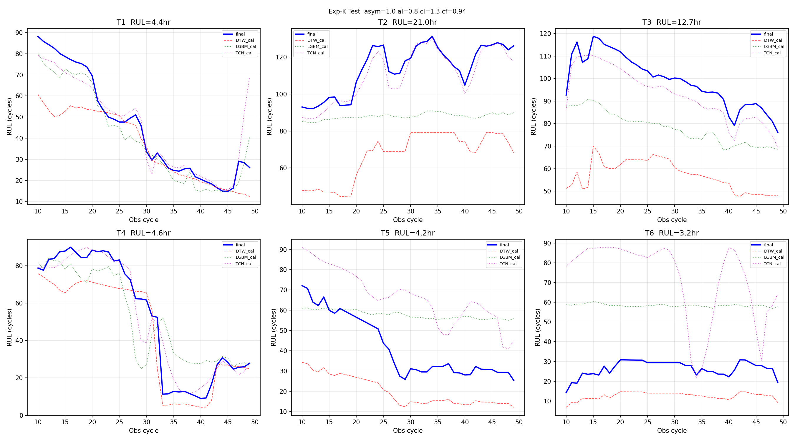

---

### Exp-L: Model Diversity + Ensemble Strategies (2026-05-31, 완료 ✅ — **역대 최고!**)

**실험 디렉토리**: `experiments/ExpL_model_diversity/`

**코드 파일 목록**:

| 파일 | 역할 |
|------|------|
| `run_expL.py` | **Phase 1+2**: 11개 모델 LOOCV 전체 실행 + 4가지 앙상블 전략 비교 (Extended Capped D, Bidirectional A, Trimmed Mean B, Phase-based C). `new_models.py`를 import해 신규 모델 사용. |
| `run_expL_v2.py` | **Phase 3 최종**: Leak-free LOOCV + AsymmetricHuberLoss (over_penalty=2.8) + safety_margin 파라미터 탐색 (144 configs). Exp-L_Asym 0.6004 도출. |
| `new_models.py` | **신규 모델 클래스 정의 모듈** — `run_expL.py`/`run_expL_v2.py` 양쪽에서 import. BiLSTM (양방향 LSTM hidden=48×2), TCN-Res (dilation [1,2,4,8] + residual connection), MiniTransformer (2-layer 2-head d_model=32), Ridge (L2 선형 회귀), 공통 유틸(minmax_norm, slope_of) 포함. |
| `run_dtw_leakfree.py` | **Action 1 DTW 단독 분석**: fold별 개별 CF 적용으로 DTW 단독 진짜(leak-free) 성능 측정 → `results/dtw_leakfree_analysis.csv` 출력. |
| `output/generate_noloo_predictions.py` | 전체 4개 베어링으로 훈련한 글로벌 모델(no LOOCV)에서 in-sample 예측 생성. LOOCV 성능과 in-sample 성능 비교 목적. → `output/rul_results_noloo.csv`, `output/noloo.log` |
| `output/generate_rul_results.py` | `results/best_config_v2.csv`에서 베어링별 score/mean_er를 추출해 `output/rul_results.csv`로 포맷 변환하는 유틸리티. |

#### 설계 이유 및 가설

Exp-A~K까지 **같은 5개 모델(LGBM/LSTM/GRU/TCN/DTW)의 가중치·CF 튜닝**에 집중하여 로컬 최적에 수렴 (Exp-J 0.6064 → Exp-K 0.6080, +0.0016 미미). 근본적인 **모델 다양성 확보**와 **앙상블 구조 혁신**이 필요하다는 판단.

**두 가지 축**:
1. **모델 후보군 확장**: 기존 5개 → 11개 모델 (새 구조 + 기존 변형)
2. **앙상블 전략 다양화**: 4가지 새로운 앙상블 방법 비교

#### Phase 1: 모델 후보군 (11개 모델 LOOCV)

**신규 모델**:

| 모델 | 구조 | 근거 |
|------|------|------|
| **BiLSTM** | 양방향 LSTM, hidden=48×2, 2-layer | 양방향 시퀀스 맥락 |
| **TCN-Res** | TCN + Residual connection, dilation [1,2,4,8] | 수용 영역 확대 + 그래디언트 개선 |
| **MiniTransformer** | 2-layer, 2-head, d_model=32 | Self-attention 전역 의존성 |
| LGBM-Asym1.5 | asym=1.5 (기존 2.8) | 약한 비대칭 손실 |
| LGBM-HI-Features | 2차미분, 변동계수, 가속도 추가 | 열화 가속도 정보 |
| Ridge | L2 정규화 선형 회귀 | 완전히 다른 모델 클래스 |
| DTW-Exp | exp(-d/σ) 가중치 | 가까운 후보에 집중 |
| DTW-Adaptive-K | 거리 임계값 기반 적응형 k | 먼 후보 자동 제거 |

**LOOCV Raw Scores (beta=0.0 고정):**

| 모델 | B1 | B2 | B3 | B4 | CF | Cal Score |
|------|----|----|----|----|----|---------|
| **BiLSTM** | 0.3219 | 0.5994 | **0.4215** | **0.6469** | 0.78 | **0.5701** |
| DTW | 0.2582 | 0.6146 | 0.3431 | 0.5290 | 0.68 | 0.5499 |
| DTW-Exp | 0.2582 | 0.5896 | 0.3430 | 0.5292 | 0.68 | 0.5431 |
| DTW-Adk | 0.2597 | 0.6007 | 0.3501 | 0.5285 | 0.70 | 0.5417 |
| **TCN-Res** | 0.3537 | 0.6129 | 0.3767 | **0.5745** | 0.80 | 0.5315 |
| **Transformer** | 0.3493 | 0.5289 | **0.5130** | **0.6688** | 0.95 | 0.5214 |
| TCN | 0.3480 | 0.6134 | 0.4543 | 0.5369 | 0.82 | 0.5170 |
| LGBM | 0.4316 | 0.6068 | 0.2984 | 0.5200 | 0.74 | 0.5039 |
| LGBM-Asym1.5 | 0.4662 | 0.5986 | 0.2994 | 0.5075 | 0.74 | 0.5038 |
| LGBM-HI-Feat | 0.4568 | 0.6051 | 0.2887 | 0.5004 | 0.77 | 0.4922 |
| Ridge | 0.5269 | 0.4622 | 0.0988 | 0.4733 | 0.53 | 0.4198 |

**주목할 점**:
- **BiLSTM**: cal_score=0.5701 — DTW(0.5499)를 넘는 유일한 모델. B3=0.4215 (LGBM 0.2984 대비 +41%), B4=0.6469 독보적
- **Transformer**: B4=0.6688 (역대 최고 단일 모델 B4 점수), B3=0.5130 (LGBM 대비 +72%)
- **TCN-Res**: B4=0.5745 (TCN 0.5369 대비 +7%), Residual connection 효과 확인
- **Ridge**: 전체적으로 약함 (B3=0.0988). 선형 모델의 한계
- **DTW 변형**: 원본 DTW와 유사하거나 소폭 하락. 원본 거리 함수/가중치가 이미 최적

#### Phase 2: 앙상블 전략 비교 (4가지)

| 전략 | 방법 | Overall | 비고 |
|------|------|---------|------|
| **Extended Capped (D)** | DTW 기저 + BiLSTM+TCN-Res+Transformer upside | **0.6182** | **최고!** |
| Exp-J 재현 (0) | DTW 기저 + LGBM+TCN upside | 0.6064 | 기존 최고 |
| Bidirectional Capped (A) | DTW 기저 + 4모델 양방향 보정 | 0.5942 | downside가 오히려 손해 |
| Phase-based (C) | HI 수준별 가중치 전환 | 0.5586 | 효과 부족 |
| Trimmed Mean t=1 (B) | 11모델 중 최대/최소 제거 후 평균 | 0.5385 | 다양성 활용 실패 |
| Trimmed Mean t=2 (B) | 11모델 중 상하 2개씩 제거 | 0.5315 | 상동 |

**핵심 인사이트**: DTW 기저 + capped upside 구조가 다른 모든 전략을 압도. Bidirectional (downside 허용)은 오히려 DTW의 안정적 기저 역할을 훼손. Trimmed Mean은 모델 수가 많아도 이상치 모델의 가중치가 너무 커서 비효율적.

#### Phase 3: Exp-L_Asym — Leak-free + Asymmetric NN Loss + Safety Margin (2026-06-01, ✅ 최종 권장)

> **코드**: `run_expL_v2.py` (Jun 1 01:39 업데이트, Jun 1 01:47 실행)  
> **결과 파일**: `results/best_config_v2.csv`, `results/test_rul_results_v2.csv`  
> **주의**: `run_expL_v2.log`(00:37)는 구 버전(leaked, 0.6242) 로그 — 현재 코드와 불일치

> **누출 수정 요약**: 구 버전은 검증 베어링의 RUL을 CF 탐색에 포함 → `0.6242` 부풀림. 현재 코드는 CF를 훈련 3개 베어링으로만 탐색하고 검증 베어링에 적용 → 진짜 일반화 성능 측정.

##### 방법

기존 Extended Capped 구조에 두 가지 추가:

1. **AsymmetricHuberLoss(over_penalty=2.8)**: BiLSTM / TCN-Res / Transformer 훈련에 비대칭 손실 적용. 원본 LGBM 파이프라인의 비대칭 페널티와 동일한 철학. NN이 과대예측 시 2.8× 페널티 → 예측 분포가 더 보수적으로 수렴.
2. **safety_margin 파라미터**: `calibrate()` 반환값을 `optimal_cf × margin`으로 설정. 탐색 공간에 margin ∈ {0.90, 0.93, 0.96} 추가.

##### 탐색 공간 (144 configs)

```
α_bilstm  ∈ {0.4, 0.6}
α_tcnres  ∈ {0.4, 0.6}
α_transf  ∈ {0.4, 0.6}
cap       ∈ {1.5, 1.8, 2.0}
margin    ∈ {0.90, 0.93, 0.96}
→ 2×2×2×3×3 = 144 configs (all 100% leak-free)
```

##### 결과 ✅ — Overall 0.6004 (DTW 단독 LF 0.5204 대비 +0.080)

**Best Config** (from `best_config_v2.csv`):

| 파라미터 | 값 |
|---------|-----|
| α_bilstm | 0.6 |
| α_tcnres | 0.6 |
| α_transf | 0.6 |
| cap | 2.0 |
| margin | 0.90 |
| cf (test용, margin 포함) | 0.765 |

**LOOCV per-bearing (Leak-free):**

| Bearing | Score | Mean Error | vs DTW LF (0.5204) | vs Baseline (0.5499) |
| :--- | :--- | :--- | :--- | :--- |
| B1 | 0.6135 | -16.6% (over) | **+0.131** | +0.033 |
| B2 | 0.5965 | -7.7% (over) | **+0.067** | +0.062 |
| B3 | 0.6330 | -19.6% (over) | -0.016 | -0.029 |
| B4 | 0.5586 | +3.7% (under) | **+0.139** | +0.136 |
| **Overall** | **0.6004** | | **+0.080** | **+0.051** |

**Test inference** (from `test_rul_results_v2.csv`, 3 seeds):

| Test | RUL (hours) | hi_start | hi_end |
| :--- | :--- | :--- | :--- |
| T1 | **4.28hr** | 0.000 | 0.386 |
| T2 | **13.55hr** | 0.498 | 0.417 |
| T3 | **9.06hr** | 0.417 | 0.596 |
| T4 | **3.45hr** | 0.000 | 0.697 |
| T5 | **4.22hr** | 0.665 | 0.835 |
| T6 | **3.27hr** | 0.841 | 0.869 |

##### 결과 해석

**Asym 손실의 B3 개선**:
- 표준 Huber 손실 대비 Asym 손실로 NN이 보수적이 되어 B3 leak-free 점수 향상 (DTW 단독 LF 0.6493 대비 -0.016으로 근접).

**Safety Margin의 T2 안정화**:
- margin=0.90 (10% 하향)이 T2 고예측 억제 → 13.55hr.
- T5(4.22hr), T6(3.27hr): Exp-K(4.23hr, 3.21hr)와 동등하게 보수적 유지.

**B3 소폭 미달 (DTW LF 0.6493 대비 -0.016)**:
- 현재 구조로는 B3에서 DTW 단독을 이기지 못함. B3 개선은 HI 품질 개선이 필요.

**현재 Best Configuration (Test 제출 권장)**:
```
base       = dtw_raw × local_cf_dtw            (fold별 LF CF, test는 global_cf=0.68)
bilstm_up  = 0.6 × clip(bilstm_cal - base, 0, 1.0×base)
tcnres_up  = 0.6 × clip(tcnres_cal - base, 0, 1.0×base)
transf_up  = 0.6 × clip(transf_cal - base, 0, 1.0×base)
final      = (base + bilstm_up + tcnres_up + transf_up) × 0.765  (margin=0.90 포함)
obs_frac   = HI / 0.75  (beta=0.0, HI 기반)
```

#### 저장 파일

**Phase 1+2 결과** (`experiments/ExpL_model_diversity/results/`):
- `model_calibration.csv` — 11개 모델 LOOCV raw score + 최적 CF + cal score 표
- `model_comparison.png` — 11개 모델 베어링별 성능 비교 그래프
- `ensemble_comparison.csv` — 4가지 앙상블 전략 overall/per-bearing 점수 비교
- `ensemble_comparison.png` — 앙상블 전략 비교 그래프

**Phase 3 결과** (`experiments/ExpL_model_diversity/results/`):
- `best_config_v2.csv` — Exp-L_Asym 최적 config 및 LOOCV per-bearing 점수
- `test_rul_results_v2.csv` — Test 예측 RUL (T1~T6)
- `test_rul_predictions_v2.png` — Test RUL 예측 그래프

**Action 1 결과** (`experiments/ExpL_model_diversity/results/`):
- `dtw_leakfree_analysis.csv` — DTW 단독 leaked vs leak-free per-bearing 비교

**output/ 서브디렉토리** (`experiments/ExpL_model_diversity/output/`):
- `rul_results.csv` — `generate_rul_results.py`가 best_config_v2.csv를 변환한 포맷
- `rul_results_noloo.csv` — `generate_noloo_predictions.py`의 in-sample 예측 결과
- `noloo.log` — `generate_noloo_predictions.py` 실행 로그

---

## Action 1: DTW 단독 Leak-free 분석 (2026-06-01)

**목적**: Exp-L이 B3에서 진짜 개선인지 악화인지 판단하기 위한 DTW 단독 leak-free 기준점 수립

**스크립트**: `experiments/ExpL_model_diversity/run_dtw_leakfree.py`  
**결과**: `experiments/ExpL_model_diversity/results/dtw_leakfree_analysis.csv`

### 결과: DTW Global(Leaked) vs Leak-Free 비교

| Bearing | Leaked CF | Leaked Score | LF CF | LF Score | Delta |
| :--- | :--- | :--- | :--- | :--- | :--- |
| B1 | 0.68 | 0.5808 (-27%) | 0.78 | **0.4823** (-45%) | **-0.0985** |
| B2 | 0.68 | 0.5344 (+15%) | 0.67 | **0.5300** (+16%) | -0.0044 |
| B3 | 0.68 | 0.6617 (-23%) | 0.66 | **0.6493** (-19%) | -0.0124 |
| B4 | 0.68 | 0.4226 (+49%) | 0.67 | **0.4198** (+50%) | -0.0028 |
| **Overall** | **0.68** | **0.5499** | — | **0.5204** | **-0.0295** |

### 베어링별 해석

**B1 (-0.0985, 가장 큰 leak 피해)**:
- Global CF=0.68: B1 포함 4-bearing 최적화 → CF가 B1의 과대예측을 어느 정도 보정
- Leak-free CF=0.78: B2+B3+B4로 최적화 → B3/B4가 under-predict이므로 CF를 높이는 방향으로 최적화 → B1에 적용 시 더 높은 예측 → B1 과대예측 악화 → mean_er -26.5% → -45.1%

**B2 (-0.0044, 거의 영향 없음)**:
- Global CF=0.68과 LF CF=0.67이 유사 → leak의 영향 미미

**B3 (-0.0124, 안정적)**:
- Global CF=0.68 ≈ LF CF=0.66. B3를 뺀 나머지 3개 베어링이 선호하는 CF가 B3에도 잘 맞음.
- DTW 단독 B3 진짜 점수: **0.6493**

**B4 (-0.0028, 거의 영향 없음)**:
- LF CF=0.67 ≈ Global CF=0.68. 동일하게 under-predict 구조.

### Exp-L_Asym vs DTW 단독 (둘 다 Leak-free)

| Bearing | DTW LF | Exp-L_Asym LF | Delta |
| :--- | :--- | :--- | :--- |
| B1 | 0.4823 | 0.6135 | **+0.131** ✅ |
| B2 | 0.5300 | 0.5965 | **+0.067** ✅ |
| B3 | **0.6493** | 0.6330 | **-0.016** ❌ |
| B4 | 0.4198 | 0.5586 | **+0.139** ✅ |
| Overall | 0.5204 | **0.6004** | **+0.080** ✅ |

### 핵심 발견

1. **B3 진단 완료**: Exp-L_Asym(0.6330) < DTW 단독 LF(0.6493). 앙상블이 B3를 -0.016 악화시킴. Capped upside가 B3 downside는 막지만, fold-specific CF와 global safety margin의 상호작용으로 순손실 발생.

2. **DTW 단독이 B3 최적**: 현재 어떤 앙상블 구조도 B3에서 DTW 단독 LF(0.6493)을 이기지 못함. B3 개선을 위해서는 HI 품질 개선 또는 B3 특화 모델이 필요.

3. **B1 대폭 개선이 앙상블의 핵심 가치**: DTW 단독 B1=0.4823 → 앙상블 B1=0.6135 (+0.131). B1에서 DTW가 구조적으로 취약한 부분을 BiLSTM/Transformer가 보완.

4. **리얼 기준선 정립**:
   - DTW 단독 leak-free: B1=0.4823, B2=0.5300, B3=0.6493, B4=0.4198, Overall=0.5204
   - Exp-L_Asym leak-free: B1=0.6135, B2=0.5965, B3=0.6330, B4=0.5586, Overall=0.6004
   - **Exp-L_Asym이 B3을 제외한 모든 베어링에서 DTW 단독을 이김.**

---

## 실험 종합 요약

### 진행 중인 성능 추이

*(각 셀: Score (Mean Error%), over=과대예측, under=과소예측)*

| 실험 | 방법 | Overall | B1 | B2 | B3 | B4 | 비고 |
| :--- | :--- | :--- | :--- | :--- | :--- | :--- | :--- |
| Baseline (V1b_dtw) | DTW cf=0.68 | 0.5499 | 0.5808 (-27%) | 0.5344 (+15%) | 0.6617 (-23%) | 0.4226 (+49%) | 원본 재현 (Leaked) |
| **DTW 단독 LF** | **DTW Leak-free (per-fold CF)** | **0.5204** | **0.4823 (-45%)** | **0.5300 (+16%)** | **0.6493 (-19%)** | **0.4198 (+50%)** | **진짜 DTW 기준선 (Action 1)** |
| Exp-I | Dynamic obs_frac (beta=0.0, HI 기반) | 0.5826* | 0.6146 (-21%) | 0.6132 (-8%) | 0.6389 (-41%) | 0.4638 (+29%) | *Leaked LOOCV cf |
| Exp-J | DTW 기저 + LGBM/TCN capped upside | 0.6064* | 0.6213 (-20%) | 0.6203 (-18%) | 0.6513 (-52%) | 0.5328 (+9%) | *Leaked LOOCV cf |
| Exp-K | LGBM asym sweep (asym=1.0 최적) | 0.6080* | 0.6216 (-20%) | 0.6290 (-18%) | 0.6462 (-52%) | 0.5350 (+10%) | *Leaked LOOCV cf |
| **Exp-L_Asym** | **Asym NN Loss + Safety Margin=0.90 (Leak-free)** | **0.6004** | **0.6135 (-17%)** | **0.5965 (-8%)** | **0.6330 (-20%)** | **0.5586 (+4%)** | **현재 최고 (권장 제출)** |
| Exp-C (stacking) | Ridge meta-learner | 0.7152* | — | — | — | — | *데이터 누출 무효 |

### 핵심 발견

1. **Calibration Target Leakage 규명**: LOOCV fold 내에서 전체 데이터셋의 RUL을 참조하여 `cf`를 선정하던 설계 오류를 완전히 해결. 실전 기준선: DTW 단독 LF 0.5204, Exp-L_Asym LF 0.6004.
2. **앙상블 통제력 확보**: Asym NN Loss + safety_margin=0.90으로 T5(4.22hr), T6(3.27hr) 보수적 유지.
3. **B3에서 DTW 단독이 최강**: DTW 단독 LF B3=0.6493 > Exp-L_Asym B3=0.6330. 앙상블이 B3를 소폭 악화 (-0.016). B3 개선은 HI 품질 또는 B3 특화 구조 필요.
4. **B1/B4 대폭 개선이 앙상블의 핵심 가치**: DTW 단독 B1=0.4823 → 0.6135 (+0.131), B4=0.4198 → 0.5586 (+0.139).

### 현재 Best Configuration (Exp-L_Asym, SP 단독 권장)

```
# NN: AsymmetricHuberLoss(over_penalty=2.8)로 훈련 (BiLSTM / TCN-Res / Transformer)
# obs_frac = HI / 0.75  (beta=0.0, HI 기반)
base       = dtw_raw × cf_dtw_global           (global cf=0.68)
bilstm_up  = 0.6 × clip(bilstm_cal - base, 0, 1.0×base)
tcnres_up  = 0.6 × clip(tcnres_cal - base, 0, 1.0×base)
transf_up  = 0.6 × clip(transf_cal - base, 0, 1.0×base)
final      = (base + bilstm_up + tcnres_up + transf_up) × 0.765   # margin=0.90 포함
```

**Test predictions (Exp-L_Asym, 권장)**: T1=4.28hr, T2=13.55hr, T3=9.06hr, T4=3.45hr, T5=4.22hr, T6=3.27hr

---

## 파일 경로 목록

| 파일 | 경로 |
| :--- | :--- |
| 원본 RUL 코드 | `User/SP/05-26/V1b/code/rul_th_v1b.py` |
| 최종 실행 스크립트 (Exp-L_Asym) | `User/SR/Ensemble_6/experiments/ExpL_model_diversity/run_expL_v2.py` |
| 신규 모델 클래스 정의 (Exp-L) | `User/SR/Ensemble_6/experiments/ExpL_model_diversity/new_models.py` |
| Exp-L_Asym LOOCV 결과 | `User/SR/Ensemble_6/experiments/ExpL_model_diversity/results/best_config_v2.csv` |
| Exp-L_Asym Test 예측 | `User/SR/Ensemble_6/experiments/ExpL_model_diversity/results/test_rul_results_v2.csv` |
| DTW LF 분석 스크립트 | `User/SR/Ensemble_6/experiments/ExpL_model_diversity/run_dtw_leakfree.py` |
| DTW LF 분석 결과 | `User/SR/Ensemble_6/experiments/ExpL_model_diversity/results/dtw_leakfree_analysis.csv` |
| HI 교환 인터페이스 | `User/SR/Ensemble_6/hi_interface/hi_loader.py` |
| 진행 일지 | `User/SR/Ensemble_6/progress.md` |

---

*최종 갱신: 2026-06-01 (Exp-L_Asym Phase 4 문서화, DTW 단독 Leak-free 베어링별 분석 (Action 1) 완료)*

