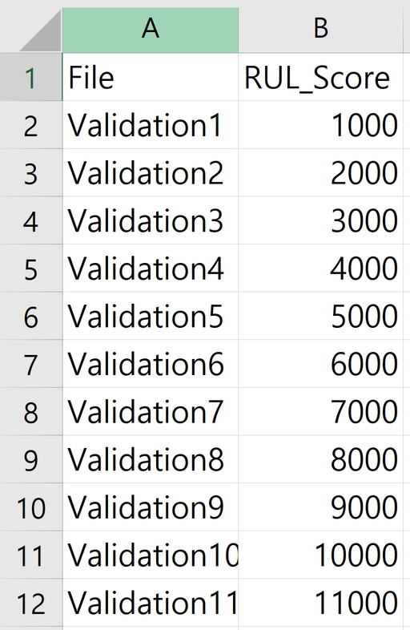

# KSPHM-KIMM 기계 데이터 챌린지 2026

### 주 관 : 한국PHM학회, 한국기계연구원
운 영 : 아주대학교([데이터 지능형 PHM 연구실](https://phm.imweb.me/), [인공지능 기반 시스템 분석 연구실](https://ai-sa.ajou.ac.kr/))

---

<aside>
🔗

[**KSPHM-KIMM 기계 데이터 챌린지 2026 팀 등록**](https://forms.gle/KRiAWHzAhsyiJ7MT6)

🔔팀 등록은 팀장이 대표로 진행하며, 본선 진출 팀은 팀당 최소 1명이 PHM Korea 2026 정기학술대회에 등록해야 합니다.
(예선 참여 시, 제한 없음)

🔔팀원 인원의 제한은 없습니다. 또한 여러 기관이 공동으로 참여할 수 있습니다.

</aside>

<aside>
🔗

**KSPHM-KIMM 기계 데이터 챌린지 2026 데이터 다운로드링크 : [한국기계연구원 기계데이터플랫폼](https://kimmdata.kimm.re.kr/dataset/detail?pageIndex=1&pageUnit=9&datasetCatCode=C011&datasetId=DTS_0000000000003295&typeValue=card)**

</aside>

## 공지사항

- train4 데이터셋과 관련하여, 마지막 진동 데이터 1개가 미취득된 것이 확인되었습니다. train4 데이터셋을 활용하실 경우, 해당 부분을 고려하여 수행해주시기 바랍니다.
- Test set에는 진동 데이터만 제공하고 operation 데이터셋에 대한 정보는 제공하지 않습니다.

<aside>

</aside>

## KSPHM-KIMM 데이터 챌린지 2026 주요 일정

|                           **진행 내용** |                             **날짜** |
| --- | --- |
| 데이터 공개 1차 (Train Set) | 3/23 (월) |
| 팀 등록 마감 | 4/27 (월) |
| 데이터 공개 2차 (Validation Set) | 5/4(월) |
| Validation 예비 제출 | 6/1(월)~6/5(금) |
| Validation 최종 제출 | 6/8(월) |
| 결과 발표 | 6/9(화) |
| 발표 평가 | 6/25(목) |
| 우수 팀 시상 | 6/25(목) |

<aside>
💡

## **목차**

</aside>

# 데이터 챌린지 소개

## 1.  개요

- 베어링은 회전 기계의 핵심 구성 요소로, 지속적인 운전 과정에서 마모·피로·균열 등 다양한 열화가 진행됩니다. 이러한 열화를 사전에 감지하지 못하면 예기치 않은 설비 고장과 생산 중단으로 이어질 수 있어, 베어링의 상태를 모니터링하고 잔여수명(RUL)을 정확히 예측하는 기술은 산업 현장에서 핵심적인 연구 과제로 자리잡고 있습니다.
- 본 챌린지는 실제 베어링 진동 데이터를 활용하여 잔여수명을 예측하는 것을 목표로 합니다. 이를 통해 참가자들이 데이터 기반의 예지보전(Predictive Maintenance) 역량을 키우고, 실무에 적용 가능한 강건한 예측 모델을 개발하는 데 기여하고자 합니다

---

## 2.  목표

- 제공되는 학습용 베어링 진동 데이터셋으로 수명 예지 모델을 학습하고, 별도로 제공되는 검증용 데이터셋을 사용하여 모델의 성능을 검증합니다.
- 모든 데이터는 동일한 테스트베드에서 다수의 반복 실험을 통해 측정되었으며, 참가팀은 이를 고려하여 강건한 수명 예지 모델을 개발해야 합니다.
- 최종적으로, 학습된 모델을 이용하여 검증용 데이터셋 각 베어링의 잔여수명을 예측하고 그 결과를 제출해야 합니다.

---

## 3.  데이터 셋

### 3.1 실험 조건

- 본 챌린지에서 제공되는 데이터는 베어링의 열화 시험이 가능하도록 설계 및 제작된 테스트베드에서 실험을 통해 수집되었습니다. 구체적으로, 베어링에 미세 고장을 인가한 후 테스트베드에 조립하여 운전함으로써 고장을 점진적으로 심화시켰습니다.
- 실험은 약 700–950 rpm 범위내 회전 속도가 변경되는 조건으로 수행되었으며, 회전 속도는 1시간 단위 간격으로 변경되었습니다.
- 실험은 노이즈가 많이 발생하는 환경에서 수행되어, 제공되는 데이터에는 다량의 노이즈가 포함되어 있습니다.



그림1. 테스트베드


그림2. 테스트베드 구조


그림3. 테스트베드 세부 구조

<aside>
💡

본 챌린지에서 제공되는 **시험 데이터의 취득 조건은 아래와 같습니다.** 

### 🔹 데이터 샘플링 레이트 (Sampling Rate)

- 진동 신호: 25.6 kHz
- 이외 신호: 0.1 Hz

### 🔹 데이터 수집 주기

- 10분 주기로 1분씩 취득 (테스트베드는 연속적으로 운전)

### 🔹 시험 중단 조건과 데이터 특성

- 베어링이 [**중단 조건](https://www.notion.so/KSPHM-KIMM-2026-a6a39f853cf782e0a0ee014d68590cb6?pvs=21)에 도달하면 실험이 종료됨**
- 데이터 측정 중 고장이 발생할 경우, 고장 시점의 데이터가 포함
- 데이터 미측정 중 고장이 발생할 경우, 고장 시점의 데이터가 불포함
- **실제 고장 시점과 마지막 데이터 측정 시간은 일치하지 않을 수 있으며,**  이는 예측 모델에서 고려되어야 할 중요한 변수임


그림4. 시험 데이터 취득 조건

</aside>

- 실험에 활용된 베어링의 상세 규격은 아래와 같습니다.

|                            **항목** |              **단위** |              **값** |
| --- | --- | --- |
| Bearing Model | n/a | 30306 |
| Inner Diameter | mm | 30 |
| Outer Diameter | mm | 72 |
| Width | mm | 20.75 |
| Static Loading Rate | kN | 60 |
| Dynamic Loading Rate | kN | 59.5 |
| Grease Maximum Temperature | ℃ | 200 |
- 베어링 고장 주파수(Bearing Fault Frequency) (1000 RPM 기준)

|                                     **항목** |                      **주파수** |
| --- | --- |
| Ball Passing Frequency Inner (BPFI) | 140 Hz |
| Ball Passing Frequency Outer (BPFO) | 93 Hz |
| Ball Spinning Frequency (BSF) | 78 Hz |
| Cage Rotational Speed | 6.7 Hz |

### 3.2 열화시험 조건

|                        **항목** |                                **값** |
| --- | --- |
| 축방향 하중 | 15 kN |
| 반경 방향 하중 | 10 kN |
| 회전 속도 | 약 700 - 950rpm (1시간 간격) |

### 3.3 열화시험 중단 조건

- 아래 2개의 조건 중 1개가 먼저 만족되는 조건

|                        **항목** |                                **값** |
| --- | --- |
| 베어링 하우징 온도 | 200 ℃ 이상 |
| 회전 토크 | -20 Nm 이하 |

---

## 4. 데이터 셋(set) 구성 및 다운로드

- 데이터 다운로드 링크:
    - **Train Set :** 🔗[**한국기계연구원 기계데이터플랫폼**](https://kimmdata.kimm.re.kr/dataset/detail?pageIndex=1&pageUnit=9&datasetCatCode=C011&datasetId=DTS_0000000000003295&typeValue=card)
    - **Validation Set:  (5/4 공개 예정)**
    - **예측 결과 제출 시트 양식: (추후 공개 예정)**
- 데이터는 학습용 `train` 데이터 셋과 검증용 `validation`데이터 셋으로 나누어서 제공됩니다.
- `train` 데이터 셋 : 열화시험 중단 조건에 도달할 때까지 시험한 데이터로, 참가팀은 이 데이터 셋을 사용하여 모델을 학습해야 합니다.
- `validation` 데이터 셋 : 열화시험 중단 조건에 도달하지 못하고 베어링의 결함이 진전되고 있는 상태까지 시험한 데이터로, 참가팀은 이 데이터 셋을 사용하여 잔여수명을 예측하고 그 결과를 제출해야 합니다.

### 📖 데이터 셋 변수 설명

<aside>
📖

|              채널명 |                                             설명 |
| --- | --- |
| CH1 | Front Vertical Vibration |
| CH2 | Front Axial Vibration |
| CH3 | Rear Vertical Vibration |
| CH4 | Rear Axial Vibration |
| Torque [Nm] | Rotational Torque |
| Motor Speed [RPM] | RPM (revolutions per minute) |
| TC SP Front [℃] | Front Bearing Temperature |
| TC SP Rear [℃] | Front Rear Temperature |
</aside>

 

- Python으로 TDMS 데이터 접근하기
    - 가상 환경내 nptdms 설치 코드
    - TDMS 데이터 접근 코드

📌

```python
conda install conda-forge::nptdms
```

📌 

```python
from nptdms import TdmsFile
import pandas as pd

def load_tdms_file(file_path):
    tdms_file = TdmsFile.read(file_path)
		df = tdms_file.as_dataframe()
    return df 
```

---

## 5. 평가 지표

- 본 챌린지에서 참가팀은 각 validation 데이터 셋의 마지막 시각을 기준으로 베어링의 잔여수명시간(Remaining Useful Life, RUL)을 초단위로 예측해야 합니다.


그림 5. 베어링 수명 데이터의 RUL 

### 5.1 예측 오차 계산

- 예측 값과 실제 값 사이의 오차는 아래 수식과 같이 백분율로 환산하여 계산됩니다.

<aside>

$$
Er_i = 100 *\frac{ActRUL_i- \widehat{RUL_i}}{ActRUL_i}
$$

</aside>

### 5.2 점수 계산

- 오차값(Er_i)을 이용하여 아래의 함수를 이용하여 정확도 점수(A_RUL)를 계산합니다.
- 잔여수명 예측 결과가 실제 잔여수명보다 길게 예측된 경우, 베어링 고장에 이르기 전에 운전을 중단하지 못할 수 있으므로, 해당 경우에는 아래의 식에 의해 페널티가 부과됩니다.

<aside>

$$
A_{RUL} =
\begin{cases} 
\exp \left(-\ln(0.5) \cdot \frac{Er_i}{20} \right), & \text{if } Er_i \leq 0 \\
\exp \left(+\ln(0.5) \cdot \frac{Er_i}{50} \right), & \text{if } Er_i > 0
\end{cases}
$$


그림 6. 오차값에 의한 페널티

</aside>

### 5.3 최종 점수 계산

- 최종 점수(Final Score)는 예측해야하는 베어링의 모든 RUL Score의 평균을 내어 계산합니다.

$$
Final Score = \frac{1}{N} \sum_{i=1}^{N} A_{RUL}^{(i)}

$$

---

## 6. 제출 방법

<aside>
📌

[결과 제출 링크](https://docs.google.com/forms/d/e/1FAIpQLSeMfclPPkkqDw4R8ECcmvyv1U2Gy6Vh9f4ANdgpIWrG3YMfPQ/viewform)

- 예비 제출일(6월 1일~5일)에는 **Validation 데이터에 대한 RUL Score 파일([팀이름_validation.xlsx])을 결과 제출 링크를 통해 업로드해주시기 바랍니다.
- 최종 제출일(6월 8일)에는 아래의 **3가지 파일**을 모두 준비해 결과 제출 링크를 통해 각 항목에 맞게 업로드해주시기 바랍니다.

### 📁 항목별 제출 양식

1. Validation 데이터에 대한 RUL Score 파일
    1. 파일명: [](https://www.notion.so/KSPHM-KIMM-2026-a6a39f853cf782e0a0ee014d68590cb6?pvs=21)**팀이름_validation.xlsx**
        
        
        
    
2. 예측 성능 복원 가능한 코드
    1. 파일명: **팀이름_code.zip**
        1. 복원이 가능한 코드 파일
        2. 복원이 가능한 모델 weight 파일
    2. 사용 가능 언어: Python
    3. 필수 요건:
        1. 입·출력 경로는 `/data` 디렉터리 기준으로 작성
        2. 허용 확장자: `.py`, `.ipynb`
        3. 코드와 주석은 UTF-8 인코딩
        4. 수치 데이터 형식은 float32 형식을 사용
        5. 모든 라이브러리는 코드 내에서 로딩되며 오류없이 실행 가능해야 함
        6. 코드는 주석 및 설명을 포함하여 가독성 있게 정리하여 제출
        7. 사용하는 운영체제(OS) 및 라이브러리 버전을 명시할 것
    
3. Technical report
    1. 파일명: **팀이름_report.pdf**
    2. 분량: A4 기준 1페이지 내외, 자유 형식
    3. 포함 내용: 모델 구조, 학습 방식, 예측 방법 등 요약 설명
</aside>

### 🔒 유의 사항

- 본 챌린지는 검증용 데이터 셋에 대한 예측 결과(`팀이름_validation.xlsx`)를 기준으로 성능을 평가합니다.
- 예비 제출은 모델의 성능을 사전 확인하기 위한 용도이며, 제출된 결과는 중간 순위로 공개됩니다.
- 예비 제출 결과는 최종 평가에는 반영되지 않으며, 최종 순위는 6월 8일 최종 제출 결과를 기준으로 평가됩니다.

---

## 7. 심사 기준

본 챌린지는 예선과 본선의 2단계로 심사가 이루어집니다. 

- 예선(~6/8(월))에서는 잔여수명 예측 결과와 Technical Report를 토대로, 아래 표의 3가지 기준 (창의성, 합리성, 예측 정확도)으로 평가하여 상위 7개 팀이 본선에 진출합니다.
- 본선(6/25(월))에서는 잔여수명 예측 결과와 발표평가를 토대로, 아래 표의 5가지 기준 (예선 기준 3가지 + 우수성, 논리성)으로 평가하여 7개 팀의 등수를 결정합니다.

정확한 예측 모델 개발 뿐만 아니라, 기술적인 설명과 문제 해결 접근 방식을 담은 리포트와 발표 준비 또한 중요합니다.

|                             **평가 항목** |                       **배점** |                           **세부 기준** |
| --- | --- | --- |
| 🔹 성능 평가 (1차) |  |  |
| • 기법 선정의 창의성 | 10% | 독창적인 접근법과 모델 설계의 창의성 |
| • 알고리즘의 합리성 | 10% | 선택한 알고리즘이 문제에 적절한가 |
| • 잔여수명 예측 정확도 | 30% | 실제 수명과 예측값의 오차 수준 |
| 🔹 발표 평가 (2차) |  |  |
| • 예측 결과의 우수성 | 20% | 예측 결과 해석, 적용 가능성 등 |
| • 발표의 논리성 | 30% | 전달력, 구성, 기술적 설명의 명확성 |

### 🏆 수상 내역 및 상금

- 🏅 대상: 1팀
    
    • **시상 및 상금 200만원**
    
- 🥇 최우수상: 1팀
    
    • **시상 및 상금 100만원**
    
- 🥈 우수상: 2팀
    
    • **시상 및 상금 80만원**
    
- 🥉 장려상: 3팀
    
    • **시상 및 상금 50만원**
    

---

<aside>
🔔

본 챌린지에 대한 개별 문의사항이 있으시면 [링크](https://forms.gle/TSR2sujFyStJBPk86)를 통해 문의해주시기 바랍니다. 

</aside>

[FAQ](FAQ%2003839f853cf7834aa46b0152c0240f5c.csv)

